# OpenMetadata S3 Connector

[](https://opensource.org/licenses/MIT)
[](https://www.python.org/downloads/)

A production-ready connector that ingests metadata from S3-compatible storage into OpenMetadata.

## Architecture Overview

```mermaid
graph TB
    subgraph "S3/MinIO Storage"
        S3[🗄️ S3 Bucket]
        Files[📄 Data Files<br/>CSV, JSON, Parquet, etc.]
        Partitions[🗂️ Partitioned Data<br/>region=US/year=2024/]
    end
    
    subgraph "OpenMetadata S3 Connector"
        Disco[🔍 File Discovery]
        Parse[🧩 Format Detection]
        Schema[📊 Schema Inference]
        Part[🗃️ Partition Grouping]
    end
    
    subgraph "OpenMetadata Platform"
        API[🔌 OpenMetadata API]
        UI[👁️ Web Interface]
        Meta[🏷️ Metadata Store]
    end
    
    S3 --> Disco
    Files --> Parse
    Partitions --> Part
    
    Disco --> Parse
    Parse --> Schema
    Schema --> Part
    Part --> API
    
    API --> Meta
    API --> UI
    
    style S3 fill:#e1f5fe
    style API fill:#e8f5e8
    style UI fill:#f3e5f5
```



## Features

- **Multi-format support**: 15+ file formats (CSV, JSON, Parquet, Avro, ORC, Excel, Delta, etc.)
- **Smart partitioning**: Hive-style partition detection and logical table grouping
- **Sample data**: Preview data directly in OpenMetadata
- **Auto-tagging**: Rule-based tagging for data governance
- **Enterprise ready**: Multiple authentication methods and scalable architecture

## Supported File Formats


## Quick Start

### Installation

```bash
git clone <repository-url>
cd openmetadata-s3-connector
pip install -r requirements.txt
pip install -e .
```

### Configuration

Create your configuration file:

```yaml
source:
  type: customDatabase
  serviceName: "my-s3-datalake"
  serviceConnection:
    config:
      type: CustomDatabase
      sourcePythonClass: om_s3_connector.core.s3_connector.S3Source
      connectionOptions:
        awsAccessKeyId: "YOUR_ACCESS_KEY"
        awsSecretAccessKey: "YOUR_SECRET_KEY"
        awsRegion: "us-east-1"
        endPointURL: "http://localhost:9000"  # For MinIO
        bucketName: "my-bucket"
        file_formats: "csv,json,parquet"

sink:
  type: metadata-rest
  config: {}

workflowConfig:
  openMetadataServerConfig:
    hostPort: "http://localhost:8585/api"
    authProvider: "openmetadata"
    securityConfig:
      jwtToken: "YOUR_JWT_TOKEN"
```

### Run Ingestion

```bash
export PYTHONPATH=$(pwd)/src
metadata ingest -c config/my-config.yaml
```
## Configuration Options

| Option | Description | Default |
|--------|-------------|---------|
| `bucketName` | S3 bucket to scan | Required |
| `file_formats` | Comma-separated file extensions | `csv,json,parquet` |
| `enable_partition_parsing` | Detect Hive partitions | `true` |
| `max_sample_rows` | Sample data rows | `100` |

## Docker Usage

```bash
docker build -t s3-connector .
docker run --rm -v $(pwd)/config:/app/config s3-connector
```

## Ingestion Workflow


## Testing

```bash
python -m pytest tests/
python -c "from om_s3_connector import S3Source; print('✅ Import successful')"
```

## Documentation

- 📖 **[Complete Documentation](docs/)** - Comprehensive documentation index
- 🚀 **[Quick Start Guide](docs/user-guides/quick-start.md)** - Get started in 5 minutes
- ⚙️ **[Configuration Guide](docs/user-guides/configuration.md)** - Detailed configuration options
- 🏗️ **[Architecture Overview](docs/developer-guides/architecture.md)** - System design and components
- 🚀 **[Deployment Guide](docs/deployment/deployment-guide.md)** - Production deployment scenarios
- 🔧 **[Troubleshooting](docs/user-guides/troubleshooting.md)** - Common issues and solutions
- � **[Supported Formats](docs/reference/supported-formats.md)** - Complete file format matrix

### For Developers
- 🧩 **[Adding File Formats](docs/developer-guides/adding-formats.md)** - Extend format support
- 🗂️ **[Hierarchical Folders](docs/reference/hierarchical-folders.md)** - Advanced partitioning
- 📚 **[API Reference](docs/reference/api-reference.md)** - Complete API documentation

## Contributing

1. Fork the repository
2. Create a feature branch: `git checkout -b feature/new-feature`
3. Commit changes: `git commit -m 'Add new feature'`
4. Push and create a Pull Request

## License

MIT License - see [LICENSE](LICENSE) file for details.

---

**Author**: Mustapha Fonsau ([mfonsau@talentys.eu](mailto:mfonsau@talentys.eu))
