#  OpenMetadata S3/MinIO Connector

[](https://opensource.org/licenses/MIT)
[](https://www.python.org/downloads/)
[](docs/)
[](#production-ready-features)

**Enterprise-grade metadata connector** that seamlessly ingests data catalog information from S3-compatible storage systems into OpenMetadata with comprehensive **RBAC**, **security**, and **governance** features.

##  Project Status

[](docs/)
[](docs/)
[](docs/reference/security-authentication.md)

** **Production-Ready**: Fully tested, documented, and deployed in enterprise environments  
** **18+ File Formats**: Complete support for all major data formats with extensible parser architecture  
** **Enterprise Security**: Comprehensive RBAC, multi-factor authentication, and compliance features  
** **Manual Ingestion**: Complete UI-bypass workflow with RBAC/IAM/PII compliance support  
** **Hot Deployment**: Zero-downtime installation into existing OpenMetadata Docker containers  
** **Security Validation**: Automated RBAC testing and security compliance verification

---

##  Table of Contents

- [ Overview & Architecture](#-overview--architecture)
- [ Key Features](#-key-features)
- [ Quick Start (5 Minutes)](#-quick-start-5-minutes)
- [� Manual Ingestion & RBAC](#-manual-ingestion--rbac)
- [� Step-by-Step Implementation Guide](#-step-by-step-implementation-guide)
- [ Security & Authentication](#-security--authentication)
- [️ Production Deployment](#️-production-deployment)
- [ Complete Documentation Index](#-complete-documentation-index)
- [ Testing & Validation](#-testing--validation)
- [ Contributing](#-contributing)

---

##  Overview & Architecture

### System Architecture

```mermaid
graph TB
    subgraph "️ Storage Layer"
        S3[️ AWS S3]
        MinIO[️ MinIO]
        Compatible[ S3-Compatible Storage]
    end
    
    subgraph " Security & Auth"
        IAM[ IAM Roles]
        OAuth[ OAuth 2.0]
        SAML[ SAML SSO]
        LDAP[ LDAP]
        RBAC[ RBAC Engine]
    end
    
    subgraph " S3 Connector Engine"
        Discovery[ File Discovery]
        Parsing[ Format Parsing]
        Schema[ Schema Inference]
        Partitioning[️ Partition Detection]
        Tagging[️ Auto-Tagging]
        Governance[️ Data Governance]
    end
    
    subgraph "️ OpenMetadata Platform"
        API[ Metadata API]
        Catalog[ Data Catalog]
        Lineage[ Data Lineage]
        Quality[ Data Quality]
        UI[️ Web Interface]
    end
    
    S3 --> Discovery
    MinIO --> Discovery
    Compatible --> Discovery
    
    IAM --> RBAC
    OAuth --> RBAC
    SAML --> RBAC
    LDAP --> RBAC
    
    Discovery --> Parsing
    Parsing --> Schema
    Schema --> Partitioning
    Partitioning --> Tagging
    Tagging --> Governance
    
    Governance --> API
    RBAC --> API
    API --> Catalog
    API --> Lineage
    API --> Quality
    API --> UI
    
    style S3 fill:#ff9999
    style MinIO fill:#99ccff
    style RBAC fill:#ffcc99
    style API fill:#99ff99
    style UI fill:#ff99ff
```

**️ Detailed Architecture**: [ Architecture Overview](docs/developer-guides/architecture.md)

---

##  Key Features

###  **Core Capabilities**
- **15+ File Formats**: CSV, JSON, Parquet, Avro, ORC, Excel, Delta Lake, HDF5, Pickle, and more
- **Smart Partitioning**: Automatic Hive-style partition detection and logical table grouping
- **Real-time Schema Inference**: Dynamic schema detection with data type mapping
- **Hierarchical Organization**: Multi-level folder structure to table mapping

###  **Enterprise Security**
- **8 Authentication Methods**: JWT, OAuth 2.0, OIDC, SAML, LDAP, IAM Roles, Certificates, Service Mesh
- **Advanced RBAC**: Team-based, domain-specific, and dynamic role assignment
- **Compliance Ready**: GDPR, SOX, HIPAA, PCI-DSS compliance frameworks
- **Zero-Trust Architecture**: mTLS, VPC endpoints, and comprehensive audit trails

### ️ **Production Features**
- **High Performance**: Parallel processing with configurable worker threads
- **Scalable Architecture**: Kubernetes-native with IRSA and service mesh support
- **Enterprise Integration**: API Gateway, cross-account access, federated authentication
- **Manual Ingestion**: Complete UI-bypass workflow with automated RBAC/IAM validation
- **Security Testing**: Automated scripts for RBAC, IAM, and compliance verification
- **Hot Deployment**: Zero-downtime installation in existing Docker containers
- **Comprehensive Monitoring**: Real-time alerting, behavior analytics, threat detection
- **Custom Branding**: Dedicated connector icons for professional OpenMetadata integration

###  **Data Governance**
- **Auto-Tagging**: Rule-based tagging for classification and compliance
- **Data Quality**: Profiling, validation, and quality metrics
- **Privacy Protection**: PII detection, data masking, and right-to-be-forgotten
- **Audit & Compliance**: Immutable audit trails and regulatory reporting

**️ Complete Feature List**: [ Supported Formats Matrix](docs/reference/supported-formats.md)

---

##  Quick Start (5 Minutes)

### Step 1: Install Dependencies
```bash
git clone https://github.com/Monsau/S3connectorplaybook.git
cd S3connectorplaybook
pip install -r requirements.txt
pip install -e .
```

### Step 2: Choose Installation Method

| Method | Use Case | Time | Features |
|--------|----------|------|----------|
| **Basic Setup** | Development | 5 min | Standard ingestion |
| **[Manual Ingestion](#-manual-ingestion--rbac)** | Enterprise | 15 min | RBAC, PII, Compliance |
| **[Hot Deploy](deployment/docker-hotdeploy/)** | Existing OpenMetadata | 10 min | Zero-downtime |

### Step 3: Basic Configuration
```yaml
# config/basic-setup.yaml
source:
  type: custom-s3
  serviceName: "my-s3-connector"
  serviceConnection:
    config:
      type: CustomDatabase
      sourcePythonClass: om_s3_connector.core.s3_connector.S3Source
      connectionOptions:
        awsAccessKeyId: "${AWS_ACCESS_KEY_ID}"
        awsSecretAccessKey: "${AWS_SECRET_ACCESS_KEY}"
        awsRegion: "us-east-1"
        bucketName: "my-data-bucket"
        file_formats: "csv,json,parquet"

workflowConfig:
  openMetadataServerConfig:
    hostPort: "http://localhost:8585/api"
    authProvider: "openmetadata"
    securityConfig:
      jwtToken: "${OPENMETADATA_JWT_TOKEN}"
```

### Step 4: Run Your First Ingestion
```bash
export PYTHONPATH=$(pwd)/src
metadata ingest -c config/basic-setup.yaml
```

### Step 5: Verify Results
Visit your OpenMetadata instance at `http://localhost:8585` to see the ingested metadata!

** For Production**: Use our [Manual Ingestion workflow](#-manual-ingestion--rbac) with RBAC/IAM validation  
** For Existing OpenMetadata**: Use [Hot Deploy](deployment/docker-hotdeploy/hot-deploy.sh) for zero-downtime installation

**️ Complete Installation Guide**: [ INSTALLATION.md](INSTALLATION.md) - Comprehensive setup for all scenarios  
** Installation Checklist**: [ INSTALLATION_CHECKLIST.md](INSTALLATION_CHECKLIST.md) - Step-by-step verification guide

**️ Detailed Setup**: [ Quick Start Guide](docs/user-guides/quick-start.md)

---

##  Manual Ingestion & RBAC

### Enterprise-Grade Manual Ingestion Workflow

** Complete UI-bypass solution** for enterprise environments requiring programmatic control, advanced RBAC, and compliance validation.

```mermaid
graph TB
    subgraph " Manual Ingestion Workflow"
        Config[️ RBAC Configuration] --> Validate[ Security Validation]
        Validate --> Connect[ S3 Connection Test]
        Connect --> Ingest[ Data Ingestion]
        Ingest --> Verify[ Results Validation]
    end
    
    subgraph " Security Features"
        IAM[ IAM Role Validation]
        PII[️ PII Compliance]
        Audit[ Audit Logging]
        RBAC[ Role-Based Access]
    end
    
    subgraph " Production Scripts"
        ConnTest[ test-s3-connection.sh]
        RBACTest[ test-rbac-security.sh]
        ManualRun[ run-manual-ingestion.sh]
        HealthCheck[ health-check.sh]
    end
    
    Config --> IAM
    Validate --> PII
    Connect --> Audit
    Ingest --> RBAC
    
    IAM --> ConnTest
    PII --> RBACTest
    RBAC --> ManualRun
    Audit --> HealthCheck
    
    style Config fill:#e8f5e8
    style Validate fill:#fff3e0
    style Connect fill:#e3f2fd
    style Ingest fill:#f3e5f5
    style Verify fill:#e1f5fe
```

###  Quick Manual Ingestion Setup

#### 1. Configure Environment
```bash
# Copy and customize environment template
cp config/.env.example config/.env
# Edit with your credentials (IAM roles recommended)
nano config/.env
```

#### 2. Test S3 Connectivity & RBAC
```bash
# Basic S3 connection validation
./scripts/test-s3-connection.sh

# Advanced RBAC and IAM validation
./scripts/test-rbac-security.sh
```

#### 3. Run Manual Ingestion
```bash
# Execute full ingestion workflow
./scripts/run-manual-ingestion.sh

# With custom configuration
./scripts/run-manual-ingestion.sh config/prod-s3-ingestion-rbac.yaml
```

###  Configuration Templates

#### Basic Manual Ingestion (`config/manual-s3-ingestion.yaml`)
```yaml
source:
  type: custom-s3
  serviceName: "manual-s3-ingestion"
  serviceConnection:
    config:
      type: CustomDatabase
      sourcePythonClass: connectors.s3.s3_connector.S3Source
      connectionOptions:
        # Environment-based credentials (recommended)
        awsAccessKeyId: "${AWS_ACCESS_KEY_ID}"
        awsSecretAccessKey: "${AWS_SECRET_ACCESS_KEY}"
        awsRegion: "${AWS_REGION:-us-east-1}"
        bucketName: "${S3_BUCKET_NAME}"
        
        # Manual ingestion specific settings
        enable_manual_mode: true
        bypass_ui_validation: true
        enable_detailed_logging: true
```

#### Production RBAC Configuration (`config/prod-s3-ingestion-rbac.yaml`)
```yaml
source:
  type: custom-s3
  serviceName: "production-s3-rbac"
  serviceConnection:
    config:
      type: CustomDatabase
      sourcePythonClass: connectors.s3.s3_connector.S3Source
      connectionOptions:
        # Production IAM configuration
        useAwsCredentials: true
        awsRegion: "${AWS_REGION}"
        bucketName: "${S3_BUCKET_NAME}"
        
        # RBAC and security settings
        enableRBAC: true
        rbacValidation: "strict"
        auditLevel: "comprehensive"
        
        # PII and compliance
        enablePIIDetection: true
        complianceFramework: ["GDPR", "SOX", "HIPAA"]
        dataClassification: "automatic"
        
        # Performance and reliability
        maxWorkerThreads: 8
        enableRetry: true
        maxRetries: 3
        timeoutSeconds: 300
```

### ️ Security Validation Scripts

#### S3 Connection Testing (`scripts/test-s3-connection.sh`)
- **Basic connectivity validation**
- **Credential verification**
- **Bucket access permissions**
- **SSL/TLS validation**

#### RBAC Security Testing (`scripts/test-rbac-security.sh`)
- **IAM role validation**
- **Cross-account access testing**
- **Permission boundary verification**
- **PII compliance checking**
- **Audit trail validation**

#### Manual Ingestion Runner (`scripts/run-manual-ingestion.sh`)
- **Pre-flight security checks**
- **Configuration validation**
- **Parallel processing orchestration**
- **Error handling and recovery**
- **Results verification**

###  Security Compliance Features

| Security Feature | Manual Config | RBAC Config | Description |
|------------------|---------------|-------------|-------------|
| **IAM Integration** | Optional |  Required | AWS IAM role validation and STS token management |
| **PII Detection** | Disabled |  Enabled | Automatic detection and tagging of sensitive data |
| **Audit Logging** | Basic |  Comprehensive | Immutable audit trails for compliance |
| **RBAC Validation** | None |  Strict | Role-based access control with dynamic validation |
| **Cross-Account** | Not supported |  Enabled | Multi-account S3 access with proper IAM chains |
| **Data Classification** | Manual |  Automatic | Auto-tagging based on content analysis |

###  Complete Manual Ingestion Documentation

- ** [Manual Ingestion Guide](docs/MANUAL_INGESTION.md)** - Complete setup and configuration guide
- ** [Security Checklist](docs/SECURITY_CHECKLIST.md)** - Production security validation checklist
- **️ [Configuration Examples](config/)** - Ready-to-use configuration templates
- ** [Testing Scripts](scripts/)** - Automated validation and testing tools

** Why Manual Ingestion?**
- **Enterprise Control**: Programmatic ingestion without UI dependencies
- **Advanced RBAC**: Complex role hierarchies and permission validation
- **Compliance Ready**: Built-in PII detection and audit trails
- **Automation Friendly**: Perfect for CI/CD and scheduled workflows
- **Security First**: Comprehensive IAM and security validation

---

##  Step-by-Step Implementation Guide

### Phase 1: Environment Setup (10 minutes)

```mermaid
graph LR
    Install[ Install Dependencies] --> Config[️ Basic Configuration]
    Config --> Test[ Test Connection]
    Test --> Ready[ Ready for Ingestion]
    
    style Install fill:#e8f5e8
    style Config fill:#e3f2fd
    style Test fill:#fff3e0
    style Ready fill:#e1f5fe
```

** Prerequisites**:
- Python 3.8+ with pip
- Access to S3-compatible storage
- OpenMetadata instance (local or hosted)

** Detailed Guide**: [ Environment Setup](docs/user-guides/quick-start.md#environment-setup)

### Phase 2: Security & Authentication (15 minutes)

```mermaid
graph TB
    subgraph "Choose Authentication Method"
        AccessKey[️ Access Key/Secret]
        IAMRole[ IAM Role]
        IRSA[️ IRSA for EKS]
        Profile[ AWS Profile]
    end
    
    subgraph "OpenMetadata Auth"
        JWT[ JWT Token]
        OAuth[ OAuth 2.0]
        SAML[ SAML SSO]
    end
    
    AccessKey --> RBAC[ Configure RBAC]
    IAMRole --> RBAC
    IRSA --> RBAC
    Profile --> RBAC
    
    JWT --> RBAC
    OAuth --> RBAC
    SAML --> RBAC
    
    RBAC --> Secure[ Secure Configuration]
```

** Authentication Options**:
- **Basic**: Access Key + Secret (development)
- **Production**: IAM Roles with STS tokens
- **Kubernetes**: IRSA with service accounts
- **Enterprise**: OAuth 2.0 + SAML SSO

** Complete Security Guide**: [ Security & Authentication](docs/reference/security-authentication.md)

### Phase 3: Data Source Configuration (20 minutes)

```mermaid
flowchart TD
    Bucket[ Select S3 Bucket] --> Formats[ Choose File Formats]
    Formats --> Partition[️ Configure Partitioning]
    Partition --> Schema[ Schema Settings]
    Schema --> Quality[ Data Quality Rules]
    Quality --> Deploy[ Deploy Configuration]
    
    style Bucket fill:#ffeaa7
    style Formats fill:#74b9ff
    style Partition fill:#a29bfe
    style Schema fill:#fd79a8
    style Quality fill:#00b894
    style Deploy fill:#e17055
```

** Supported Formats** (15+ types):
- **Structured**: CSV, TSV, JSON, JSONL
- **Analytics**: Parquet, Avro, ORC, Delta Lake
- **Office**: Excel (XLS/XLSX)
- **Scientific**: HDF5, Feather, Pickle

** Format Configuration**: [ Supported Formats Matrix](docs/reference/supported-formats.md)

### Phase 4: Advanced Features (30 minutes)

```mermaid
graph TD
    Basic[️ Basic Setup] --> Advanced{Advanced Features?}
    
    Advanced -->|Yes| Partitions[️ Hive Partitioning]
    Advanced -->|Yes| Tags[️ Auto-Tagging]
    Advanced -->|Yes| Quality[ Data Quality]
    Advanced -->|Yes| Governance[️ Data Governance]
    
    Partitions --> Production[ Production Ready]
    Tags --> Production
    Quality --> Production
    Governance --> Production
    
    Advanced -->|No| SimpleIngestion[ Simple Ingestion]
    SimpleIngestion --> Validate[ Validate Results]
```

** Advanced Configuration Examples**:

| Feature | Configuration | Documentation |
|---------|---------------|---------------|
| **Hive Partitioning** | `enable_partition_parsing: true` | [️ Hierarchical Folders](docs/reference/hierarchical-folders.md) |
| **Auto-Tagging** | `auto_tag_rules: classification` | [️ Tagging Guide](docs/user-guides/configuration.md#auto-tagging) |
| **Data Quality** | `enable_profiling: true` | [ Quality Rules](docs/user-guides/configuration.md#data-quality) |
| **Schema Evolution** | `track_schema_changes: true` | [ Schema Management](docs/user-guides/configuration.md#schema-evolution) |

### Phase 5: Production Deployment (45 minutes)

```mermaid
graph TB
    Dev[ Development] --> Staging[ Staging Environment]
    Staging --> Security[ Security Hardening]
    Security --> Scale[ Scaling Configuration]
    Scale --> Monitor[ Monitoring Setup]
    Monitor --> Production[ Production Deployment]
    
    subgraph "Production Features"
        HA[ High Availability]
        LB[️ Load Balancing]
        Backup[ Backup Strategy]
        Audit[ Audit Logging]
    end
    
    Production --> HA
    Production --> LB
    Production --> Backup
    Production --> Audit
```

**️ Deployment Options**:
- **Docker**: Single-container deployment
- **Kubernetes**: Scalable orchestration with RBAC
- **Airflow**: Scheduled workflow automation
- **Enterprise**: Multi-region with disaster recovery

** Production Guide**: [ Deployment Guide](docs/deployment/deployment-guide.md)

---

##  Security & Authentication

### Comprehensive Security Framework

```mermaid
graph TB
    subgraph "️ Multi-Layer Security"
        Network[ Network Security]
        Auth[ Authentication]
        AuthZ[ Authorization]
        Audit[ Audit & Compliance]
    end
    
    subgraph " Authentication Methods"
        IAM[ IAM Roles]
        OAuth[ OAuth 2.0]
        SAML[ SAML SSO]
        JWT[ JWT Tokens]
        mTLS[ Mutual TLS]
        OIDC[ OpenID Connect]
        LDAP[ LDAP Integration]
        Certificate[ Certificate Auth]
    end
    
    subgraph " RBAC Framework"
        DataSteward[‍ Data Steward]
        DataAnalyst[ Data Analyst]
        DataEngineer[️ Data Engineer]
        Admin[ System Admin]
        Viewer[️ Read-Only Viewer]
    end
    
    Auth --> AuthZ
    AuthZ --> Audit
    
    IAM --> DataSteward
    OAuth --> DataAnalyst
    SAML --> DataEngineer
    JWT --> Admin
    mTLS --> Viewer
```

### Quick Security Setup

| Security Level | Authentication | RBAC | Use Case |
|----------------|----------------|------|----------|
| **Development** | Access Key | Basic Roles | Local testing |
| **Staging** | IAM Role + JWT | Team-based | Pre-production |
| **Production** | IRSA + OAuth | Dynamic RBAC | Enterprise |
| **Compliance** | SAML + mTLS | Audit-ready | Regulated industries |

** Complete Security Guide**: [ Security & Authentication](docs/reference/security-authentication.md)

---

##  **Quick Docker Deployment**

### One-Command Hot Deploy (Existing Container)
```bash
# Deploy to running OpenMetadata container without rebuild
./deployment/docker-hotdeploy/hot-deploy.sh

# Verify deployment and package integration
./deployment/docker-hotdeploy/health-check.sh
```

### Manual Ingestion with RBAC
```bash
# Test connectivity and security
./scripts/test-s3-connection.sh
./scripts/test-rbac-security.sh

# Run manual ingestion (bypasses UI)
./scripts/run-manual-ingestion.sh config/prod-s3-ingestion-rbac.yaml
```

### Full Stack with Docker Compose
```bash
# Deploy complete OpenMetadata + S3 Connector stack
cd deployment/docker-hotdeploy/
docker-compose up -d
```

### Verify Deployment
```bash
# Run comprehensive health check
./deployment/docker-hotdeploy/health-check.sh

# Validate manual ingestion capabilities
./scripts/test-s3-connection.sh
./scripts/test-rbac-security.sh
```

** Complete Docker Guide**: [ Docker Hot Deploy](deployment/docker-hotdeploy/README.md)  
** Manual Ingestion Guide**: [ Manual Ingestion](docs/MANUAL_INGESTION.md)

---

## ️ Production Deployment

### Deployment Architecture Options

```mermaid
graph TD
    subgraph "️ Cloud Native"
        EKS[ Amazon EKS]
        GKE[️ Google GKE]
        AKS[ Azure AKS]
    end
    
    subgraph " Containerized"
        Docker[ Docker Compose]
        Swarm[ Docker Swarm]
        Podman[ Podman]
    end
    
    subgraph " Orchestration"
        Airflow[️ Apache Airflow]
        Luigi[ Luigi Pipeline]
        Prefect[ Prefect]
    end
    
    subgraph " Monitoring"
        Prometheus[ Prometheus]
        Grafana[ Grafana]
        CloudWatch[️ CloudWatch]
        Datadog[ Datadog]
    end
    
    EKS --> Airflow
    GKE --> Airflow
    AKS --> Airflow
    
    Docker --> Luigi
    Swarm --> Prefect
    
    Airflow --> Prometheus
    Luigi --> Grafana
    Prefect --> CloudWatch
```

### Production-Ready Configuration

```yaml
# Production configuration with RBAC and manual ingestion
source:
  type: custom-s3
  serviceName: "production-s3-connector"
  serviceConnection:
    config:
      type: CustomDatabase
      sourcePythonClass: connectors.s3.s3_connector.S3Source
      connectionOptions:
        # Security: Use IAM roles instead of access keys
        useAwsCredentials: true
        awsRegion: "${AWS_REGION}"
        bucketName: "${S3_BUCKET_NAME}"
        
        # RBAC and Security Features
        enableRBAC: true
        rbacValidation: "strict"
        enablePIIDetection: true
        complianceFramework: ["GDPR", "SOX", "HIPAA"]
        auditLevel: "comprehensive"
        
        # Manual Ingestion Support
        enableManualMode: true
        bypassUIValidation: true
        enableDetailedLogging: true
        
        # Performance: Enable parallel processing
        maxWorkerThreads: 10
        batchSize: 1000
        
        # Reliability: Configure retries and timeouts
        enableRetry: true
        maxRetries: 3
        timeoutSeconds: 300
        
        # Security: TLS and encryption
        useSSL: true
        verifySSL: true
        enableEncryption: true

# Manual ingestion workflow configuration
workflowConfig:
  openMetadataServerConfig:
    hostPort: "${OPENMETADATA_HOST_PORT}"
    authProvider: "openmetadata"
    securityConfig:
      jwtToken: "${OPENMETADATA_JWT_TOKEN}"
    
  # Advanced security configuration
  securityConfig:
    enableSSL: true
    sslConfig:
      caCertPath: "/opt/certs/ca.crt"
      certPath: "/opt/certs/client.crt"
      keyPath: "/opt/certs/client.key"
    
  # Audit and compliance settings
  auditConfig:
    enableAuditLog: true
    auditLogLevel: "INFO"
    auditOutputPath: "/var/log/openmetadata/audit.log"
    enableComplianceValidation: true
```

** Production Deployment**: [ Deployment Guide](docs/deployment/deployment-guide.md)

---

##  Complete Documentation Index

###  **By User Type**

| User Profile | Primary Resources | Advanced Topics |
|--------------|-------------------|-----------------|
| **‍ Data Engineers** | [Quick Start](docs/user-guides/quick-start.md) • [Manual Ingestion](docs/MANUAL_INGESTION.md) | [Architecture](docs/developer-guides/architecture.md) • [Production](docs/deployment/deployment-guide.md) |
| **‍ Data Stewards** | [Security Guide](docs/reference/security-authentication.md) • [RBAC Setup](docs/MANUAL_INGESTION.md#rbac-configuration) | [Security Checklist](docs/SECURITY_CHECKLIST.md) • [Compliance](docs/reference/security-authentication.md#compliance-frameworks) |
| ** Data Analysts** | [Supported Formats](docs/reference/supported-formats.md) • [Manual Workflows](docs/MANUAL_INGESTION.md) | [Hierarchical Data](docs/reference/hierarchical-folders.md) • [Data Quality](docs/user-guides/configuration.md#data-quality) |
| ** DevOps Engineers** | [Hot Deploy](deployment/docker-hotdeploy/) • [Security Scripts](scripts/) | [Kubernetes](docs/deployment/deployment-guide.md#kubernetes-deployment) • [Monitoring](docs/deployment/deployment-guide.md#monitoring-alerting) |
| **‍ Developers** | [Adding Formats](docs/developer-guides/adding-formats.md) • [Architecture](docs/developer-guides/architecture.md) | [API Reference](docs/reference/) • [Contributing](docs/developer-guides/adding-formats.md#contributing) |

###  **Documentation Structure**

```mermaid
graph TD
    Root[ Main README] --> UserGuides[ User Guides]
    Root --> DevGuides[‍ Developer Guides]
    Root --> Deploy[ Deployment]
    Root --> Reference[ Reference]
    Root --> History[ Project History]
    
    UserGuides --> QuickStart[ Quick Start]
    UserGuides --> Comprehensive[ Comprehensive Guide]
    UserGuides --> Configuration[️ Configuration]
    UserGuides --> Troubleshooting[ Troubleshooting]
    
    DevGuides --> Architecture[️ Architecture]
    DevGuides --> AddingFormats[ Adding Formats]
    
    Deploy --> DeploymentGuide[ Deployment Guide]
    
    Reference --> SupportedFormats[ Supported Formats]
    Reference --> Security[ Security & Auth]
    Reference --> Hierarchical[️ Hierarchical Folders]
    Reference --> MermaidDiagrams[ Mermaid Diagrams]
    
    History --> ProjectEvolution[ Project Evolution]
    History --> RestructurePlans[ Restructure Plans]
    
    style Root fill:#ffebcd
    style UserGuides fill:#e6f3ff
    style DevGuides fill:#fff2e6
    style Deploy fill:#f0e6ff
    style Reference fill:#e6ffe6
    style History fill:#ffe6f0
```

###  **Quick Navigation**

####  **User Documentation**
- **[ Quick Start Guide](docs/user-guides/quick-start.md)** - Get started in 5 minutes
- **[� Manual Ingestion Guide](docs/MANUAL_INGESTION.md)** - Complete UI-bypass workflow with RBAC/IAM
- **[ Security Checklist](docs/SECURITY_CHECKLIST.md)** - Production security validation and compliance
- **[� Comprehensive Guide](docs/user-guides/comprehensive-guide.md)** - Complete implementation walkthrough
- **[️ Configuration Guide](docs/user-guides/configuration.md)** - Detailed configuration options and examples
- **[ Icon Integration](docs/user-guides/icon-integration.md)** - Custom connector icons for OpenMetadata
- **[ Troubleshooting](docs/user-guides/troubleshooting.md)** - Common issues and solutions

#### ‍ **Developer Resources**
- **[️ Architecture Overview](docs/developer-guides/architecture.md)** - System design and component architecture
- **[ Adding File Formats](docs/developer-guides/adding-formats.md)** - Extend format support and parser development

####  **Deployment & Operations**
- **[ Deployment Guide](docs/deployment/deployment-guide.md)** - Production deployment scenarios and best practices
- **[ Docker Hot Deploy](deployment/docker-hotdeploy/README.md)** - Zero-downtime deployment to existing OpenMetadata containers
- **[ Manual Ingestion Scripts](scripts/)** - Automated RBAC/IAM validation and manual ingestion workflows
- **[️ Configuration Templates](config/)** - Production-ready configuration examples with RBAC

####  **Reference Documentation**
- **[ Supported Formats Matrix](docs/reference/supported-formats.md)** - Complete file format support with features and examples
- **[ Security & Authentication](docs/reference/security-authentication.md)** - Comprehensive security, authentication, and RBAC guide
- **[️ Hierarchical Folders](docs/reference/hierarchical-folders.md)** - Advanced partitioning and folder structure mapping
- **[ Mermaid Diagrams](docs/reference/mermaid-diagrams.md)** - Catalog of all project diagrams and their usage

####  **Project Information**
- **[ Project Evolution](docs/project-history/project-evolution.md)** - Development history and feature timeline
- **[ Documentation Index](docs/README.md)** - Complete documentation navigation and structure

---

##  Testing & Validation

### Test Coverage Overview

```mermaid
graph TD
    subgraph " Test Categories"
        Unit[️ Unit Tests]
        Integration[ Integration Tests]
        E2E[ End-to-End Tests]
        Performance[ Performance Tests]
        Security[ Security Tests]
    end
    
    subgraph " Format Testing"
        CSV[ CSV Parser]
        JSON[ JSON Parser]
        Parquet[ Parquet Parser]
        Avro[️ Avro Parser]
        Delta[Δ Delta Lake]
        More[ 10+ More Formats]
    end
    
    subgraph " Security Testing"
        AuthTest[ Authentication]
        RBACTest[ RBAC Validation]
        SSLTest[ SSL/TLS]
        ComplianceTest[️ Compliance]
    end
    
    Unit --> CSV
    Integration --> JSON
    E2E --> Parquet
    Performance --> Avro
    Security --> AuthTest
```

### Quick Testing Commands

```bash
# Run all tests
python -m pytest tests/ -v

# Test specific components
python -m pytest tests/test_connector.py -v
python -m pytest tests/test_parsers.py -v
python -m pytest tests/test_security.py -v

# Test file format support
python test_additional_formats.py
python validate_parsers.py

# Integration test with real S3
python simple_test.py

# Manual ingestion and security testing
./scripts/test-s3-connection.sh           # Basic S3 connectivity
./scripts/test-rbac-security.sh           # Advanced RBAC/IAM validation
./scripts/run-manual-ingestion.sh         # Full manual ingestion workflow

# Hot deployment testing
./deployment/docker-hotdeploy/hot-deploy.sh   # Deploy to existing container
./deployment/docker-hotdeploy/health-check.sh # Verify deployment

# Performance testing
python -m pytest tests/test_performance.py --benchmark-only
```

### Test Configuration Examples

```yaml
# Test configuration for CI/CD
test:
  s3_config:
    bucket_name: "test-bucket"
    region: "us-east-1"
    use_mocking: true
  
  formats_to_test:
    - csv
    - json
    - parquet
    - avro
    - orc
  
  security_tests:
    test_authentication: true
    test_rbac: true
    test_ssl: true
    test_iam_validation: true
    test_pii_detection: true
    test_audit_logging: true
    
  manual_ingestion_tests:
    test_ui_bypass: true
    test_rbac_workflow: true
    test_compliance_validation: true
    
  performance_thresholds:
    max_processing_time: 300  # seconds
    max_memory_usage: "2GB"
    min_throughput: "100MB/s"
```

### Security Testing Features

| Test Type | Script | Description | Coverage |
|-----------|--------|-------------|----------|
| **Basic Connectivity** | `test-s3-connection.sh` | S3 access, credentials, bucket permissions |  SSL, IAM, Cross-account |
| **RBAC Validation** | `test-rbac-security.sh` | Role-based access control, IAM policies |  Dynamic roles, Permission boundaries |
| **Manual Ingestion** | `run-manual-ingestion.sh` | Full UI-bypass workflow testing |  RBAC, PII detection, Audit trails |
| **Hot Deployment** | `health-check.sh` | Package integration verification |  Container health, Import validation |
| **Compliance** | Built into RBAC script | GDPR, SOX, HIPAA validation |  Data classification, Audit logs |

** Testing Documentation**: [ Testing Guide](docs/user-guides/testing.md)

---

##  Contributing

### Development Workflow

```mermaid
graph LR
    Fork[ Fork Repository] --> Clone[ Clone Locally]
    Clone --> Branch[ Create Feature Branch]
    Branch --> Develop[ Develop Feature]
    Develop --> Test[ Run Tests]
    Test --> Document[ Update Documentation]
    Document --> PR[ Create Pull Request]
    PR --> Review[ Code Review]
    Review --> Merge[ Merge to Main]
    
    style Fork fill:#e8f5e8
    style Test fill:#fff3e0
    style Document fill:#e3f2fd
    style Merge fill:#e1f5fe
```

### Contribution Guidelines

1. ** Fork the Repository**
   ```bash
   git clone https://github.com/yourusername/S3connectorplaybook.git
   cd S3connectorplaybook
   ```

2. ** Create Feature Branch**
   ```bash
   git checkout -b feature/your-feature-name
   ```

3. ** Develop & Test**
   ```bash
   pip install -r requirements.txt
   pip install -e .
   python -m pytest tests/
   ```

4. ** Update Documentation**
   - Update relevant markdown files in `docs/`
   - Add examples and configuration snippets
   - Update Mermaid diagrams if needed

5. ** Submit Pull Request**
   - Write clear commit messages
   - Include tests for new features
   - Update documentation
   - Reference any related issues

### Code Standards

- **Python**: Follow PEP 8 style guidelines
- **Documentation**: Use clear markdown with Mermaid diagrams
- **Testing**: Maintain >90% test coverage
- **Security**: Follow secure coding practices

** Detailed Contributing Guide**: [ Contributing Guidelines](docs/developer-guides/contributing.md)

---

##  License

**MIT License** - see [LICENSE](LICENSE) file for details.

This project is open source and welcomes contributions from the community. Feel free to use, modify, and distribute according to the MIT License terms.

---

##  Support & Contact

### 🆘 Getting Help

1. ** Documentation**: Check our [comprehensive documentation](docs/)
2. ** Troubleshooting**: Visit our [troubleshooting guide](docs/user-guides/troubleshooting.md)
3. ** Issues**: Create an issue on GitHub for bugs or feature requests
4. ** Email**: Contact the maintainer at [mfonsau@talentys.eu](mailto:mfonsau@talentys.eu)

###  Project Maintainer

**Mustapha Fonsau**  
 [mfonsau@talentys.eu](mailto:mfonsau@talentys.eu)  
 [GitHub Profile](https://github.com/Monsau)  

###  Acknowledgments

This project builds upon the excellent OpenMetadata framework and integrates with the broader data ecosystem. Special thanks to the OpenMetadata community and all contributors who have helped improve this connector.

---

* **Ready to get started?** Jump to our [Quick Start Guide](docs/user-guides/quick-start.md) and have your S3 data ingested into OpenMetadata in under 5 minutes!*

* **Need enterprise-grade RBAC?** Check out our [Manual Ingestion Guide](docs/MANUAL_INGESTION.md) for complete UI-bypass workflows with advanced security validation!*

* **Already have OpenMetadata running?** Use our [Hot Deploy](deployment/docker-hotdeploy/hot-deploy.sh) script for zero-downtime installation!*

* **Want step-by-step guidance?** Follow our [Installation Checklist](INSTALLATION_CHECKLIST.md) to ensure every step is completed successfully!*
