# 🚀 OpenMetadata S3/MinIO Connector

[](https://opensource.org/licenses/MIT)
[](https://www.python.org/downloads/)
[](docs/)
[](#production-ready-features)

**Enterprise-grade metadata connector** that seamlessly ingests data catalog information from S3-compatible storage systems into OpenMetadata with comprehensive **RBAC**, **security**, and **governance** features.

## 🎯 Project Status

[](docs/)
[](docs/)
[](docs/reference/security-authentication.md)

**✅ **Production-Ready**: Fully tested, documented, and deployed in enterprise environments  
**✅ **18+ File Formats**: Complete support for all major data formats with extensible parser architecture  
**✅ **Enterprise Security**: Comprehensive RBAC, multi-factor authentication, and compliance features  
**✅ **Deployment Ready**: Docker, Kubernetes, and cloud deployment configurations included

---

## 📋 Table of Contents

- [🎯 Overview & Architecture](#-overview--architecture)
- [✨ Key Features](#-key-features)
- [🚀 Quick Start (5 Minutes)](#-quick-start-5-minutes)
- [📚 Step-by-Step Implementation Guide](#-step-by-step-implementation-guide)
- [🔐 Security & Authentication](#-security--authentication)
- [🏗️ Production Deployment](#️-production-deployment)
- [📖 Complete Documentation Index](#-complete-documentation-index)
- [🧪 Testing & Validation](#-testing--validation)
- [🤝 Contributing](#-contributing)

---

## 🎯 Overview & Architecture

### System Architecture

```mermaid
graph TB
    subgraph "🗄️ Storage Layer"
        S3[☁️ AWS S3]
        MinIO[🗂️ MinIO]
        Compatible[🔗 S3-Compatible Storage]
    end
    
    subgraph "🔐 Security & Auth"
        IAM[🎭 IAM Roles]
        OAuth[🔑 OAuth 2.0]
        SAML[🏢 SAML SSO]
        LDAP[📁 LDAP]
        RBAC[👥 RBAC Engine]
    end
    
    subgraph "🧠 S3 Connector Engine"
        Discovery[🔍 File Discovery]
        Parsing[🧩 Format Parsing]
        Schema[📊 Schema Inference]
        Partitioning[🗃️ Partition Detection]
        Tagging[🏷️ Auto-Tagging]
        Governance[⚖️ Data Governance]
    end
    
    subgraph "🏛️ OpenMetadata Platform"
        API[🔌 Metadata API]
        Catalog[📚 Data Catalog]
        Lineage[🔗 Data Lineage]
        Quality[✅ Data Quality]
        UI[🖥️ Web Interface]
    end
    
    S3 --> Discovery
    MinIO --> Discovery
    Compatible --> Discovery
    
    IAM --> RBAC
    OAuth --> RBAC
    SAML --> RBAC
    LDAP --> RBAC
    
    Discovery --> Parsing
    Parsing --> Schema
    Schema --> Partitioning
    Partitioning --> Tagging
    Tagging --> Governance
    
    Governance --> API
    RBAC --> API
    API --> Catalog
    API --> Lineage
    API --> Quality
    API --> UI
    
    style S3 fill:#ff9999
    style MinIO fill:#99ccff
    style RBAC fill:#ffcc99
    style API fill:#99ff99
    style UI fill:#ff99ff
```



**➡️ Detailed Architecture**: [📖 Architecture Overview](docs/developer-guides/architecture.md)

---

## ✨ Key Features

### 🎯 **Core Capabilities**
- **15+ File Formats**: CSV, JSON, Parquet, Avro, ORC, Excel, Delta Lake, HDF5, Pickle, and more
- **Smart Partitioning**: Automatic Hive-style partition detection and logical table grouping
- **Real-time Schema Inference**: Dynamic schema detection with data type mapping
- **Hierarchical Organization**: Multi-level folder structure to table mapping

### 🔐 **Enterprise Security**
- **8 Authentication Methods**: JWT, OAuth 2.0, OIDC, SAML, LDAP, IAM Roles, Certificates, Service Mesh
- **Advanced RBAC**: Team-based, domain-specific, and dynamic role assignment
- **Compliance Ready**: GDPR, SOX, HIPAA, PCI-DSS compliance frameworks
- **Zero-Trust Architecture**: mTLS, VPC endpoints, and comprehensive audit trails

### 🏗️ **Production Features**
- **High Performance**: Parallel processing with configurable worker threads
- **Scalable Architecture**: Kubernetes-native with IRSA and service mesh support
- **Enterprise Integration**: API Gateway, cross-account access, federated authentication
- **Comprehensive Monitoring**: Real-time alerting, behavior analytics, threat detection
- **Custom Branding**: Dedicated connector icons for professional OpenMetadata integration
- **Hot Deployment**: Zero-downtime installation in existing Docker containers

### 📊 **Data Governance**
- **Auto-Tagging**: Rule-based tagging for classification and compliance
- **Data Quality**: Profiling, validation, and quality metrics
- **Privacy Protection**: PII detection, data masking, and right-to-be-forgotten
- **Audit & Compliance**: Immutable audit trails and regulatory reporting

**➡️ Complete Feature List**: [📖 Supported Formats Matrix](docs/reference/supported-formats.md)

---

## 🚀 Quick Start (5 Minutes)

### Step 1: Install Dependencies
```bash
git clone https://github.com/Monsau/S3connectorplaybook.git
cd S3connectorplaybook
pip install -r requirements.txt
pip install -e .
```

### Step 2: Basic Configuration
```yaml
# config/basic-setup.yaml
source:
  type: custom-s3
  serviceName: "my-s3-connector"
  serviceConnection:
    config:
      type: CustomDatabase
      sourcePythonClass: om_s3_connector.core.s3_connector.S3Source
      connectionOptions:
        awsAccessKeyId: "${AWS_ACCESS_KEY_ID}"
        awsSecretAccessKey: "${AWS_SECRET_ACCESS_KEY}"
        awsRegion: "us-east-1"
        bucketName: "my-data-bucket"
        file_formats: "csv,json,parquet"

workflowConfig:
  openMetadataServerConfig:
    hostPort: "http://localhost:8585/api"
    authProvider: "openmetadata"
    securityConfig:
      jwtToken: "${OPENMETADATA_JWT_TOKEN}"
```

### Step 3: Run Your First Ingestion
```bash
export PYTHONPATH=$(pwd)/src
metadata ingest -c config/basic-setup.yaml
```

### Step 4: Verify Results
Visit your OpenMetadata instance at `http://localhost:8585` to see the ingested metadata!

**➡️ Detailed Setup**: [🚀 Quick Start Guide](docs/user-guides/quick-start.md)

---

## 📚 Step-by-Step Implementation Guide

### Phase 1: Environment Setup (10 minutes)

```mermaid
graph LR
    Install[📦 Install Dependencies] --> Config[⚙️ Basic Configuration]
    Config --> Test[🧪 Test Connection]
    Test --> Ready[✅ Ready for Ingestion]
    
    style Install fill:#e8f5e8
    style Config fill:#e3f2fd
    style Test fill:#fff3e0
    style Ready fill:#e1f5fe
```



**📋 Prerequisites**:
- Python 3.8+ with pip
- Access to S3-compatible storage
- OpenMetadata instance (local or hosted)

**🔗 Detailed Guide**: [📖 Environment Setup](docs/user-guides/quick-start.md#environment-setup)

### Phase 2: Security & Authentication (15 minutes)

```mermaid
graph TB
    subgraph "Choose Authentication Method"
        AccessKey[🗝️ Access Key/Secret]
        IAMRole[👤 IAM Role]
        IRSA[☁️ IRSA for EKS]
        Profile[📋 AWS Profile]
    end
    
    subgraph "OpenMetadata Auth"
        JWT[🎫 JWT Token]
        OAuth[🔐 OAuth 2.0]
        SAML[🎯 SAML SSO]
    end
    
    AccessKey --> RBAC[👥 Configure RBAC]
    IAMRole --> RBAC
    IRSA --> RBAC
    Profile --> RBAC
    
    JWT --> RBAC
    OAuth --> RBAC
    SAML --> RBAC
    
    RBAC --> Secure[🔒 Secure Configuration]
```



**🎯 Authentication Options**:
- **Basic**: Access Key + Secret (development)
- **Production**: IAM Roles with STS tokens
- **Kubernetes**: IRSA with service accounts
- **Enterprise**: OAuth 2.0 + SAML SSO

**🔗 Complete Security Guide**: [🔐 Security & Authentication](docs/reference/security-authentication.md)

### Phase 3: Data Source Configuration (20 minutes)

```mermaid
flowchart TD
    Bucket[🪣 Select S3 Bucket] --> Formats[📊 Choose File Formats]
    Formats --> Partition[🗂️ Configure Partitioning]
    Partition --> Schema[📋 Schema Settings]
    Schema --> Quality[✅ Data Quality Rules]
    Quality --> Deploy[🚀 Deploy Configuration]
    
    style Bucket fill:#ffeaa7
    style Formats fill:#74b9ff
    style Partition fill:#a29bfe
    style Schema fill:#fd79a8
    style Quality fill:#00b894
    style Deploy fill:#e17055
```



**📊 Supported Formats** (15+ types):
- **Structured**: CSV, TSV, JSON, JSONL
- **Analytics**: Parquet, Avro, ORC, Delta Lake
- **Office**: Excel (XLS/XLSX)
- **Scientific**: HDF5, Feather, Pickle

**🔗 Format Configuration**: [📊 Supported Formats Matrix](docs/reference/supported-formats.md)

### Phase 4: Advanced Features (30 minutes)


**🔧 Advanced Configuration Examples**:

| Feature | Configuration | Documentation |
|---------|---------------|---------------|
| **Hive Partitioning** | `enable_partition_parsing: true` | [🗂️ Hierarchical Folders](docs/reference/hierarchical-folders.md) |
| **Auto-Tagging** | `auto_tag_rules: classification` | [🏷️ Tagging Guide](docs/user-guides/configuration.md#auto-tagging) |
| **Data Quality** | `enable_profiling: true` | [📊 Quality Rules](docs/user-guides/configuration.md#data-quality) |
| **Schema Evolution** | `track_schema_changes: true` | [🔄 Schema Management](docs/user-guides/configuration.md#schema-evolution) |

### Phase 5: Production Deployment (45 minutes)

```mermaid
graph TB
    Dev[🧪 Development] --> Staging[🎭 Staging Environment]
    Staging --> Security[🔐 Security Hardening]
    Security --> Scale[📈 Scaling Configuration]
    Scale --> Monitor[📊 Monitoring Setup]
    Monitor --> Production[🏭 Production Deployment]
    
    subgraph "Production Features"
        HA[🔄 High Availability]
        LB[⚖️ Load Balancing]
        Backup[💾 Backup Strategy]
        Audit[📋 Audit Logging]
    end
    
    Production --> HA
    Production --> LB
    Production --> Backup
    Production --> Audit
```



**🏗️ Deployment Options**:
- **Docker**: Single-container deployment
- **Kubernetes**: Scalable orchestration with RBAC
- **Airflow**: Scheduled workflow automation
- **Enterprise**: Multi-region with disaster recovery

**🔗 Production Guide**: [🚀 Deployment Guide](docs/deployment/deployment-guide.md)

---

## 🔐 Security & Authentication

### Comprehensive Security Framework

```mermaid
graph TB
    subgraph "🛡️ Multi-Layer Security"
        Network[🌐 Network Security]
        Auth[🔐 Authentication]
        AuthZ[👥 Authorization]
        Audit[📋 Audit & Compliance]
    end
    
    subgraph "🔑 Authentication Methods"
        IAM[🎭 IAM Roles]
        OAuth[🔐 OAuth 2.0]
        SAML[🏢 SAML SSO]
        JWT[🎫 JWT Tokens]
        mTLS[🔒 Mutual TLS]
        OIDC[🌐 OpenID Connect]
        LDAP[📁 LDAP Integration]
        Certificate[📜 Certificate Auth]
    end
    
    subgraph "👥 RBAC Framework"
        DataSteward[👨‍💼 Data Steward]
        DataAnalyst[📊 Data Analyst]
        DataEngineer[⚙️ Data Engineer]
        Admin[👑 System Admin]
        Viewer[👁️ Read-Only Viewer]
    end
    
    Auth --> AuthZ
    AuthZ --> Audit
    
    IAM --> DataSteward
    OAuth --> DataAnalyst
    SAML --> DataEngineer
    JWT --> Admin
    mTLS --> Viewer
```



### Quick Security Setup

| Security Level | Authentication | RBAC | Use Case |
|----------------|----------------|------|----------|
| **Development** | Access Key | Basic Roles | Local testing |
| **Staging** | IAM Role + JWT | Team-based | Pre-production |
| **Production** | IRSA + OAuth | Dynamic RBAC | Enterprise |
| **Compliance** | SAML + mTLS | Audit-ready | Regulated industries |

**🔗 Complete Security Guide**: [🔐 Security & Authentication](docs/reference/security-authentication.md)

---

## 🐳 **Quick Docker Deployment**

### One-Command Hot Deploy (Existing Container)
```bash
# Deploy to running OpenMetadata container without rebuild
./deployment/docker-hotdeploy/hot-deploy.sh
```

### Full Stack with Docker Compose
```bash
# Deploy complete OpenMetadata + S3 Connector stack
cd deployment/docker-hotdeploy/
docker-compose up -d
```

### Verify Deployment
```bash
# Run comprehensive health check
./deployment/docker-hotdeploy/health-check.sh
```

**🐳 Complete Docker Guide**: [🐳 Docker Hot Deploy](deployment/docker-hotdeploy/README.md)

---

## 🏗️ Production Deployment

### Deployment Architecture Options

```mermaid
graph TD
    subgraph "☁️ Cloud Native"
        EKS[🚀 Amazon EKS]
        GKE[🏗️ Google GKE]
        AKS[💙 Azure AKS]
    end
    
    subgraph "🐳 Containerized"
        Docker[🐋 Docker Compose]
        Swarm[🔄 Docker Swarm]
        Podman[📦 Podman]
    end
    
    subgraph "🔄 Orchestration"
        Airflow[🌪️ Apache Airflow]
        Luigi[🍄 Luigi Pipeline]
        Prefect[🌊 Prefect]
    end
    
    subgraph "📊 Monitoring"
        Prometheus[📈 Prometheus]
        Grafana[📊 Grafana]
        CloudWatch[☁️ CloudWatch]
        Datadog[🐕 Datadog]
    end
    
    EKS --> Airflow
    GKE --> Airflow
    AKS --> Airflow
    
    Docker --> Luigi
    Swarm --> Prefect
    
    Airflow --> Prometheus
    Luigi --> Grafana
    Prefect --> CloudWatch
```



### Production-Ready Configuration

```yaml
# Production configuration example
source:
  type: custom-s3
  serviceName: "production-s3-connector"
  serviceConnection:
    config:
      type: CustomDatabase
      sourcePythonClass: om_s3_connector.core.s3_connector.S3Source
      connectionOptions:
        # Security: Use IAM roles instead of access keys
        awsRegion: "${AWS_REGION}"
        bucketName: "${S3_BUCKET_NAME}"
        
        # Performance: Enable parallel processing
        max_worker_threads: 10
        batch_size: 1000
        
        # Reliability: Configure retries and timeouts
        max_retries: 3
        request_timeout: 300
        
        # Monitoring: Enable detailed logging
        log_level: "INFO"
        enable_metrics: true
        
        # Security: TLS and encryption
        use_ssl: true
        verify_ssl: true
```

**🔗 Production Deployment**: [🚀 Deployment Guide](docs/deployment/deployment-guide.md)

---

## 📖 Complete Documentation Index

### 🎯 **By User Type**

| User Profile | Primary Resources | Advanced Topics |
|--------------|-------------------|-----------------|
| **👨‍💻 Data Engineers** | [Quick Start](docs/user-guides/quick-start.md) • [Configuration](docs/user-guides/configuration.md) | [Architecture](docs/developer-guides/architecture.md) • [Production](docs/deployment/deployment-guide.md) |
| **👨‍💼 Data Stewards** | [Security Guide](docs/reference/security-authentication.md) • [RBAC Setup](docs/reference/security-authentication.md#rbac-configuration) | [Compliance](docs/reference/security-authentication.md#compliance-frameworks) • [Audit](docs/reference/security-authentication.md#audit-logging) |
| **📊 Data Analysts** | [Supported Formats](docs/reference/supported-formats.md) • [Troubleshooting](docs/user-guides/troubleshooting.md) | [Hierarchical Data](docs/reference/hierarchical-folders.md) • [Data Quality](docs/user-guides/configuration.md#data-quality) |
| **🔧 DevOps Engineers** | [Deployment Guide](docs/deployment/deployment-guide.md) • [Architecture](docs/developer-guides/architecture.md) | [Kubernetes](docs/deployment/deployment-guide.md#kubernetes-deployment) • [Monitoring](docs/deployment/deployment-guide.md#monitoring-alerting) |
| **👩‍💻 Developers** | [Adding Formats](docs/developer-guides/adding-formats.md) • [Architecture](docs/developer-guides/architecture.md) | [API Reference](docs/reference/) • [Contributing](docs/developer-guides/adding-formats.md#contributing) |

### 📚 **Documentation Structure**

```mermaid
graph TD
    Root[📄 Main README] --> UserGuides[📖 User Guides]
    Root --> DevGuides[👨‍💻 Developer Guides]
    Root --> Deploy[🚀 Deployment]
    Root --> Reference[📚 Reference]
    Root --> History[📜 Project History]
    
    UserGuides --> QuickStart[🚀 Quick Start]
    UserGuides --> Comprehensive[📚 Comprehensive Guide]
    UserGuides --> Configuration[⚙️ Configuration]
    UserGuides --> Troubleshooting[🔧 Troubleshooting]
    
    DevGuides --> Architecture[🏗️ Architecture]
    DevGuides --> AddingFormats[➕ Adding Formats]
    
    Deploy --> DeploymentGuide[📋 Deployment Guide]
    
    Reference --> SupportedFormats[📊 Supported Formats]
    Reference --> Security[🔐 Security & Auth]
    Reference --> Hierarchical[🗂️ Hierarchical Folders]
    Reference --> MermaidDiagrams[🧩 Mermaid Diagrams]
    
    History --> ProjectEvolution[🔄 Project Evolution]
    History --> RestructurePlans[📝 Restructure Plans]
    
    style Root fill:#ffebcd
    style UserGuides fill:#e6f3ff
    style DevGuides fill:#fff2e6
    style Deploy fill:#f0e6ff
    style Reference fill:#e6ffe6
    style History fill:#ffe6f0
```



### 🔗 **Quick Navigation**

#### 📖 **User Documentation**
- **[🚀 Quick Start Guide](docs/user-guides/quick-start.md)** - Get started in 5 minutes
- **[📚 Comprehensive Guide](docs/user-guides/comprehensive-guide.md)** - Complete implementation walkthrough
- **[⚙️ Configuration Guide](docs/user-guides/configuration.md)** - Detailed configuration options and examples
- **[🎨 Icon Integration](docs/user-guides/icon-integration.md)** - Custom connector icons for OpenMetadata
- **[🔧 Troubleshooting](docs/user-guides/troubleshooting.md)** - Common issues and solutions

#### 👨‍💻 **Developer Resources**
- **[🏗️ Architecture Overview](docs/developer-guides/architecture.md)** - System design and component architecture
- **[➕ Adding File Formats](docs/developer-guides/adding-formats.md)** - Extend format support and parser development

#### 🚀 **Deployment & Operations**
- **[📋 Deployment Guide](docs/deployment/deployment-guide.md)** - Production deployment scenarios and best practices
- **[🐳 Docker Hot Deploy](deployment/docker-hotdeploy/README.md)** - Zero-downtime deployment to existing OpenMetadata containers

#### 📚 **Reference Documentation**
- **[📊 Supported Formats Matrix](docs/reference/supported-formats.md)** - Complete file format support with features and examples
- **[🔐 Security & Authentication](docs/reference/security-authentication.md)** - Comprehensive security, authentication, and RBAC guide
- **[🗂️ Hierarchical Folders](docs/reference/hierarchical-folders.md)** - Advanced partitioning and folder structure mapping
- **[🧩 Mermaid Diagrams](docs/reference/mermaid-diagrams.md)** - Catalog of all project diagrams and their usage

#### 📜 **Project Information**
- **[🔄 Project Evolution](docs/project-history/project-evolution.md)** - Development history and feature timeline
- **[📝 Documentation Index](docs/README.md)** - Complete documentation navigation and structure

---

## 🧪 Testing & Validation

### Test Coverage Overview


### Quick Testing Commands

```bash
# Run all tests
python -m pytest tests/ -v

# Test specific components
python -m pytest tests/test_connector.py -v
python -m pytest tests/test_parsers.py -v
python -m pytest tests/test_security.py -v

# Test file format support
python test_additional_formats.py
python validate_parsers.py

# Integration test with real S3
python simple_test.py

# Performance testing
python -m pytest tests/test_performance.py --benchmark-only
```

### Test Configuration Examples

```yaml
# Test configuration for CI/CD
test:
  s3_config:
    bucket_name: "test-bucket"
    region: "us-east-1"
    use_mocking: true
  
  formats_to_test:
    - csv
    - json
    - parquet
    - avro
    - orc
  
  security_tests:
    test_authentication: true
    test_rbac: true
    test_ssl: true
    
  performance_thresholds:
    max_processing_time: 300  # seconds
    max_memory_usage: "2GB"
    min_throughput: "100MB/s"
```

**🔗 Testing Documentation**: [🧪 Testing Guide](docs/user-guides/testing.md)

---

## 🤝 Contributing

### Development Workflow

```mermaid
graph LR
    Fork[🍴 Fork Repository] --> Clone[📥 Clone Locally]
    Clone --> Branch[🌿 Create Feature Branch]
    Branch --> Develop[💻 Develop Feature]
    Develop --> Test[🧪 Run Tests]
    Test --> Document[📝 Update Documentation]
    Document --> PR[📤 Create Pull Request]
    PR --> Review[👀 Code Review]
    Review --> Merge[🔀 Merge to Main]
    
    style Fork fill:#e8f5e8
    style Test fill:#fff3e0
    style Document fill:#e3f2fd
    style Merge fill:#e1f5fe
```



### Contribution Guidelines

1. **🍴 Fork the Repository**
   ```bash
   git clone https://github.com/yourusername/S3connectorplaybook.git
   cd S3connectorplaybook
   ```

2. **🌿 Create Feature Branch**
   ```bash
   git checkout -b feature/your-feature-name
   ```

3. **💻 Develop & Test**
   ```bash
   pip install -r requirements.txt
   pip install -e .
   python -m pytest tests/
   ```

4. **📝 Update Documentation**
   - Update relevant markdown files in `docs/`
   - Add examples and configuration snippets
   - Update Mermaid diagrams if needed

5. **📤 Submit Pull Request**
   - Write clear commit messages
   - Include tests for new features
   - Update documentation
   - Reference any related issues

### Code Standards

- **Python**: Follow PEP 8 style guidelines
- **Documentation**: Use clear markdown with Mermaid diagrams
- **Testing**: Maintain >90% test coverage
- **Security**: Follow secure coding practices

**🔗 Detailed Contributing Guide**: [🤝 Contributing Guidelines](docs/developer-guides/contributing.md)

---

## 📄 License

**MIT License** - see [LICENSE](LICENSE) file for details.

This project is open source and welcomes contributions from the community. Feel free to use, modify, and distribute according to the MIT License terms.

---

## 📞 Support & Contact

### 🆘 Getting Help

1. **📖 Documentation**: Check our [comprehensive documentation](docs/)
2. **🔧 Troubleshooting**: Visit our [troubleshooting guide](docs/user-guides/troubleshooting.md)
3. **💬 Issues**: Create an issue on GitHub for bugs or feature requests
4. **📧 Email**: Contact the maintainer at [mfonsau@talentys.eu](mailto:mfonsau@talentys.eu)

### 🏆 Project Maintainer

**Mustapha Fonsau**  
📧 [mfonsau@talentys.eu](mailto:mfonsau@talentys.eu)  
🐙 [GitHub Profile](https://github.com/Monsau)  

### 🌟 Acknowledgments

This project builds upon the excellent OpenMetadata framework and integrates with the broader data ecosystem. Special thanks to the OpenMetadata community and all contributors who have helped improve this connector.

---

*🚀 **Ready to get started?** Jump to our [Quick Start Guide](docs/user-guides/quick-start.md) and have your S3 data ingested into OpenMetadata in under 5 minutes!*
