# 🚀 OpenMetadata S3/MinIO Connector

[](https://opensource.org/licenses/MIT)
[](https://www.python.org/downloads/)
[](docs/)
[](#production-ready-features)

**Enterprise-grade metadata connector** that seamlessly ingests data catalog information from S3-compatible storage systems into OpenMetadata with comprehensive **RBAC**, **security**, and **governance** features.

---

## 📋 Table of Contents

- [🎯 Overview & Architecture](#-overview--architecture)
- [✨ Key Features](#-key-features)
- [🚀 Quick Start (5 Minutes)](#-quick-start-5-minutes)
- [📚 Step-by-Step Implementation Guide](#-step-by-step-implementation-guide)
- [🔐 Security & Authentication](#-security--authentication)
- [🏗️ Production Deployment](#️-production-deployment)
- [📖 Complete Documentation Index](#-complete-documentation-index)
- [🧪 Testing & Validation](#-testing--validation)
- [🤝 Contributing](#-contributing)

---

## 🎯 Overview & Architecture

### System Architecture

```mermaid
graph TB
    subgraph "🗄️ Storage Layer"
        S3[☁️ AWS S3]
        MinIO[🗂️ MinIO]
        Compatible[� S3-Compatible Storage]
    end
    
    subgraph "🔐 Security & Auth"
        IAM[🎭 IAM Roles]
        OAuth[🔑 OAuth 2.0]
        SAML[🏢 SAML SSO]
        LDAP[� LDAP]
        RBAC[👥 RBAC Engine]
    end
    
    subgraph "🧠 S3 Connector Engine"
        Discovery[🔍 File Discovery]
        Parsing[🧩 Format Parsing]
        Schema[📊 Schema Inference]
        Partitioning[🗃️ Partition Detection]
        Tagging[🏷️ Auto-Tagging]
        Governance[⚖️ Data Governance]
    end
    
    subgraph "🏛️ OpenMetadata Platform"
        API[🔌 Metadata API]
        Catalog[� Data Catalog]
        Lineage[🔗 Data Lineage]
        Quality[✅ Data Quality]
        UI[🖥️ Web Interface]
    end
    
    S3 --> Discovery
    MinIO --> Discovery
    Compatible --> Discovery
    
    IAM --> RBAC
    OAuth --> RBAC
    SAML --> RBAC
    LDAP --> RBAC
    
    Discovery --> Parsing
    Parsing --> Schema
    Schema --> Partitioning
    Partitioning --> Tagging
    Tagging --> Governance
    
    Governance --> API
    RBAC --> API
    API --> Catalog
    API --> Lineage
    API --> Quality
    API --> UI
    
    style S3 fill:#ff9999
    style MinIO fill:#99ccff
    style RBAC fill:#ffcc99
    style API fill:#99ff99
    style UI fill:#ff99ff
```



**➡️ Detailed Architecture**: [📖 Architecture Overview](docs/developer-guides/architecture.md)

---

## ✨ Key Features

### 🎯 **Core Capabilities**
- **15+ File Formats**: CSV, JSON, Parquet, Avro, ORC, Excel, Delta Lake, HDF5, Pickle, and more
- **Smart Partitioning**: Automatic Hive-style partition detection and logical table grouping
- **Real-time Schema Inference**: Dynamic schema detection with data type mapping
- **Hierarchical Organization**: Multi-level folder structure to table mapping

### 🔐 **Enterprise Security**
- **8 Authentication Methods**: JWT, OAuth 2.0, OIDC, SAML, LDAP, IAM Roles, Certificates, Service Mesh
- **Advanced RBAC**: Team-based, domain-specific, and dynamic role assignment
- **Compliance Ready**: GDPR, SOX, HIPAA, PCI-DSS compliance frameworks
- **Zero-Trust Architecture**: mTLS, VPC endpoints, and comprehensive audit trails

### 🏗️ **Production Features**
- **High Performance**: Parallel processing with configurable worker threads
- **Scalable Architecture**: Kubernetes-native with IRSA and service mesh support
- **Enterprise Integration**: API Gateway, cross-account access, federated authentication
- **Comprehensive Monitoring**: Real-time alerting, behavior analytics, threat detection

### 📊 **Data Governance**
- **Auto-Tagging**: Rule-based tagging for classification and compliance
- **Data Quality**: Profiling, validation, and quality metrics
- **Privacy Protection**: PII detection, data masking, and right-to-be-forgotten
- **Audit & Compliance**: Immutable audit trails and regulatory reporting

**➡️ Complete Feature List**: [📖 Supported Formats Matrix](docs/reference/supported-formats.md)

---

## 🚀 Quick Start (5 Minutes)

### Step 1: Install Dependencies
```bash
git clone https://github.com/Monsau/S3connectorplaybook.git
cd S3connectorplaybook
pip install -r requirements.txt
pip install -e .
```

### Step 2: Basic Configuration
```yaml
# config/basic-setup.yaml
source:
  type: custom-s3
  serviceName: "my-s3-connector"
  serviceConnection:
    config:
      type: CustomDatabase
      sourcePythonClass: om_s3_connector.core.s3_connector.S3Source
      connectionOptions:
        awsAccessKeyId: "${AWS_ACCESS_KEY_ID}"
        awsSecretAccessKey: "${AWS_SECRET_ACCESS_KEY}"
        awsRegion: "us-east-1"
        bucketName: "my-data-bucket"
        file_formats: "csv,json,parquet"

workflowConfig:
  openMetadataServerConfig:
    hostPort: "http://localhost:8585/api"
    authProvider: "openmetadata"
    securityConfig:
      jwtToken: "${OPENMETADATA_JWT_TOKEN}"
```

### Step 3: Run Your First Ingestion
```bash
export PYTHONPATH=$(pwd)/src
metadata ingest -c config/basic-setup.yaml
```

### Step 4: Verify Results
Visit your OpenMetadata instance at `http://localhost:8585` to see the ingested metadata!

**➡️ Detailed Setup**: [🚀 Quick Start Guide](docs/user-guides/quick-start.md)

---

## 📚 Step-by-Step Implementation Guide

### Phase 1: Environment Setup (10 minutes)

```mermaid
graph LR
    Install[📦 Install Dependencies] --> Config[⚙️ Basic Configuration]
    Config --> Test[🧪 Test Connection]
    Test --> Ready[✅ Ready for Ingestion]
    
    style Install fill:#e8f5e8
    style Config fill:#e3f2fd
    style Test fill:#fff3e0
    style Ready fill:#e1f5fe
```



**📋 Prerequisites**:
- Python 3.8+ with pip
- Access to S3-compatible storage
- OpenMetadata instance (local or hosted)

**🔗 Detailed Guide**: [📖 Environment Setup](docs/user-guides/quick-start.md#environment-setup)

### Phase 2: Security & Authentication (15 minutes)

```mermaid
graph TB
    subgraph "Choose Authentication Method"
        AccessKey[🗝️ Access Key/Secret]
        IAMRole[👤 IAM Role]
        IRSA[☁️ IRSA for EKS]
        Profile[📋 AWS Profile]
    end
    
    subgraph "OpenMetadata Auth"
        JWT[🎫 JWT Token]
        OAuth[🔐 OAuth 2.0]
        SAML[🎯 SAML SSO]
    end
    
    AccessKey --> RBAC[👥 Configure RBAC]
    IAMRole --> RBAC
    IRSA --> RBAC
    Profile --> RBAC
    
    JWT --> RBAC
    OAuth --> RBAC
    SAML --> RBAC
    
    RBAC --> Secure[🔒 Secure Configuration]
```



**🎯 Authentication Options**:
- **Basic**: Access Key + Secret (development)
- **Production**: IAM Roles with STS tokens
- **Kubernetes**: IRSA with service accounts
- **Enterprise**: OAuth 2.0 + SAML SSO

**🔗 Complete Security Guide**: [🔐 Security & Authentication](docs/reference/security-authentication.md)

### Phase 3: Data Source Configuration (20 minutes)

```mermaid
flowchart TD
    Bucket[🪣 Select S3 Bucket] --> Formats[📊 Choose File Formats]
    Formats --> Partition[🗂️ Configure Partitioning]
    Partition --> Schema[📋 Schema Settings]
    Schema --> Quality[✅ Data Quality Rules]
    Quality --> Deploy[🚀 Deploy Configuration]
    
    style Bucket fill:#ffeaa7
    style Formats fill:#74b9ff
    style Partition fill:#a29bfe
    style Schema fill:#fd79a8
    style Quality fill:#00b894
    style Deploy fill:#e17055
```



**📊 Supported Formats** (15+ types):
- **Structured**: CSV, TSV, JSON, JSONL
- **Analytics**: Parquet, Avro, ORC, Delta Lake
- **Office**: Excel (XLS/XLSX)
- **Scientific**: HDF5, Feather, Pickle

**🔗 Format Configuration**: [📊 Supported Formats Matrix](docs/reference/supported-formats.md)
## Configuration Options

| Option | Description | Default |
|--------|-------------|---------|
| `bucketName` | S3 bucket to scan | Required |
| `file_formats` | Comma-separated file extensions | `csv,json,parquet` |
| `enable_partition_parsing` | Detect Hive partitions | `true` |
| `max_sample_rows` | Sample data rows | `100` |

## Docker Usage

```bash
docker build -t s3-connector .
docker run --rm -v $(pwd)/config:/app/config s3-connector
```

## Ingestion Workflow


## Testing

```bash
python -m pytest tests/
python -c "from om_s3_connector import S3Source; print('✅ Import successful')"
```

## Documentation

- 📖 **[Complete Documentation](docs/)** - Comprehensive documentation index
- 🚀 **[Quick Start Guide](docs/user-guides/quick-start.md)** - Get started in 5 minutes
- ⚙️ **[Configuration Guide](docs/user-guides/configuration.md)** - Detailed configuration options
- 🏗️ **[Architecture Overview](docs/developer-guides/architecture.md)** - System design and components
- 🚀 **[Deployment Guide](docs/deployment/deployment-guide.md)** - Production deployment scenarios
- 🔧 **[Troubleshooting](docs/user-guides/troubleshooting.md)** - Common issues and solutions
- � **[Supported Formats](docs/reference/supported-formats.md)** - Complete file format matrix

### For Developers
- 🧩 **[Adding File Formats](docs/developer-guides/adding-formats.md)** - Extend format support
- 🗂️ **[Hierarchical Folders](docs/reference/hierarchical-folders.md)** - Advanced partitioning
- 📚 **[API Reference](docs/reference/api-reference.md)** - Complete API documentation

## Contributing

1. Fork the repository
2. Create a feature branch: `git checkout -b feature/new-feature`
3. Commit changes: `git commit -m 'Add new feature'`
4. Push and create a Pull Request

## License

MIT License - see [LICENSE](LICENSE) file for details.

---

**Author**: Mustapha Fonsau ([mfonsau@talentys.eu](mailto:mfonsau@talentys.eu))
