# 🚀 OpenMetadata Universal Connector Playbook

[](https://opensource.org/licenses/MIT)
[](https://www.python.org/downloads/)
[](docs/)
[](#production-ready-features)

**The definitive enterprise-grade playbook** for building, deploying, and maintaining custom OpenMetadata connectors with comprehensive **RBAC**, **security**, and **governance** frameworks.

## 🎯 Project Mission

This playbook provides a **complete blueprint** for creating any OpenMetadata connector, from simple file-based connectors to complex enterprise data source integrations. Built from production-tested enterprise implementations, it includes everything needed for enterprise deployment.

**✅ **Universal Framework**: Adaptable template for any data source (databases, APIs, file systems, cloud services)  
**✅ **18+ Parser Templates**: Extensible parsing architecture for all major data formats  
**✅ **Enterprise Security**: Comprehensive RBAC, multi-factor authentication, and compliance frameworks  
**✅ **Manual Ingestion**: Complete UI-bypass workflow with automated RBAC/IAM validation  
**✅ **Hot Deployment**: Zero-downtime installation into existing OpenMetadata containers  
**✅ **Security Validation**: Automated RBAC testing and security compliance verification

---

## 📋 Table of Contents

- [🎯 Universal Connector Framework](#-universal-connector-framework)
- [✨ Key Features & Capabilities](#-key-features--capabilities)
- [🚀 Quick Start (Any Connector in 10 Minutes)](#-quick-start-any-connector-in-10-minutes)
- [🔧 Connector Development Guide](#-connector-development-guide)
- [🔐 Universal Security & RBAC](#-universal-security--rbac)
- [📚 Implementation Patterns](#-implementation-patterns)
- [🏗️ Production Deployment](#️-production-deployment)
- [📖 Complete Documentation Index](#-complete-documentation-index)
- [🧪 Testing & Validation Framework](#-testing--validation-framework)
- [🤝 Contributing](#-contributing)

---

## 🎯 Universal Connector Framework

### Connector Architecture Blueprint

```mermaid
graph TB
    subgraph "🗄️ Data Sources (Any)"
        DB[(🗃️ Databases<br/>MySQL, PostgreSQL, Oracle)]
        API[🌐 REST APIs<br/>Salesforce, ServiceNow]
        Files[📁 File Systems<br/>HDFS, NFS, FTP, Cloud Storage]
        Stream[🌊 Streaming<br/>Kafka, Kinesis, Pulsar]
        Cloud[☁️ Cloud Services<br/>BigQuery, Snowflake, Azure]
    end
    
    subgraph "🔐 Universal Security Layer"
        Auth[🔑 Authentication<br/>OAuth, SAML, JWT, API Keys]
        RBAC[👥 RBAC Engine<br/>Dynamic Roles & Permissions]
        Audit[📋 Audit Trail<br/>Compliance & Governance]
        Encrypt[🔒 Encryption<br/>TLS, Field-level, At-rest]
    end
    
    subgraph "🧠 Universal Connector Engine"
        Discovery[🔍 Source Discovery<br/>Schema Detection]
        Parsing[🧩 Format Parsing<br/>18+ Format Support]
        Schema[📊 Schema Inference<br/>Type Detection & Mapping]
        Metadata[🏷️ Metadata Extraction<br/>Lineage, Tags, Quality]
        Transform[⚙️ Data Transformation<br/>Normalization & Enrichment]
    end
    
    subgraph "🏛️ OpenMetadata Platform"
        API[🔌 Metadata API<br/>REST & GraphQL]
        Catalog[📚 Data Catalog<br/>Searchable Metadata]
        Lineage[🔗 Data Lineage<br/>End-to-end Tracking]
        Quality[✅ Data Quality<br/>Profiling & Validation]
        UI[🖥️ Web Interface<br/>User Experience]
    end
    
    DB --> Discovery
    API --> Discovery
    Files --> Discovery
    Stream --> Discovery
    Cloud --> Discovery
    
    Auth --> RBAC
    RBAC --> Audit
    Audit --> Encrypt
    
    Discovery --> Parsing
    Parsing --> Schema
    Schema --> Metadata
    Metadata --> Transform
    
    Transform --> API
    RBAC --> API
    API --> Catalog
    API --> Lineage
    API --> Quality
    API --> UI
    
    style DB fill:#ff9999
    style API fill:#99ccff
    style Files fill:#ffcc99
    style RBAC fill:#99ff99
    style Discovery fill:#ff99ff
    style API fill:#ccff99
```



### Supported Connector Types

| Connector Category | Examples | Implementation Complexity | Timeline |
|-------------------|----------|---------------------------|----------|
| **File-based** | HDFS, NFS, FTP, Local Files, Cloud Storage | ⭐⭐ Basic | 1-2 weeks |
| **Database** | MySQL, PostgreSQL, Oracle, MongoDB | ⭐⭐⭐ Moderate | 2-4 weeks |
| **Cloud Services** | BigQuery, Snowflake, Azure Data Lake | ⭐⭐⭐⭐ Complex | 4-6 weeks |
| **API-based** | Salesforce, ServiceNow, REST APIs | ⭐⭐⭐ Moderate | 2-4 weeks |
| **Streaming** | Kafka, Kinesis, Pulsar, Event Hubs | ⭐⭐⭐⭐⭐ Advanced | 6-8 weeks |
| **Enterprise** | SAP, SharePoint, Tableau, Power BI | ⭐⭐⭐⭐⭐ Advanced | 8-12 weeks |

---

## ✨ Key Features & Capabilities

### 🎯 **Universal Core Framework**
- **Modular Architecture**: Pluggable components for any data source type
- **18+ Format Parsers**: CSV, JSON, Parquet, Avro, ORC, Excel, Delta Lake, and more
- **Schema Auto-Detection**: Intelligent schema inference with data type mapping
- **Hierarchical Organization**: Multi-level structure mapping for complex data sources

### 🔐 **Enterprise Security Framework**
- **8 Authentication Methods**: JWT, OAuth 2.0, OIDC, SAML, LDAP, IAM Roles, Certificates, mTLS
- **Advanced RBAC**: Team-based, domain-specific, and dynamic role assignment
- **Compliance Ready**: GDPR, SOX, HIPAA, PCI-DSS compliance frameworks
- **Zero-Trust Architecture**: Comprehensive security validation and audit trails

### 🏗️ **Production Features**
- **High Performance**: Parallel processing with configurable worker threads
- **Scalable Architecture**: Kubernetes-native with service mesh support
- **Manual Ingestion**: Complete UI-bypass workflow with automated security validation
- **Hot Deployment**: Zero-downtime installation in existing Docker containers
- **Security Testing**: Automated scripts for RBAC, IAM, and compliance verification
- **Comprehensive Monitoring**: Real-time alerting, behavior analytics, threat detection

### 📊 **Data Governance**
- **Auto-Tagging**: Rule-based tagging for classification and compliance
- **Data Quality**: Profiling, validation, and quality metrics
- **Privacy Protection**: PII detection, data masking, and right-to-be-forgotten
- **Audit & Compliance**: Immutable audit trails and regulatory reporting

---

## 🚀 Quick Start (Any Connector in 10 Minutes)

### Step 1: Clone the Playbook
```bash
git clone https://github.com/your-org/openmetadata-connector-playbook.git universal-connector
cd universal-connector
git checkout universal-playbook-clean
```

### Step 2: Choose Your Connector Type
```bash
# Copy the appropriate template
cp templates/connectors/file-based-connector.py connectors/my_connector/connector.py
# OR
cp templates/connectors/database-connector.py connectors/my_connector/connector.py
# OR
cp templates/connectors/api-connector.py connectors/my_connector/connector.py
```

### Step 3: Basic Configuration
```yaml
# config/my-connector-config.yaml
source:
  type: custom-connector
  serviceName: "my-data-source-connector"
  serviceConnection:
    config:
      type: CustomDatabase
      sourcePythonClass: connectors.my_connector.connector.MyConnectorSource
      connectionOptions:
        # Your connector-specific settings
        host: "${DATA_SOURCE_HOST}"
        credentials: "${DATA_SOURCE_CREDENTIALS}"
        
workflowConfig:
  openMetadataServerConfig:
    hostPort: "http://localhost:8585/api"
    authProvider: "openmetadata"
    securityConfig:
      jwtToken: "${OPENMETADATA_JWT_TOKEN}"
```

### Step 4: Install and Test
```bash
pip install -r requirements.txt
pip install -e .

# Test your connector
export PYTHONPATH=$(pwd)
metadata ingest -c config/my-connector-config.yaml --dry-run
```

### Step 5: Verify Results
Visit your OpenMetadata instance to see the ingested metadata!

**➡️ Complete Development Guide**: [🔧 Connector Development Guide](#-connector-development-guide)

---

## 🔧 Connector Development Guide

### Development Workflow

```mermaid
flowchart TD
    Start[🎯 Define Data Source] --> Choose{Choose Connector Type}
    
    Choose -->|File System| FileTemplate[📁 File-based Template]
    Choose -->|Database| DBTemplate[🗃️ Database Template]
    Choose -->|API| APITemplate[🌐 API Template]
    Choose -->|Streaming| StreamTemplate[🌊 Streaming Template]
    
    FileTemplate --> Customize[⚙️ Customize Template]
    DBTemplate --> Customize
    APITemplate --> Customize
    StreamTemplate --> Customize
    
    Customize --> Implement[💻 Implement Methods]
    Implement --> Configure[📋 Configure Settings]
    Configure --> Test[🧪 Test Locally]
    
    Test --> Security[🔐 Security Setup]
    Security --> Deploy[🚀 Deploy]
    Deploy --> Validate[✅ Validate Production]
    
    style Start fill:#e8f5e8
    style Test fill:#fff3e0
    style Security fill:#ffebee
    style Deploy fill:#e3f2fd
    style Validate fill:#e1f5fe
```



### Step-by-Step Implementation

#### Phase 1: Connector Foundation (Day 1-2)

**1. Choose Your Template**
```bash
# File-based connectors (HDFS, NFS, FTP, cloud storage)
cp templates/connectors/file-based-connector.py connectors/my_connector/

# Database connectors (MySQL, PostgreSQL, etc.)
cp templates/connectors/database-connector.py connectors/my_connector/

# API-based connectors (REST APIs, SaaS platforms)
cp templates/connectors/api-connector.py connectors/my_connector/

# Streaming connectors (Kafka, Kinesis, etc.)
cp templates/connectors/streaming-connector.py connectors/my_connector/
```

**2. Implement Core Methods**
```python
class MyConnectorSource(CommonConnectorSource):
    def __init__(self, config: dict, metadata_config: dict):
        super().__init__(config, metadata_config)
        # Initialize your connector-specific settings
    
    def prepare(self):
        """Initialize connection to your data source"""
        pass
    
    def get_database_names(self) -> List[str]:
        """Return list of databases/schemas/containers"""
        pass
    
    def get_table_names_and_types(self) -> List[Tuple[str, str]]:
        """Return list of tables/files with their types"""
        pass
    
    def get_table_metadata(self, table_name: str) -> Dict:
        """Extract metadata for a specific table/file"""
        pass
```

#### Phase 2: Parser Integration (Day 3-4)

**1. Choose Format Parsers**
```python
from connectors.parsers.factory import ParserFactory

# In your connector
def get_supported_formats(self):
    return ['csv', 'json', 'parquet', 'avro', 'excel']  # Your formats

def parse_data_source(self, source_path: str):
    parser = ParserFactory.get_parser(source_path)
    return parser.extract_metadata()
```

**2. Add Custom Parsers (if needed)**
```python
# connectors/my_connector/parsers/custom_parser.py
from connectors.parsers.base_parser import BaseParser

class MyCustomParser(BaseParser):
    def get_schema(self) -> Dict:
        """Extract schema from your custom format"""
        pass
    
    def get_sample_data(self) -> List[Dict]:
        """Get sample data for profiling"""
        pass
```

#### Phase 3: Security Integration (Day 5-6)

**1. Implement Authentication**
```python
from connectors.security import SecurityManager

class MyConnectorSecurity(SecurityManager):
    def authenticate(self):
        """Implement your authentication logic"""
        pass
    
    def validate_permissions(self):
        """Check RBAC permissions"""
        pass
    
    def get_audit_info(self):
        """Return audit information"""
        pass
```

**2. Configure RBAC**
```yaml
# config/my-connector-rbac.yaml
rbacConfig:
  enableRBAC: true
  roles:
    - name: "MyConnectorReader"
      permissions: ["read"]
    - name: "MyConnectorAdmin"
      permissions: ["read", "write", "admin"]
  
securityConfig:
  auditLevel: "comprehensive"
  enablePIIDetection: true
  complianceFramework: ["GDPR", "SOX"]
```

#### Phase 4: Testing & Validation (Day 7-8)

**1. Unit Testing**
```bash
# Test your connector components
python -m pytest tests/test_my_connector.py -v

# Test parsers
python -m pytest tests/test_my_parsers.py -v

# Test security
python -m pytest tests/test_my_security.py -v
```

**2. Integration Testing**
```bash
# Test connectivity
./scripts/test-connector-connection.sh my-connector

# Test RBAC
./scripts/test-connector-rbac.sh my-connector

# Test manual ingestion
./scripts/run-manual-ingestion.sh config/my-connector-config.yaml
```

#### Phase 5: Production Deployment (Day 9-10)

**1. Hot Deployment**
```bash
# Deploy to existing OpenMetadata
./deployment/docker-hotdeploy/deploy-connector.sh my-connector

# Verify deployment
./deployment/docker-hotdeploy/health-check.sh my-connector
```

**2. Production Configuration**
```yaml
# config/my-connector-production.yaml
source:
  type: my-custom-connector
  serviceName: "production-my-connector"
  serviceConnection:
    config:
      # Production settings with security
      enableRBAC: true
      auditLevel: "comprehensive"
      performanceOptimized: true
      maxWorkerThreads: 10
```

---

## 🔐 Universal Security & RBAC

### Security Framework Architecture

```mermaid
graph TB
    subgraph "🛡️ Multi-Layer Security Framework"
        Network[🌐 Network Security<br/>VPC, Firewalls, mTLS]
        Auth[🔐 Authentication<br/>Multi-factor, SSO, Certificates]
        AuthZ[👥 Authorization<br/>RBAC, ABAC, Dynamic Policies]
        Audit[📋 Audit & Compliance<br/>Immutable Logs, Reporting]
    end
    
    subgraph "🔑 Universal Authentication"
        OAuth[🌐 OAuth 2.0 / OIDC]
        SAML[🏢 SAML SSO]
        JWT[🎫 JWT Tokens]
        IAM[🎭 Cloud IAM Services]
        LDAP[📁 LDAP / Active Directory]
        API[🔑 API Keys / Service Accounts]
        mTLS[🔒 Mutual TLS]
        Custom[⚙️ Custom Authentication]
    end
    
    subgraph "👥 Universal RBAC"
        DataSteward[👨‍💼 Data Steward]
        DataAnalyst[📊 Data Analyst]
        DataEngineer[⚙️ Data Engineer]
        SystemAdmin[👑 System Admin]
        ReadOnly[👁️ Read-Only User]
        Compliance[⚖️ Compliance Officer]
    end
    
    Network --> Auth
    Auth --> AuthZ
    AuthZ --> Audit
    
    OAuth --> DataSteward
    SAML --> DataAnalyst
    JWT --> DataEngineer
    IAM --> SystemAdmin
    LDAP --> ReadOnly
    API --> Compliance
    
    style Network fill:#ffebee
    style Auth fill:#e8f5e8
    style AuthZ fill:#fff3e0
    style Audit fill:#e3f2fd
```



### Security Implementation Templates

#### Authentication Template
```python
# templates/security/auth_template.py
class UniversalAuthenticator:
    def __init__(self, auth_config: dict):
        self.auth_type = auth_config.get('type')
        self.config = auth_config
    
    def authenticate(self) -> bool:
        """Universal authentication method"""
        if self.auth_type == 'oauth':
            return self._oauth_auth()
        elif self.auth_type == 'saml':
            return self._saml_auth()
        elif self.auth_type == 'jwt':
            return self._jwt_auth()
        elif self.auth_type == 'iam':
            return self._iam_auth()
        # Add more authentication methods
    
    def _oauth_auth(self) -> bool:
        """OAuth 2.0 / OIDC authentication"""
        pass
    
    def _saml_auth(self) -> bool:
        """SAML SSO authentication"""
        pass
```

#### RBAC Template
```python
# templates/security/rbac_template.py
class UniversalRBAC:
    def __init__(self, rbac_config: dict):
        self.roles = rbac_config.get('roles', [])
        self.policies = rbac_config.get('policies', {})
    
    def check_permission(self, user: str, resource: str, action: str) -> bool:
        """Check if user has permission for action on resource"""
        user_roles = self.get_user_roles(user)
        for role in user_roles:
            if self.role_has_permission(role, resource, action):
                return True
        return False
    
    def validate_data_access(self, user: str, data_source: str) -> bool:
        """Validate user access to specific data source"""
        pass
```

### Security Configuration Examples

#### Basic Security Configuration
```yaml
# config/templates/basic-security.yaml
securityConfig:
  authentication:
    type: "jwt"
    jwtConfig:
      tokenUrl: "https://auth.company.com/token"
      audience: "openmetadata"
  
  rbac:
    enabled: true
    defaultRole: "read-only"
    roles:
      - name: "connector-admin"
        permissions: ["read", "write", "admin"]
      - name: "data-reader"
        permissions: ["read"]
  
  audit:
    enabled: true
    level: "INFO"
    retention: "90d"
```

#### Enterprise Security Configuration
```yaml
# config/templates/enterprise-security.yaml
securityConfig:
  authentication:
    type: "saml"
    samlConfig:
      idpUrl: "https://sso.company.com/saml"
      certificate: "/path/to/cert.pem"
  
  rbac:
    enabled: true
    dynamicRoles: true
    crossAccountAccess: true
    
  compliance:
    frameworks: ["GDPR", "SOX", "HIPAA"]
    piiDetection: true
    dataClassification: "automatic"
    auditRetention: "7y"
  
  encryption:
    inTransit: "TLS1.3"
    atRest: "AES256"
    fieldLevel: true
```

---

## 📚 Implementation Patterns

### Common Connector Patterns

#### 1. File-Based Connector Pattern
```python
# Pattern for HDFS, NFS, FTP, local files, cloud storage, etc.
class FileBasedConnector(CommonConnectorSource):
    def get_files_list(self) -> List[str]:
        """Get list of files from source"""
        pass
    
    def process_file(self, file_path: str) -> Dict:
        """Process individual file"""
        parser = ParserFactory.get_parser(file_path)
        return parser.extract_metadata()
    
    def get_partitions(self, file_path: str) -> List[str]:
        """Extract partition information if applicable"""
        pass
```

#### 2. Database Connector Pattern
```python
# Pattern for MySQL, PostgreSQL, etc.
class DatabaseConnector(CommonConnectorSource):
    def get_connection(self):
        """Establish database connection"""
        pass
    
    def get_schemas(self) -> List[str]:
        """Get list of database schemas"""
        pass
    
    def get_tables(self, schema: str) -> List[str]:
        """Get tables in schema"""
        pass
    
    def get_table_schema(self, table: str) -> Dict:
        """Extract table schema"""
        pass
```

#### 3. API Connector Pattern
```python
# Pattern for REST APIs, SaaS platforms
class APIConnector(CommonConnectorSource):
    def authenticate_api(self):
        """API authentication"""
        pass
    
    def get_endpoints(self) -> List[str]:
        """Get available API endpoints"""
        pass
    
    def fetch_data(self, endpoint: str) -> Dict:
        """Fetch data from API endpoint"""
        pass
    
    def paginate_results(self, endpoint: str) -> Iterator[Dict]:
        """Handle API pagination"""
        pass
```

#### 4. Streaming Connector Pattern
```python
# Pattern for Kafka, Kinesis, etc.
class StreamingConnector(CommonConnectorSource):
    def get_topics(self) -> List[str]:
        """Get available topics/streams"""
        pass
    
    def get_schema_registry(self) -> Dict:
        """Get schema information"""
        pass
    
    def sample_messages(self, topic: str) -> List[Dict]:
        """Sample messages for metadata extraction"""
        pass
```

### Configuration Patterns

#### Environment-Based Configuration
```yaml
# config/templates/environment-config.yaml
development:
  source:
    connectionOptions:
      host: "dev-server.company.com"
      enableDebug: true
      
staging:
  source:
    connectionOptions:
      host: "staging-server.company.com"
      enableAudit: true
      
production:
  source:
    connectionOptions:
      host: "prod-server.company.com"
      enableRBAC: true
      auditLevel: "comprehensive"
```

#### Multi-Source Configuration
```yaml
# config/templates/multi-source-config.yaml
sources:
  - name: "primary-source"
    type: "database"
    config:
      host: "primary-db.company.com"
      
  - name: "secondary-source"
    type: "file-system"
    config:
      path: "/data/files"
      
  - name: "api-source"
    type: "api"
    config:
      baseUrl: "https://api.company.com"
```

---

## 🏗️ Production Deployment

### Universal Deployment Architecture

```mermaid
graph TD
    subgraph "🌍 Multi-Environment Pipeline"
        Dev[🧪 Development<br/>Local Testing]
        Staging[🎭 Staging<br/>Integration Testing]
        Prod[🏭 Production<br/>Live Deployment]
    end
    
    subgraph "🐳 Container Orchestration"
        Docker[🐋 Docker Containers]
        K8s[☸️ Kubernetes]
        Helm[⛵ Helm Charts]
        Compose[📋 Docker Compose]
    end
    
    subgraph "☁️ Cloud Platforms"
        CloudA[☁️ Cloud Platform A]
        CloudB[🔷 Cloud Platform B]
        CloudC[🌐 Cloud Platform C]
        OnPrem[🏢 On-Premises]
    end
    
    subgraph "📊 Monitoring & Observability"
        Prometheus[📈 Prometheus]
        Grafana[📊 Grafana]
        Jaeger[🔍 Jaeger Tracing]
        Logs[📝 Centralized Logging]
    end
    
    Dev --> Staging
    Staging --> Prod
    
    Docker --> K8s
    K8s --> Helm
    Compose --> Docker
    
    CloudA --> Prometheus
    CloudB --> Grafana
    CloudC --> Jaeger
    OnPrem --> Logs
    
    style Dev fill:#e8f5e8
    style Staging fill:#fff3e0
    style Prod fill:#ffebee
    style K8s fill:#e3f2fd
```



### Deployment Templates

#### Docker Deployment
```dockerfile
# templates/deployment/Dockerfile.template
FROM openmetadata/ingestion:1.8.1

# Copy your connector
COPY connectors/ /opt/openmetadata/connectors/
COPY config/ /opt/openmetadata/config/

# Install dependencies
COPY requirements.txt /tmp/
RUN pip install -r /tmp/requirements.txt

# Set up connector
WORKDIR /opt/openmetadata
RUN pip install -e .

# Health check
HEALTHCHECK --interval=30s --timeout=10s --start-period=5s --retries=3 \
  CMD python -c "import connectors.my_connector.connector; print('OK')"

ENTRYPOINT ["metadata", "ingest"]
```

#### Kubernetes Deployment
```yaml
# templates/deployment/k8s-deployment.yaml
apiVersion: apps/v1
kind: Deployment
metadata:
  name: my-connector-ingestion
  labels:
    app: my-connector
spec:
  replicas: 3
  selector:
    matchLabels:
      app: my-connector
  template:
    metadata:
      labels:
        app: my-connector
    spec:
      containers:
      - name: connector
        image: my-connector:latest
        env:
        - name: CONNECTOR_CONFIG
          valueFrom:
            configMapKeyRef:
              name: connector-config
              key: config.yaml
        resources:
          requests:
            memory: "512Mi"
            cpu: "250m"
          limits:
            memory: "2Gi"
            cpu: "1000m"
        livenessProbe:
          exec:
            command:
            - python
            - -c
            - "import connectors.my_connector.connector"
          initialDelaySeconds: 30
          periodSeconds: 10
```

#### Helm Chart Template
```yaml
# templates/deployment/helm/values.yaml
replicaCount: 3

image:
  repository: my-connector
  tag: latest
  pullPolicy: IfNotPresent

service:
  type: ClusterIP
  port: 8080

ingress:
  enabled: true
  annotations:
    kubernetes.io/ingress.class: nginx
  hosts:
    - host: my-connector.company.com
      paths: ["/"]

resources:
  requests:
    memory: 512Mi
    cpu: 250m
  limits:
    memory: 2Gi
    cpu: 1000m

autoscaling:
  enabled: true
  minReplicas: 2
  maxReplicas: 10
  targetCPUUtilizationPercentage: 80
```

---

## 📖 Complete Documentation Index

### 🎯 **By Connector Type**

| Connector Type | Getting Started | Advanced Features | Production Guide |
|---------------|-----------------|-------------------|------------------|
| **📁 File-based** | [File Connector Guide](docs/connectors/file-based.md) | [Advanced Parsing](docs/advanced/parsing.md) | [File Connector Production](docs/production/file-connectors.md) |
| **🗃️ Database** | [Database Connector Guide](docs/connectors/database.md) | [Schema Management](docs/advanced/schema.md) | [Database Production](docs/production/database-connectors.md) |
| **🌐 API-based** | [API Connector Guide](docs/connectors/api-based.md) | [Rate Limiting](docs/advanced/rate-limiting.md) | [API Production](docs/production/api-connectors.md) |
| **🌊 Streaming** | [Streaming Guide](docs/connectors/streaming.md) | [Real-time Processing](docs/advanced/streaming.md) | [Streaming Production](docs/production/streaming-connectors.md) |

### 📚 **Universal Documentation Structure**

```mermaid
graph TD
    Root[📄 Universal Playbook] --> Templates[📋 Templates]
    Root --> Guides[📖 Implementation Guides]
    Root --> Reference[📚 Reference]
    Root --> Examples[💡 Examples]
    
    Templates --> ConnectorTemplates[🔧 Connector Templates]
    Templates --> SecurityTemplates[🔐 Security Templates]
    Templates --> DeploymentTemplates[🚀 Deployment Templates]
    Templates --> ConfigTemplates[⚙️ Config Templates]
    
    Guides --> GettingStarted[🚀 Getting Started]
    Guides --> Development[💻 Development Guide]
    Guides --> Security[🔐 Security Guide]
    Guides --> Production[🏭 Production Guide]
    
    Reference --> API[🔌 API Reference]
    Reference --> Patterns[🧩 Design Patterns]
    Reference --> BestPractices[✅ Best Practices]
    Reference --> Troubleshooting[🔧 Troubleshooting]
    
    Examples --> FileExample[📁 File Connector Example]
    Examples --> DBExample[🗃️ Database Example]
    Examples --> APIExample[🌐 API Example]
    Examples --> StreamExample[🌊 Streaming Example]
    
    style Root fill:#ffebcd
    style Templates fill:#e6f3ff
    style Guides fill:#fff2e6
    style Reference fill:#f0e6ff
    style Examples fill:#e6ffe6
```



### 🔗 **Quick Navigation**

#### 📋 **Templates & Scaffolding**
- **[🔧 Connector Templates](templates/connectors/)** - Ready-to-use connector templates
- **[🔐 Security Templates](templates/security/)** - Authentication and RBAC templates
- **[🚀 Deployment Templates](templates/deployment/)** - Docker, Kubernetes, and cloud deployment
- **[⚙️ Configuration Templates](templates/config/)** - Environment and multi-source configurations

#### 📖 **Implementation Guides**
- **[🚀 Quick Start Guide](docs/guides/quick-start.md)** - Any connector in 10 minutes
- **[💻 Development Guide](docs/guides/development.md)** - Step-by-step implementation
- **[🔐 Security Guide](docs/guides/security.md)** - Universal security implementation
- **[🏭 Production Guide](docs/guides/production.md)** - Enterprise deployment best practices

#### 📚 **Reference Documentation**
- **[🔌 API Reference](docs/reference/api.md)** - Complete API documentation
- **[🧩 Design Patterns](docs/reference/patterns.md)** - Common implementation patterns
- **[✅ Best Practices](docs/reference/best-practices.md)** - Industry best practices
- **[🔧 Troubleshooting](docs/reference/troubleshooting.md)** - Common issues and solutions

#### 💡 **Practical Examples**
- **[📁 File Connector Example](examples/file-connector/)** - Complete HDFS/NFS implementation
- **[🗃️ Database Example](examples/database-connector/)** - MySQL/PostgreSQL connector
- **[🌐 API Example](examples/api-connector/)** - REST API connector implementation
- **[🌊 Streaming Example](examples/streaming-connector/)** - Kafka/Kinesis connector

---

## 🧪 Testing & Validation Framework

### Universal Testing Architecture

```mermaid
graph TB
    subgraph "🧪 Testing Layers"
        Unit[⚗️ Unit Tests<br/>Component Testing]
        Integration[🔗 Integration Tests<br/>End-to-end Testing]
        Security[🔐 Security Tests<br/>RBAC & Auth Testing]
        Performance[⚡ Performance Tests<br/>Load & Stress Testing]
        Compliance[⚖️ Compliance Tests<br/>Regulatory Validation]
    end
    
    subgraph "🎯 Test Categories"
        Connector[🔧 Connector Logic]
        Parser[🧩 Parser Testing]
        Auth[🔑 Authentication]
        RBAC[👥 RBAC Validation]
        Deployment[🚀 Deployment Tests]
    end
    
    subgraph "🤖 Automation"
        CI[🔄 CI/CD Pipeline]
        Scheduled[⏰ Scheduled Tests]
        Monitoring[📊 Continuous Monitoring]
        Alerts[🚨 Automated Alerts]
    end
    
    Unit --> Connector
    Integration --> Parser
    Security --> Auth
    Performance --> RBAC
    Compliance --> Deployment
    
    Connector --> CI
    Parser --> Scheduled
    Auth --> Monitoring
    RBAC --> Alerts
```



### Testing Templates

#### Unit Test Template
```python
# templates/tests/test_connector_template.py
import pytest
from connectors.my_connector.connector import MyConnectorSource

class TestMyConnector:
    def setup_method(self):
        self.config = {
            'host': 'test-server',
            'credentials': 'test-creds'
        }
        self.connector = MyConnectorSource(self.config, {})
    
    def test_connection(self):
        """Test basic connectivity"""
        assert self.connector.test_connection() == True
    
    def test_get_databases(self):
        """Test database enumeration"""
        databases = self.connector.get_database_names()
        assert isinstance(databases, list)
        assert len(databases) > 0
    
    def test_get_tables(self):
        """Test table enumeration"""
        tables = self.connector.get_table_names_and_types()
        assert isinstance(tables, list)
    
    def test_get_metadata(self):
        """Test metadata extraction"""
        metadata = self.connector.get_table_metadata('test_table')
        assert 'schema' in metadata
        assert 'columns' in metadata
```

#### Security Test Template
```python
# templates/tests/test_security_template.py
import pytest
from connectors.security import UniversalAuthenticator, UniversalRBAC

class TestSecurity:
    def test_authentication(self):
        """Test authentication methods"""
        auth_config = {'type': 'jwt', 'token': 'test-token'}
        authenticator = UniversalAuthenticator(auth_config)
        assert authenticator.authenticate() == True
    
    def test_rbac_permissions(self):
        """Test RBAC permission checking"""
        rbac_config = {
            'roles': [
                {'name': 'admin', 'permissions': ['read', 'write']}
            ]
        }
        rbac = UniversalRBAC(rbac_config)
        assert rbac.check_permission('admin', 'resource', 'read') == True
    
    def test_audit_logging(self):
        """Test audit trail generation"""
        # Test audit log generation
        pass
```

#### Integration Test Template
```bash
#!/bin/bash
# templates/tests/integration_test_template.sh

echo "🧪 Running Integration Tests for My Connector"

# Test 1: Connectivity
echo "Testing connectivity..."
./scripts/test-connector-connection.sh my-connector
if [ $? -ne 0 ]; then
    echo "❌ Connectivity test failed"
    exit 1
fi

# Test 2: RBAC
echo "Testing RBAC..."
./scripts/test-connector-rbac.sh my-connector
if [ $? -ne 0 ]; then
    echo "❌ RBAC test failed"
    exit 1
fi

# Test 3: Manual Ingestion
echo "Testing manual ingestion..."
./scripts/run-manual-ingestion.sh config/my-connector-test.yaml --dry-run
if [ $? -ne 0 ]; then
    echo "❌ Manual ingestion test failed"
    exit 1
fi

echo "✅ All integration tests passed!"
```

### Automated Testing Pipeline

#### CI/CD Pipeline Template
```yaml
# templates/ci-cd/github-actions.yml
name: Universal Connector Tests

on:
  push:
    branches: [ main, develop ]
  pull_request:
    branches: [ main ]

jobs:
  test:
    runs-on: ubuntu-latest
    strategy:
      matrix:
        python-version: [3.8, 3.9, '3.10', 3.11]
    
    steps:
    - uses: actions/checkout@v3
    
    - name: Set up Python ${{ matrix.python-version }}
      uses: actions/setup-python@v3
      with:
        python-version: ${{ matrix.python-version }}
    
    - name: Install dependencies
      run: |
        python -m pip install --upgrade pip
        pip install -r requirements.txt
        pip install -e .
    
    - name: Run unit tests
      run: |
        python -m pytest tests/unit/ -v --cov=connectors
    
    - name: Run integration tests
      run: |
        ./tests/integration/run_all_tests.sh
    
    - name: Run security tests
      run: |
        python -m pytest tests/security/ -v
    
    - name: Upload coverage
      uses: codecov/codecov-action@v3
  
  security-scan:
    runs-on: ubuntu-latest
    steps:
    - uses: actions/checkout@v3
    - name: Run security scan
      run: |
        pip install bandit safety
        bandit -r connectors/
        safety check
```

---

## 🤝 Contributing

### Universal Contribution Framework

```mermaid
graph LR
    Fork[🍴 Fork Playbook] --> Choose{Choose Contribution Type}
    
    Choose -->|New Connector| ConnectorDev[🔧 Develop Connector]
    Choose -->|Parser| ParserDev[🧩 Develop Parser]
    Choose -->|Security| SecurityDev[🔐 Security Enhancement]
    Choose -->|Documentation| DocsDev[📚 Documentation]
    
    ConnectorDev --> Test[🧪 Test Implementation]
    ParserDev --> Test
    SecurityDev --> Test
    DocsDev --> Review[📖 Review Content]
    
    Test --> PR[📤 Create Pull Request]
    Review --> PR
    
    PR --> CodeReview[👀 Code Review]
    CodeReview --> Merge[🔀 Merge to Main]
    
    style Fork fill:#e8f5e8
    style Test fill:#fff3e0
    style PR fill:#e3f2fd
    style Merge fill:#e1f5fe
```



### Contribution Types

#### 1. **🔧 New Connector Contributions**
- Implement new connector using provided templates
- Follow established patterns and conventions
- Include comprehensive tests and documentation
- Submit with example configurations

#### 2. **🧩 Parser Contributions**
- Add support for new data formats
- Extend existing parsers with new features
- Optimize parsing performance
- Include format-specific tests

#### 3. **🔐 Security Enhancements**
- Add new authentication methods
- Enhance RBAC capabilities
- Improve compliance features
- Contribute security best practices

#### 4. **📚 Documentation Contributions**
- Improve existing documentation
- Add new implementation guides
- Create tutorial content
- Enhance troubleshooting guides

### Contribution Guidelines

**🌿 Development Workflow**
```bash
# 1. Fork and clone
git clone https://github.com/yourusername/openmetadata-connector-playbook.git
cd openmetadata-connector-playbook
git checkout universal-playbook-clean

# 2. Create feature branch
git checkout -b feature/my-new-connector

# 3. Develop using templates
cp templates/connectors/file-based-connector.py connectors/my_connector/
# Implement your connector...

# 4. Test thoroughly
python -m pytest tests/ -v
./scripts/test-connector-connection.sh my-connector

# 5. Document your work
# Update docs/connectors/my-connector.md
# Add examples/my-connector/

# 6. Submit pull request
git push origin feature/my-new-connector
```

**📋 Contribution Checklist**
- [ ] Follows established patterns and templates
- [ ] Includes comprehensive unit tests
- [ ] Includes integration tests
- [ ] Includes security validation
- [ ] Documentation is complete and accurate
- [ ] Examples are provided
- [ ] Code follows style guidelines
- [ ] All tests pass in CI/CD pipeline

---

## 📄 License

**MIT License** - see [LICENSE](LICENSE) file for details.

This universal playbook is open source and designed to accelerate the development of OpenMetadata connectors across the community.

---

## 📞 Support & Community

### 🆘 Getting Help

1. **📖 Documentation**: Comprehensive guides for every connector type
2. **💡 Examples**: Real-world implementations and patterns
3. **🔧 Templates**: Ready-to-use scaffolding for rapid development
4. **💬 Community**: Join discussions and get help from experts
5. **📧 Direct Support**: Contact [mfonsau@talentys.eu](mailto:mfonsau@talentys.eu)

### 🌟 Acknowledgments

This universal playbook is built on production experience from enterprise implementations and contributions from the OpenMetadata community. Special thanks to all contributors who help make data integration accessible and secure.

---

*🚀 **Ready to build your connector?** Choose your [connector type template](#-connector-development-guide) and have your custom OpenMetadata connector running in production within days, not months!*

*🔐 **Need enterprise security?** Our [universal RBAC framework](#-universal-security--rbac) provides battle-tested security patterns for any data source!*

*🎯 **Want to contribute?** Join our [contributor community](#-contributing) and help build the future of universal data connectivity!*
