# S3 Connector - Configuration Examples

This directory contains configuration examples for different deployment scenarios.

## Configuration Flow

```mermaid
graph LR
    subgraph "Environment Selection"
        Dev[🧪 Development]
        Staging[🔄 Staging]
        Prod[🚀 Production]
    end
    
    subgraph "Configuration Files"
        Basic[📄 ingestion.yaml<br/>Basic Template]
        Enhanced[📄 enhanced_examples.yaml<br/>Advanced Examples]
        DevConfig[📄 development.yaml<br/>Dev Settings]
        ProdConfig[📄 production.yaml<br/>Prod Settings]
    end
    
    subgraph "Customization"
        Copy[📋 Copy Template]
        Edit[✏️ Edit Credentials]
        Test[🧪 Test Connection]
    end
    
    Dev --> DevConfig
    Staging --> Enhanced
    Prod --> ProdConfig
    
    Basic --> Copy
    Enhanced --> Copy
    DevConfig --> Copy
    ProdConfig --> Copy
    
    Copy --> Edit
    Edit --> Test
    
    style Dev fill:#e8f5e8
    style Prod fill:#ffebee
    style Enhanced fill:#e3f2fd
```



## Configuration Files

- `ingestion.yaml` - Basic configuration template
- `enhanced_ingestion_examples.yaml` - Advanced configuration examples
- `development.yaml` - Development environment settings
- `production.yaml` - Production environment settings

## Quick Start

1. Copy the appropriate configuration file:
   ```bash
   cp config/ingestion.yaml config/my-config.yaml
   ```

2. Edit the configuration with your credentials and settings

3. Run the connector:
   ```bash
   export PYTHONPATH=$(pwd)/src
   metadata ingest -c config/my-config.yaml
   ```

## Configuration Options

See the main README.md for detailed configuration options and examples.
