# S3 Connector - Configuration Examples

This directory contains configuration examples for different deployment scenarios.

## Configuration Flow

```mermaid
graph LR
    subgraph "Environment Selection"
        Dev[🧪 Development]
        Staging[🔄 Staging]
        Prod[🚀 Production]
    end
    
    subgraph "Configuration Files"
        Basic[📄 ingestion.yaml<br/>Basic Template]
        Enhanced[📄 enhanced_examples.yaml<br/>Advanced Examples]
        DevConfig[📄 development.yaml<br/>Dev Settings]
        ProdConfig[📄 production.yaml<br/>Prod Settings]
    end
    
    subgraph "Customization"
        Copy[📋 Copy Template]
        Edit[✏️ Edit Credentials]
        Test[🧪 Test Connection]
    end
    
    Dev --> DevConfig
    Staging --> Enhanced
    Prod --> ProdConfig
    
    Basic --> Copy
    Enhanced --> Copy
    DevConfig --> Copy
    ProdConfig --> Copy
    
    Copy --> Edit
    Edit --> Test
    
    style Dev fill:#e8f5e8
    style Prod fill:#ffebee
    style Enhanced fill:#e3f2fd
```



## Configuration Files

### Available Configuration Templates

| File | Purpose | Use Case | Features |
|------|---------|----------|----------|
| `ingestion.yaml` | Basic configuration template | Development, testing | Simple S3 connection |
| `manual-s3-ingestion.yaml` | Manual ingestion workflow | Enterprise, automation | UI-bypass, basic RBAC |
| `prod-s3-ingestion-rbac.yaml` | Production RBAC setup | Enterprise production | Advanced RBAC, IAM, PII detection |
| `enhanced_ingestion_examples.yaml` | Advanced configuration examples | Complex scenarios | Multiple auth methods, advanced features |
| `.env.example` | Environment variables template | All deployments | Secure credential management |

### Configuration Selection Guide

```mermaid
flowchart TD
    Start[🎯 Choose Installation Type] --> QuickTest{Quick Test?}
    Start --> Enterprise{Enterprise Deployment?}
    Start --> Existing{Existing OpenMetadata?}
    
    QuickTest -->|Yes| Basic[📄 ingestion.yaml]
    QuickTest -->|No| Advanced{Advanced Features?}
    
    Enterprise -->|Yes| Security{Security Requirements?}
    Security -->|Basic| Manual[📄 manual-s3-ingestion.yaml]
    Security -->|Advanced| Production[📄 prod-s3-ingestion-rbac.yaml]
    
    Existing -->|Yes| HotDeploy[🐳 Hot Deploy + Manual Config]
    
    Advanced -->|Yes| Enhanced[📄 enhanced_ingestion_examples.yaml]
    Advanced -->|No| Basic
    
    style Basic fill:#e8f5e8
    style Manual fill:#fff3e0
    style Production fill:#ffebee
    style Enhanced fill:#e3f2fd
    style HotDeploy fill:#f3e5f5
```



## 📋 Installation Control Checklist

### 🎯 Pre-Installation Assessment

**Step 1: Determine Your Installation Type**
- [ ] **Quick Development Setup** (5 minutes) - Basic functionality testing
- [ ] **Manual Ingestion Setup** (15 minutes) - Enterprise UI-bypass with RBAC
- [ ] **Hot Deployment** (10 minutes) - Zero-downtime to existing OpenMetadata
- [ ] **Production Installation** (30+ minutes) - Full enterprise security stack

**Step 2: Environment Readiness Check**
- [ ] Python 3.8+ installed and accessible (`python --version`)
- [ ] pip package manager available (`pip --version`)
- [ ] Git installed for repository cloning (`git --version`)
- [ ] Network access to S3/MinIO storage
- [ ] Network access to OpenMetadata instance
- [ ] Required permissions for Docker (if using hot deploy)

**Step 3: Credential & Access Verification**
- [ ] AWS/S3 credentials available (Access Key or IAM role)
- [ ] S3 bucket exists and is accessible
- [ ] OpenMetadata instance running and accessible
- [ ] OpenMetadata API credentials (JWT token, username/password, etc.)
- [ ] Network connectivity between all components

### 🔧 Installation Process Control

**Phase 1: Repository Setup**
- [ ] Clone repository: `git clone https://github.com/Monsau/S3connectorplaybook.git`
- [ ] Navigate to directory: `cd S3connectorplaybook`
- [ ] Verify repository structure: `ls -la` (should see config/, scripts/, etc.)
- [ ] Check Python path: `which python3` or `which python`

**Phase 2: Dependency Installation**
- [ ] Update pip: `pip install --upgrade pip setuptools`
- [ ] Install OpenMetadata: `pip install "openmetadata-ingestion==1.8.1"`
- [ ] Install requirements: `pip install -r requirements.txt`
- [ ] Install connector: `pip install -e .`
- [ ] Verify installation: `python -c "import connectors.s3.s3_connector; print('✅ Success')"`

**Phase 3: Configuration Setup**
- [ ] Copy environment template: `cp config/.env.example config/.env`
- [ ] Choose configuration template based on your installation type:
  - [ ] Basic: `cp config/ingestion.yaml config/my-config.yaml`
  - [ ] Manual: `cp config/manual-s3-ingestion.yaml config/my-config.yaml`
  - [ ] Production: `cp config/prod-s3-ingestion-rbac.yaml config/my-config.yaml`
- [ ] Edit `.env` file with your credentials
- [ ] Edit `my-config.yaml` with your specific settings
- [ ] Validate configuration syntax: `python -c "import yaml; yaml.safe_load(open('config/my-config.yaml'))"`

**Phase 4: Connectivity Testing**
- [ ] Make test scripts executable: `chmod +x scripts/*.sh`
- [ ] Test S3 connectivity: `./scripts/test-s3-connection.sh`
- [ ] Test OpenMetadata API: `curl $OPENMETADATA_HOST_PORT/api/v1/system/version`
- [ ] For RBAC setups: `./scripts/test-rbac-security.sh`

**Phase 5: Deployment Execution**

**For Standard Installation:**
- [ ] Set Python path: `export PYTHONPATH=$(pwd)`
- [ ] Run test ingestion: `metadata ingest -c config/my-config.yaml --dry-run`
- [ ] Run actual ingestion: `metadata ingest -c config/my-config.yaml`
- [ ] Monitor logs for errors
- [ ] Verify results in OpenMetadata UI

**For Manual Ingestion:**
- [ ] Run manual workflow: `./scripts/run-manual-ingestion.sh config/my-config.yaml`
- [ ] Monitor detailed logs
- [ ] Verify RBAC compliance in logs
- [ ] Check audit trail generation

**For Hot Deployment:**
- [ ] Verify OpenMetadata containers: `docker ps | grep openmetadata`
- [ ] Run hot deploy: `./deployment/docker-hotdeploy/hot-deploy.sh`
- [ ] Run health check: `./deployment/docker-hotdeploy/health-check.sh`
- [ ] Test connector in container: `docker exec openmetadata_server python -c "import connectors.s3.s3_connector"`

### ✅ Post-Installation Verification

**Step 1: Component Verification**
- [ ] Connector imports successfully in Python
- [ ] All required parsers are available: `python validate_parsers.py`
- [ ] Configuration validates without errors
- [ ] Network connections are stable

**Step 2: Functional Testing**
- [ ] Basic format parsing: `python test_additional_formats.py`
- [ ] S3 bucket scanning works
- [ ] Metadata appears in OpenMetadata UI
- [ ] Schema inference is working correctly

**Step 3: Security Validation (for Production)**
- [ ] RBAC roles are properly configured
- [ ] IAM permissions are correctly set
- [ ] Audit logging is functioning
- [ ] PII detection is working (if enabled)
- [ ] SSL/TLS connections are secured

**Step 4: Performance Verification**
- [ ] Ingestion completes within expected timeframes
- [ ] Memory usage is within acceptable limits
- [ ] No connection timeout errors
- [ ] Parallel processing is working (if configured)

### 🚨 Troubleshooting Checkpoints

**If Installation Fails:**
- [ ] Check Python version compatibility (3.8+)
- [ ] Verify all dependencies are installed
- [ ] Check for conflicting package versions
- [ ] Clear Python cache: `find . -name "*.pyc" -delete`
- [ ] Reinstall in clean environment

**If Connection Fails:**
- [ ] Verify credentials are correct
- [ ] Check network connectivity (`ping`, `telnet`)
- [ ] Validate SSL certificates
- [ ] Check firewall and security group settings
- [ ] Test with minimal configuration first

**If Ingestion Fails:**
- [ ] Check OpenMetadata server logs
- [ ] Verify bucket permissions and existence
- [ ] Test with smaller data subset
- [ ] Enable debug logging: `export LOG_LEVEL=DEBUG`
- [ ] Check for file format compatibility

## 🎯 Quick Reference Commands

### Essential Commands for Each Installation Type

**Basic Installation (Development)**
```bash
# 1. Setup
git clone https://github.com/Monsau/S3connectorplaybook.git && cd S3connectorplaybook
pip install -r requirements.txt && pip install -e .

# 2. Configure
cp config/ingestion.yaml config/my-config.yaml
nano config/my-config.yaml  # Edit with your settings

# 3. Test & Run
python -c "import connectors.s3.s3_connector; print('✅ Ready')"
export PYTHONPATH=$(pwd)
metadata ingest -c config/my-config.yaml
```

**Manual Ingestion (Enterprise)**
```bash
# 1. Setup with security
cp config/.env.example config/.env && nano config/.env
cp config/manual-s3-ingestion.yaml config/my-config.yaml

# 2. Security Testing
chmod +x scripts/*.sh
./scripts/test-s3-connection.sh
./scripts/test-rbac-security.sh

# 3. Manual Ingestion
./scripts/run-manual-ingestion.sh config/my-config.yaml
```

**Hot Deployment (Existing OpenMetadata)**
```bash
# 1. Verify Environment
docker ps | grep openmetadata

# 2. Deploy
./deployment/docker-hotdeploy/hot-deploy.sh

# 3. Verify
./deployment/docker-hotdeploy/health-check.sh
```

**Production Deployment (Full Security)**
```bash
# 1. Production Config
cp config/prod-s3-ingestion-rbac.yaml config/production.yaml
nano config/production.yaml  # Configure RBAC, IAM, compliance

# 2. Security Validation
./scripts/test-rbac-security.sh --production-mode

# 3. Deploy with Monitoring
./scripts/run-manual-ingestion.sh config/production.yaml --enable-monitoring
```

## 🔧 Configuration Customization Guide

### Step-by-Step Configuration

**1. Choose Your Configuration Template**
```bash
# For basic testing
cp config/ingestion.yaml config/my-config.yaml

# For manual ingestion with basic RBAC
cp config/manual-s3-ingestion.yaml config/my-config.yaml

# For production with advanced RBAC/IAM
cp config/prod-s3-ingestion-rbac.yaml config/my-config.yaml
```

**2. Environment Variables Setup**
```bash
# Copy environment template
cp config/.env.example config/.env

# Edit environment variables
nano config/.env
```

**Required Environment Variables:**
```bash
# AWS/S3 Configuration
AWS_ACCESS_KEY_ID=your_access_key_here
AWS_SECRET_ACCESS_KEY=your_secret_key_here
AWS_REGION=us-east-1
S3_BUCKET_NAME=your-data-bucket

# OpenMetadata Configuration
OPENMETADATA_HOST_PORT=http://localhost:8585/api
OPENMETADATA_JWT_TOKEN=your_jwt_token_here

# Security Settings (for production)
ENABLE_RBAC=true
ENABLE_PII_DETECTION=true
AUDIT_LEVEL=comprehensive
```

**3. Configuration File Customization**

**Basic Configuration Checklist:**
- [ ] Update `bucketName` with your S3 bucket
- [ ] Set correct `awsRegion`
- [ ] Configure authentication method (access keys or IAM role)
- [ ] Set OpenMetadata server URL and credentials
- [ ] Specify file formats to process

**Advanced Configuration Checklist:**
- [ ] Configure RBAC settings and role validation
- [ ] Enable PII detection and data classification
- [ ] Set up audit logging and compliance frameworks
- [ ] Configure performance settings (workers, batch size)
- [ ] Set up monitoring and alerting endpoints

**Security Configuration Checklist (Production):**
- [ ] Use IAM roles instead of access keys
- [ ] Enable SSL/TLS for all connections
- [ ] Configure cross-account access policies
- [ ] Set up audit logging with retention policies
- [ ] Enable compliance framework validation
- [ ] Configure data masking and privacy controls

## 📚 Additional Resources

### Configuration Documentation
- **[Main README](../README.md)** - Overview and quick start
- **[Installation Guide](../INSTALLATION.md)** - Comprehensive installation instructions
- **[Manual Ingestion Guide](../docs/MANUAL_INGESTION.md)** - Enterprise RBAC setup
- **[Security Checklist](../docs/SECURITY_CHECKLIST.md)** - Production security validation

### Testing and Validation
- **[Test Scripts](../scripts/)** - Automated testing and validation tools
- **[Hot Deployment](../deployment/docker-hotdeploy/)** - Zero-downtime deployment
- **[Troubleshooting](../docs/user-guides/troubleshooting.md)** - Common issues and solutions

### Example Configurations
- **Basic**: Simple development setup with minimal configuration
- **Manual**: Enterprise setup with RBAC and manual ingestion workflow
- **Production**: Full security stack with IAM, PII detection, and compliance
- **Hot Deploy**: Configuration for existing OpenMetadata containers

---

**💡 Pro Tip**: Always test with the basic configuration first, then gradually add advanced features as needed. Use the checklist above to ensure each step is completed successfully before moving to the next phase.
