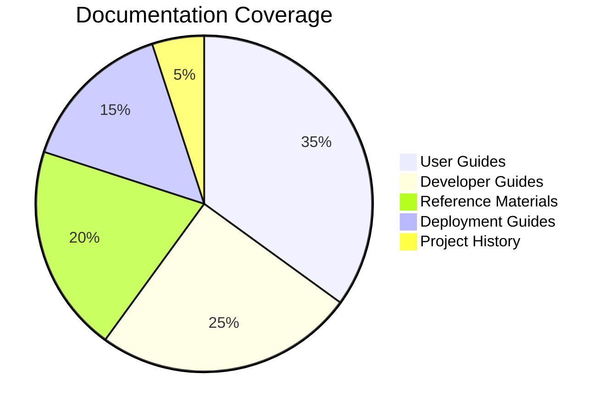
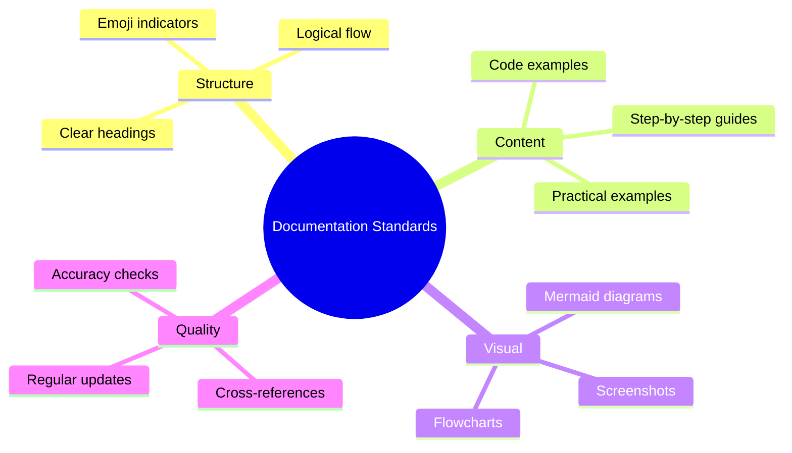

# 📚 OpenMetadata S3 Connector Documentation

Welcome to the comprehensive documentation for the OpenMetadata S3 Connector project. This documentation is organized to help users of all levels, from quick start to advanced development.

## �️ Documentation Map

```mermaid
graph TD
    Start[👋 New User] --> Quick[� Quick Start Guide]
    Start --> Main[📄 Main README]
    
    Quick --> UserGuides[� User Guides]
    Main --> UserGuides
    
    UserGuides --> Config[⚙️ Configuration]
    UserGuides --> Comprehensive[📚 Comprehensive Guide]
    UserGuides --> Troubleshoot[🔧 Troubleshooting]
    
    Main --> DevGuides[👨‍� Developer Guides]
    DevGuides --> Architecture[🏗️ Architecture]
    DevGuides --> AddFormats[➕ Adding Formats]
    
    Main --> Deploy[🚀 Deployment]
    Deploy --> DeployGuide[📋 Deployment Guide]
    Deploy --> README[📄 Installation Notes]
    
    Main --> Reference[📚 Reference]
    Reference --> Formats[📊 Supported Formats]
    Reference --> Hierarchical[🗂️ Hierarchical Folders]
    Reference --> Mermaid[🧩 Mermaid Diagrams]
    
    Main --> History[📜 Project History]
    History --> Evolution[🔄 Project Evolution]
    History --> Restructure[📝 Restructure Plans]
    History --> Cleanup[🧹 Cleanup Summaries]
    
    style Start fill:#e8f5e8
    style UserGuides fill:#e3f2fd
    style DevGuides fill:#fff3e0
    style Deploy fill:#f3e5f5
    style Reference fill:#e1f5fe
    style History fill:#fce4ec
```

## � Documentation Structure

### 🚀 **Quick Access**

| For... | Start Here | Description |
|--------|------------|-------------|
| **New Users** | [Quick Start](user-guides/quick-start.md) | Get up and running in minutes |
| **Detailed Setup** | [Comprehensive Guide](user-guides/comprehensive-guide.md) | Complete feature walkthrough |
| **Configuration** | [Configuration Guide](user-guides/configuration.md) | All configuration options |
| **Problems** | [Troubleshooting](user-guides/troubleshooting.md) | Common issues and solutions |

### 👨‍💻 **For Developers**

| Topic | Guide | Description |
|-------|-------|-------------|
| **Understanding** | [Architecture](developer-guides/architecture.md) | System design and components |
| **Extending** | [Adding Formats](developer-guides/adding-formats.md) | Support new file formats |
| **Contributing** | [Development Setup](developer-guides/development.md) | Local development environment |

### 🚀 **For DevOps/Deployment**

| Scenario | Guide | Description |
|----------|-------|-------------|
| **Production** | [Deployment Guide](deployment/deployment-guide.md) | Complete deployment scenarios |
| **Quick Install** | [Installation Notes](deployment/README.md) | Package installation |
| **Kubernetes** | [K8s Examples](deployment/kubernetes-examples.md) | Container orchestration |

### 📚 **Reference Materials**

| Topic | Reference | Description |
|-------|-----------|-------------|
| **File Formats** | [Supported Formats](reference/supported-formats.md) | Complete format matrix |
| **Complex Structures** | [Hierarchical Folders](reference/hierarchical-folders.md) | Partition handling |
| **Security & Auth** | [Security & Authentication](reference/security-authentication.md) | RBAC, authentication methods |
| **Visualizations** | [Mermaid Diagrams](reference/mermaid-diagrams.md) | All project diagrams |
| **API** | [API Reference](reference/api-reference.md) | Complete API documentation |

### 📜 **Project History**

| Document | Description |
|----------|-------------|
| [Project Evolution](project-history/project-evolution.md) | Development timeline and milestones |
| [Restructure Plans](project-history/RESTRUCTURE.md) | Documentation reorganization |
| [Cleanup Summary](project-history/README_CLEANUP_SUMMARY.md) | README optimization history |

## 🎯 **Getting Started Paths**

### Path 1: Quick Start (5 minutes)
1. [Main README](../README.md) - Overview and features
2. [Quick Start Guide](user-guides/quick-start.md) - Installation and basic usage
3. [Configuration](user-guides/configuration.md) - Basic configuration

### Path 2: Comprehensive Setup (30 minutes)
1. [Comprehensive Guide](user-guides/comprehensive-guide.md) - Complete walkthrough
2. [Architecture Overview](developer-guides/architecture.md) - Understanding the system
3. [Deployment Guide](deployment/deployment-guide.md) - Production deployment

### Path 3: Development (60 minutes)
1. [Architecture Guide](developer-guides/architecture.md) - System design
2. [Adding File Formats](developer-guides/adding-formats.md) - Extending functionality
3. [API Reference](reference/api-reference.md) - Development reference

## 🔄 **Recent Updates**

- ✅ **Documentation Restructure** - Organized into logical categories
- ✅ **Enhanced User Guides** - Step-by-step instructions with diagrams
- ✅ **Developer Resources** - Comprehensive development guides
- ✅ **Deployment Scenarios** - Production-ready deployment options
- ✅ **Reference Materials** - Complete technical reference

## 🧭 **Navigation Tips**

- **🏠 Home**: [Main README](../README.md) - Project overview
- **🚀 Quick**: [Quick Start](user-guides/quick-start.md) - Fastest way to begin
- **📚 Complete**: [Comprehensive Guide](user-guides/comprehensive-guide.md) - Everything you need
- **🏗️ Architecture**: [System Design](developer-guides/architecture.md) - How it works
- **🚀 Deploy**: [Deployment](deployment/deployment-guide.md) - Production setup

---

## 📊 Documentation Statistics

- **📖 Total Guides**: 15+ comprehensive documents
- **🧩 Mermaid Diagrams**: 25+ visual explanations
- **⚙️ Configuration Examples**: 10+ real-world scenarios
- **🧪 Code Examples**: 50+ practical snippets

## 💡 **Pro Tips**

1. **Bookmark** the [Quick Start](user-guides/quick-start.md) for reference
2. **Use** the [Troubleshooting Guide](user-guides/troubleshooting.md) for common issues
3. **Check** [Project Evolution](project-history/project-evolution.md) for recent changes
4. **Follow** the Mermaid diagrams for visual understanding

---

**📧 Questions?** Contact: [mfonsau@talentys.eu](mailto:mfonsau@talentys.eu)

**🔗 Quick Links**: [Main README](../README.md) | [Quick Start](user-guides/quick-start.md) | [Architecture](developer-guides/architecture.md) | [Deployment](deployment/deployment-guide.md)

## 🎯 Quick Navigation

### **For New Users**
Start with the main [README.md](../README.md) for a quick overview and setup instructions.

### **For Developers**
- Review [README_COMPREHENSIVE.md](README_COMPREHENSIVE.md) for detailed architecture
- Check [ADDITIONAL_FORMATS_RECOMMENDATION.md](ADDITIONAL_FORMATS_RECOMMENDATION.md) for extending functionality

### **For DevOps/SRE**
- Follow [DEPLOYMENT.md](DEPLOYMENT.md) for production deployment
- Use [DEPLOYMENT-SUMMARY.md](DEPLOYMENT-SUMMARY.md) as a quick reference

### **For Advanced Users**
- [HIERARCHICAL_FOLDERS.md](HIERARCHICAL_FOLDERS.md) for complex data organization
- [ORC_AVRO_IMPLEMENTATION.md](ORC_AVRO_IMPLEMENTATION.md) for big data formats

## 📋 Documentation Standards

All documentation follows these standards:
- ✅ **Clear headings** with emoji indicators
- ✅ **Code examples** with syntax highlighting  
- ✅ **Step-by-step instructions** where applicable
- ✅ **Mermaid diagrams** for complex workflows
- ✅ **Cross-references** between related documents

## 🔄 Keeping Documentation Updated

When making changes to the project:
1. Update relevant documentation files
2. Keep the main README.md concise and user-friendly
3. Add detailed information to README_COMPREHENSIVE.md
4. Update this index if new documentation is added

---

**Note**: The main README.md is kept intentionally concise for quick onboarding. For comprehensive details, refer to README_COMPREHENSIVE.md.
