# 📚 Documentation Restructure Plan

## 🎯 Objective
Reorganize all markdown documentation into a logical, maintainable structure while preserving all Mermaid diagrams, project steps, and important information.

## 📁 New Documentation Structure

```mermaid
graph TD
    Root[📄 README.md<br/>Main Entry Point] --> Docs[📁 docs/]
    
    Docs --> UserGuides[📁 user-guides/]
    Docs --> DevGuides[📁 developer-guides/]
    Docs --> ProjectHistory[📁 project-history/]
    Docs --> Deployment[📁 deployment/]
    Docs --> Reference[📁 reference/]
    
    UserGuides --> QuickStart[📄 quick-start.md]
    UserGuides --> Configuration[📄 configuration.md]
    UserGuides --> Troubleshooting[📄 troubleshooting.md]
    
    DevGuides --> Architecture[📄 architecture.md]
    DevGuides --> Contributing[📄 contributing.md]
    DevGuides --> Parsers[📄 extending-parsers.md]
    
    ProjectHistory --> Evolution[📄 project-evolution.md]
    ProjectHistory --> Restructuring[📄 restructuring-steps.md]
    ProjectHistory --> Cleanup[📄 readme-cleanup.md]
    
    Deployment --> Docker[📄 docker-deployment.md]
    Deployment --> Kubernetes[📄 kubernetes-deployment.md]
    Deployment --> Production[📄 production-setup.md]
    
    Reference --> API[📄 api-reference.md]
    Reference --> FileFormats[📄 supported-formats.md]
    Reference --> ConfigOptions[📄 configuration-options.md]
    
    style Root fill:#e8f5e8
    style UserGuides fill:#e3f2fd
    style DevGuides fill:#fff3e0
    style ProjectHistory fill:#f3e5f5
    style Deployment fill:#ffebee
    style Reference fill:#f1f8e9
```

## 📋 Migration Plan

### Phase 1: Create New Structure
1. Create new directory structure
2. Move and reorganize existing files
3. Update cross-references

### Phase 2: Content Organization
1. Merge related content
2. Remove duplicates
3. Enhance with missing information

### Phase 3: Quality Assurance
1. Verify all Mermaid diagrams
2. Test all links
3. Ensure consistent formatting

## 🔄 File Mapping

| Current File | New Location | Purpose |
|-------------|--------------|---------|
| `README.md` | `README.md` | Main entry point |
| `docs/README_COMPREHENSIVE.md` | `docs/user-guides/comprehensive-guide.md` | Complete user guide |
| `RENAME_COMPLETE.md` | `docs/project-history/renaming-process.md` | Project history |
| `RESTRUCTURE*.md` | `docs/project-history/restructuring-steps.md` | Restructuring documentation |
| `docs/DEPLOYMENT*.md` | `docs/deployment/` | Deployment guides |
| `docs/MERMAID_DIAGRAMS_SUMMARY.md` | `docs/reference/mermaid-diagrams.md` | Diagram reference |

This structure will make the documentation more discoverable, maintainable, and user-friendly while preserving all valuable content and diagrams.
