# 🚀 Deployment Guide

This comprehensive guide covers all deployment scenarios for the OpenMetadata S3 Connector.

## 📋 Overview

```mermaid
graph TB
    subgraph "Development"
        Local[🖥️ Local Development]
        Testing[🧪 Testing Environment]
    end
    
    subgraph "Production Deployment"
        Docker[🐳 Docker Container]
        K8s[☸️ Kubernetes]
        VM[🖥️ Virtual Machine]
    end
    
    subgraph "Cloud Options"
        AWS[☁️ AWS ECS/Fargate]
        Azure[☁️ Azure Container]
        GCP[☁️ Google Cloud Run]
    end
    
    Local --> Docker
    Testing --> K8s
    Docker --> AWS
    K8s --> Azure
    VM --> GCP
    
    style Local fill:#e8f5e8
    style Docker fill:#e3f2fd
    style K8s fill:#fff3e0
```



## 🏠 Local Development Setup

### Prerequisites

- Python 3.8+
- Git
- Access to S3/MinIO
- OpenMetadata instance (local or remote)

### Quick Setup

```bash
# Clone repository
git clone <repository-url>
cd openmetadata-s3-connector

# Create virtual environment
python -m venv venv
source venv/bin/activate  # Linux/Mac
# venv\Scripts\activate  # Windows

# Install dependencies
pip install -r requirements.txt
pip install -e .

# Verify installation
python -c "from src.connectors.s3.s3_connector import S3Source; print('✅ Installation successful')"
```

## 🐳 Docker Deployment

### Using Pre-built Image

```bash
# Pull the image
docker pull openmetadata/s3-connector:latest

# Run with configuration
docker run --rm \
  -v $(pwd)/config:/app/config \
  openmetadata/s3-connector:latest \
  metadata ingest -c /app/config/my-config.yaml
```

### Building Custom Image

```dockerfile
FROM python:3.9-slim

WORKDIR /app
COPY requirements.txt .
RUN pip install -r requirements.txt

COPY src/ ./src/
COPY config/ ./config/
RUN pip install -e .

CMD ["metadata", "ingest", "-c", "config/default.yaml"]
```

```bash
# Build image
docker build -t my-s3-connector .

# Run container
docker run --rm \
  -e AWS_ACCESS_KEY_ID=your_key \
  -e AWS_SECRET_ACCESS_KEY=your_secret \
  my-s3-connector
```

## ☸️ Kubernetes Deployment

### ConfigMap for Configuration

```yaml
apiVersion: v1
kind: ConfigMap
metadata:
  name: s3-connector-config
data:
  ingestion.yaml: |
    source:
      type: customDatabase
      serviceName: "s3-datalake"
      serviceConnection:
        config:
          type: CustomDatabase
          sourcePythonClass: src.connectors.s3.s3_connector.S3Source
          connectionOptions:
            awsAccessKeyId: "${AWS_ACCESS_KEY_ID}"
            awsSecretAccessKey: "${AWS_SECRET_ACCESS_KEY}"
            awsRegion: "us-east-1"
            bucketName: "my-bucket"
    
    sink:
      type: metadata-rest
      config: {}
    
    workflowConfig:
      openMetadataServerConfig:
        hostPort: "http://openmetadata:8585/api"
        authProvider: "openmetadata"
        securityConfig:
          jwtToken: "${OPENMETADATA_JWT_TOKEN}"
```

### Deployment Manifest

```yaml
apiVersion: apps/v1
kind: Deployment
metadata:
  name: s3-connector
spec:
  replicas: 1
  selector:
    matchLabels:
      app: s3-connector
  template:
    metadata:
      labels:
        app: s3-connector
    spec:
      containers:
      - name: s3-connector
        image: openmetadata/s3-connector:latest
        env:
        - name: AWS_ACCESS_KEY_ID
          valueFrom:
            secretKeyRef:
              name: aws-credentials
              key: access-key-id
        - name: AWS_SECRET_ACCESS_KEY
          valueFrom:
            secretKeyRef:
              name: aws-credentials
              key: secret-access-key
        - name: OPENMETADATA_JWT_TOKEN
          valueFrom:
            secretKeyRef:
              name: openmetadata-credentials
              key: jwt-token
        volumeMounts:
        - name: config
          mountPath: /app/config
        command: ["metadata", "ingest", "-c", "/app/config/ingestion.yaml"]
      volumes:
      - name: config
        configMap:
          name: s3-connector-config
```

### CronJob for Scheduled Ingestion

```yaml
apiVersion: batch/v1
kind: CronJob
metadata:
  name: s3-connector-scheduled
spec:
  schedule: "0 2 * * *"  # Daily at 2 AM
  jobTemplate:
    spec:
      template:
        spec:
          containers:
          - name: s3-connector
            image: openmetadata/s3-connector:latest
            env:
            - name: AWS_ACCESS_KEY_ID
              valueFrom:
                secretKeyRef:
                  name: aws-credentials
                  key: access-key-id
            - name: AWS_SECRET_ACCESS_KEY
              valueFrom:
                secretKeyRef:
                  name: aws-credentials
                  key: secret-access-key
            volumeMounts:
            - name: config
              mountPath: /app/config
            command: ["metadata", "ingest", "-c", "/app/config/ingestion.yaml"]
          volumes:
          - name: config
            configMap:
              name: s3-connector-config
          restartPolicy: OnFailure
```

## ☁️ Cloud Deployments

### AWS ECS/Fargate

```json
{
  "family": "s3-connector",
  "taskRoleArn": "arn:aws:iam::123456789012:role/ecsTaskRole",
  "executionRoleArn": "arn:aws:iam::123456789012:role/ecsTaskExecutionRole",
  "networkMode": "awsvpc",
  "requiresCompatibilities": ["FARGATE"],
  "cpu": "256",
  "memory": "512",
  "containerDefinitions": [
    {
      "name": "s3-connector",
      "image": "openmetadata/s3-connector:latest",
      "essential": true,
      "environment": [
        {
          "name": "AWS_REGION",
          "value": "us-east-1"
        }
      ],
      "secrets": [
        {
          "name": "AWS_ACCESS_KEY_ID",
          "valueFrom": "arn:aws:ssm:us-east-1:123456789012:parameter/s3-connector/aws-access-key"
        }
      ],
      "logConfiguration": {
        "logDriver": "awslogs",
        "options": {
          "awslogs-group": "/ecs/s3-connector",
          "awslogs-region": "us-east-1",
          "awslogs-stream-prefix": "ecs"
        }
      }
    }
  ]
}
```

### Azure Container Instances

```yaml
apiVersion: 2018-10-01
location: eastus
name: s3-connector
properties:
  containers:
  - name: s3-connector
    properties:
      image: openmetadata/s3-connector:latest
      resources:
        requests:
          cpu: 0.5
          memoryInGb: 1
      environmentVariables:
      - name: AWS_REGION
        value: us-east-1
      - name: AWS_ACCESS_KEY_ID
        secureValue: your_access_key
      - name: AWS_SECRET_ACCESS_KEY
        secureValue: your_secret_key
  osType: Linux
  restartPolicy: OnFailure
tags:
  project: openmetadata-s3-connector
type: Microsoft.ContainerInstance/containerGroups
```

## 🔒 Security Considerations

### IAM Policies for S3

```json
{
  "Version": "2012-10-17",
  "Statement": [
    {
      "Effect": "Allow",
      "Action": [
        "s3:GetObject",
        "s3:ListBucket",
        "s3:GetBucketLocation"
      ],
      "Resource": [
        "arn:aws:s3:::your-bucket",
        "arn:aws:s3:::your-bucket/*"
      ]
    }
  ]
}
```

### Secret Management

```bash
# Kubernetes Secrets
kubectl create secret generic aws-credentials \
  --from-literal=access-key-id=YOUR_ACCESS_KEY \
  --from-literal=secret-access-key=YOUR_SECRET_KEY

kubectl create secret generic openmetadata-credentials \
  --from-literal=jwt-token=YOUR_JWT_TOKEN
```

## 📊 Monitoring and Logging

### Deployment Monitoring Flow


### Health Check Endpoint

```python
# Add to your connector for health monitoring
@app.route('/health')
def health_check():
    try:
        # Test S3 connection
        s3_client.head_bucket(Bucket=bucket_name)
        # Test OpenMetadata connection
        openmetadata_client.health_check()
        return {"status": "healthy"}, 200
    except Exception as e:
        return {"status": "unhealthy", "error": str(e)}, 500
```

## 🔧 Troubleshooting

### Common Issues

| Issue | Solution |
|-------|----------|
| **Connection timeout** | Check network connectivity and security groups |
| **Authentication failed** | Verify AWS credentials and permissions |
| **Memory errors** | Increase container memory limits |
| **OpenMetadata connection** | Check JWT token validity and network access |

### Debug Mode

```bash
# Enable debug logging
export LOG_LEVEL=DEBUG
export PYTHONPATH=$(pwd)/src

# Run with verbose output
metadata ingest -c config/debug-config.yaml --verbose
```

## 📈 Scaling Considerations

### Horizontal Scaling

```yaml
# Kubernetes HPA
apiVersion: autoscaling/v2
kind: HorizontalPodAutoscaler
metadata:
  name: s3-connector-hpa
spec:
  scaleTargetRef:
    apiVersion: apps/v1
    kind: Deployment
    name: s3-connector
  minReplicas: 1
  maxReplicas: 10
  metrics:
  - type: Resource
    resource:
      name: cpu
      target:
        type: Utilization
        averageUtilization: 70
```

## 📚 Next Steps

- [Configuration Guide](../user-guides/configuration.md)
- [Troubleshooting Guide](../user-guides/troubleshooting.md)
- [Architecture Overview](../developer-guides/architecture.md)
