# 🔧 Adding New File Format Support

This guide explains how to extend the S3 connector to support additional file formats.

## 📊 Current Architecture

```mermaid
graph TB
    subgraph "Format Detection"
        Ext[📄 File Extension]
        Magic[🔍 Magic Number]
        Content[📝 Content Analysis]
    end
    
    subgraph "Parser Factory"
        Factory[🏭 ParserFactory]
        Registry[📋 Parser Registry]
    end
    
    subgraph "Base Classes"
        BaseParser[🏗️ BaseParser]
        Interface[🔌 Parser Interface]
    end
    
    subgraph "Specific Parsers"
        CSV[📊 CSVParser]
        JSON[📋 JSONParser]
        Parquet[📦 ParquetParser]
        Custom[➕ YourCustomParser]
    end
    
    Ext --> Factory
    Magic --> Factory
    Content --> Factory
    
    Factory --> Registry
    Registry --> BaseParser
    BaseParser --> Interface
    
    Interface --> CSV
    Interface --> JSON
    Interface --> Parquet
    Interface --> Custom
    
    style Custom fill:#e8f5e8
    style Factory fill:#e3f2fd
    style BaseParser fill:#fff3e0
```



## 🏗️ Implementation Steps

### 1. Create Your Parser Class

```python
# src/connectors/s3/parsers/your_format_parser.py

from typing import Optional, Dict, Any, List
import pandas as pd
from .base_parser import BaseParser
from ..exceptions import ParseError

class YourFormatParser(BaseParser):
    """Parser for YourFormat files (.yourext)"""
    
    SUPPORTED_EXTENSIONS = ['.yourext', '.alt_ext']
    FORMAT_NAME = 'YourFormat'
    
    def __init__(self, **kwargs):
        super().__init__(**kwargs)
        # Initialize format-specific configurations
        self.encoding = kwargs.get('encoding', 'utf-8')
        self.custom_option = kwargs.get('custom_option', True)
    
    def can_parse(self, file_path: str, content_sample: bytes = None) -> bool:
        """
        Determine if this parser can handle the file
        """
        # Check file extension
        if not super().can_parse(file_path):
            return False
        
        # Optional: Check magic number or content signature
        if content_sample:
            return self._check_content_signature(content_sample)
        
        return True
    
    def _check_content_signature(self, content: bytes) -> bool:
        """Check if content matches format signature"""
        # Example: Check for magic bytes
        magic_signatures = [
            b'\\x89YOURFORMAT',  # Custom magic number
            b'YOURFORMAT_HEADER'  # Text header
        ]
        
        for signature in magic_signatures:
            if content.startswith(signature):
                return True
        
        return False
    
    def parse_schema(self, file_path: str, sample_size: int = 1000) -> Dict[str, Any]:
        """
        Extract schema information from the file
        """
        try:
            # Read sample data using your format's library
            sample_data = self._read_sample_data(file_path, sample_size)
            
            # Infer schema from sample
            schema = self._infer_schema_from_data(sample_data)
            
            return {
                'columns': schema,
                'row_count_estimate': self._estimate_row_count(file_path),
                'file_size': self._get_file_size(file_path),
                'format_specific_metadata': self._extract_format_metadata(file_path)
            }
            
        except Exception as e:
            raise ParseError(f"Failed to parse schema from {file_path}: {str(e)}")
    
    def _read_sample_data(self, file_path: str, sample_size: int) -> Any:
        """Read sample data from file"""
        # Implement format-specific reading logic
        # Example for a hypothetical format:
        
        with open(file_path, 'rb') as f:
            # Your format reading logic here
            # This is highly dependent on your specific format
            raw_data = f.read(sample_size * 100)  # Rough estimate
            
            # Parse the raw data using appropriate library
            # parsed_data = your_format_library.parse(raw_data)
            
            return parsed_data
    
    def _infer_schema_from_data(self, data: Any) -> List[Dict[str, Any]]:
        """Infer column schema from sample data"""
        columns = []
        
        # Example implementation - adapt to your data structure
        if hasattr(data, 'columns'):  # DataFrame-like
            for col_name in data.columns:
                col_type = self._map_data_type(data[col_name].dtype)
                columns.append({
                    'name': col_name,
                    'dataType': col_type,
                    'nullable': data[col_name].isnull().any(),
                    'description': f"Column {col_name} from YourFormat file"
                })
        
        return columns
    
    def _map_data_type(self, native_type: Any) -> str:
        """Map format-specific data types to OpenMetadata types"""
        type_mapping = {
            'int64': 'BIGINT',
            'float64': 'DOUBLE',
            'object': 'STRING',
            'bool': 'BOOLEAN',
            'datetime64[ns]': 'TIMESTAMP',
            # Add more mappings as needed
        }
        
        return type_mapping.get(str(native_type), 'STRING')
    
    def _estimate_row_count(self, file_path: str) -> Optional[int]:
        """Estimate total number of rows in the file"""
        try:
            # Implement row counting logic
            # This could be approximate for large files
            file_size = self._get_file_size(file_path)
            
            # Sample approach: estimate based on file size and sample
            sample_data = self._read_sample_data(file_path, 100)
            if hasattr(sample_data, '__len__'):
                sample_size_bytes = 1024  # Rough estimate
                estimated_rows = (file_size // sample_size_bytes) * len(sample_data)
                return estimated_rows
            
            return None
        except:
            return None
    
    def _extract_format_metadata(self, file_path: str) -> Dict[str, Any]:
        """Extract format-specific metadata"""
        metadata = {}
        
        try:
            # Add format-specific metadata extraction
            metadata.update({
                'format_version': self._get_format_version(file_path),
                'compression': self._detect_compression(file_path),
                'custom_properties': self._extract_custom_properties(file_path)
            })
        except Exception as e:
            self.logger.warning(f"Could not extract format metadata: {e}")
        
        return metadata
    
    def get_sample_data(self, file_path: str, num_rows: int = 10) -> List[Dict[str, Any]]:
        """
        Get sample rows for preview
        """
        try:
            sample_data = self._read_sample_data(file_path, num_rows)
            
            # Convert to list of dictionaries for OpenMetadata
            if hasattr(sample_data, 'to_dict'):  # DataFrame-like
                return sample_data.head(num_rows).to_dict('records')
            else:
                # Handle other data structures
                return self._convert_to_sample_format(sample_data, num_rows)
                
        except Exception as e:
            self.logger.error(f"Failed to get sample data: {e}")
            return []
    
    def _convert_to_sample_format(self, data: Any, num_rows: int) -> List[Dict[str, Any]]:
        """Convert format-specific data to sample format"""
        # Implement conversion logic based on your data structure
        # This is highly format-dependent
        
        sample_rows = []
        # Your conversion logic here
        return sample_rows[:num_rows]
```

### 2. Register Your Parser

```python
# src/connectors/s3/parsers/factory.py

from .your_format_parser import YourFormatParser

class ParserFactory:
    def __init__(self):
        self._parsers = {
            'csv': CSVParser,
            'json': JSONParser,
            'parquet': ParquetParser,
            # Add your parser here
            'yourformat': YourFormatParser,
        }
        
        # Register file extensions
        self._extension_mapping = {
            '.csv': 'csv',
            '.json': 'json',
            '.parquet': 'parquet',
            # Add your extensions
            '.yourext': 'yourformat',
            '.alt_ext': 'yourformat',
        }
```

### 3. Add Dependencies

```python
# requirements.txt
# Add any new dependencies for your format

# Example dependencies:
your-format-library>=1.0.0
additional-dependency>=2.1.0
```

### 4. Create Tests

```python
# tests/test_your_format_parser.py

import pytest
import tempfile
import os
from src.connectors.s3.parsers.your_format_parser import YourFormatParser

class TestYourFormatParser:
    
    @pytest.fixture
    def sample_file(self):
        """Create a sample file for testing"""
        with tempfile.NamedTemporaryFile(suffix='.yourext', delete=False) as f:
            # Write sample data in your format
            sample_content = b"Your format sample content here"
            f.write(sample_content)
            f.flush()
            yield f.name
        os.unlink(f.name)
    
    def test_can_parse_valid_file(self, sample_file):
        parser = YourFormatParser()
        assert parser.can_parse(sample_file)
    
    def test_can_parse_invalid_extension(self):
        parser = YourFormatParser()
        assert not parser.can_parse("file.txt")
    
    def test_parse_schema(self, sample_file):
        parser = YourFormatParser()
        schema = parser.parse_schema(sample_file)
        
        assert 'columns' in schema
        assert 'row_count_estimate' in schema
        assert isinstance(schema['columns'], list)
    
    def test_get_sample_data(self, sample_file):
        parser = YourFormatParser()
        sample_data = parser.get_sample_data(sample_file, 5)
        
        assert isinstance(sample_data, list)
        assert len(sample_data) <= 5
    
    def test_content_signature_detection(self):
        parser = YourFormatParser()
        
        # Test with valid signature
        valid_content = b"\\x89YOURFORMAT\\x0D\\x0A"
        assert parser._check_content_signature(valid_content)
        
        # Test with invalid signature
        invalid_content = b"not your format"
        assert not parser._check_content_signature(invalid_content)
```

## 🔌 Integration Points

### Configuration Support

```python
# Add configuration options in config.py

class S3Config:
    def __init__(self, **kwargs):
        # Existing configurations...
        
        # Format-specific configurations
        self.your_format_encoding = kwargs.get('your_format_encoding', 'utf-8')
        self.your_format_options = kwargs.get('your_format_options', {})
```

### Error Handling

```python
# src/connectors/s3/exceptions.py

class YourFormatParseError(ParseError):
    """Specific exception for YourFormat parsing errors"""
    pass
```

## 📊 Advanced Features

### Streaming Support for Large Files

```python
def parse_schema_streaming(self, file_path: str) -> Dict[str, Any]:
    """Parse schema from large files using streaming"""
    
    with open(file_path, 'rb') as f:
        # Read file in chunks
        chunk_size = 8192
        schema_builder = SchemaBuilder()
        
        while True:
            chunk = f.read(chunk_size)
            if not chunk:
                break
                
            # Process chunk and update schema
            schema_builder.process_chunk(chunk)
            
            # Stop early if we have enough information
            if schema_builder.is_complete():
                break
        
        return schema_builder.get_schema()
```

### Custom Metadata Extraction

```python
def extract_lineage_info(self, file_path: str) -> Dict[str, Any]:
    """Extract lineage information from format metadata"""
    
    metadata = {}
    
    # Check if format contains lineage information
    if self._has_lineage_metadata(file_path):
        metadata['upstream_tables'] = self._extract_upstream_tables(file_path)
        metadata['transformation_logic'] = self._extract_transformations(file_path)
    
    return metadata
```

## 🧪 Testing Your Implementation

### Integration Test

```python
# tests/integration/test_end_to_end_your_format.py

def test_full_ingestion_workflow():
    """Test complete ingestion workflow with your format"""
    
    # Create test file
    test_file = create_sample_your_format_file()
    
    # Configure connector
    config = {
        'bucket_name': 'test-bucket',
        'file_formats': 'yourformat',
        'your_format_encoding': 'utf-8'
    }
    
    # Run ingestion
    connector = S3Connector(config)
    results = connector.ingest_metadata()
    
    # Verify results
    assert len(results) > 0
    assert results[0]['format'] == 'yourformat'
    assert 'schema' in results[0]
```

## 📈 Performance Considerations

### Optimization Tips

```mermaid
graph LR
    subgraph "Performance Optimization"
        Cache[🗄️ Schema Caching]
        Parallel[⚡ Parallel Processing]
        Memory[💾 Memory Management]
        Sampling[📊 Smart Sampling]
    end
    
    subgraph "Implementation"
        LRU[LRU Cache for Schemas]
        ThreadPool[Thread Pool for Files]
        Streaming[Streaming for Large Files]
        Adaptive[Adaptive Sample Size]
    end
    
    Cache --> LRU
    Parallel --> ThreadPool
    Memory --> Streaming
    Sampling --> Adaptive
    
    style Cache fill:#e8f5e8
    style Parallel fill:#e3f2fd
```



### Caching Implementation

```python
from functools import lru_cache

@lru_cache(maxsize=128)
def get_cached_schema(self, file_path: str, file_mtime: float) -> Dict[str, Any]:
    """Cache schema results to avoid re-parsing unchanged files"""
    return self.parse_schema(file_path)
```

## 📚 Resources

### Useful Libraries by Format Type

| Format Type | Recommended Libraries |
|-------------|----------------------|
| **Binary** | `struct`, `numpy` |
| **Text-based** | `pandas`, `csv` |
| **Columnar** | `pyarrow`, `fastparquet` |
| **Scientific** | `h5py`, `scipy` |
| **Compression** | `gzip`, `lz4`, `zstandard` |

### Example Implementations

- [CSV Parser](../../../src/connectors/s3/parsers/csv_parser.py) - Simple text format
- [Parquet Parser](../../../src/connectors/s3/parsers/parquet_parser.py) - Columnar format
- [Avro Parser](../../../src/connectors/s3/parsers/avro_parser.py) - Schema evolution

## 🔗 Next Steps

1. **[Base Parser Reference](../reference/base-parser-api.md)** - Complete API documentation
2. **[Testing Guide](testing-guide.md)** - Testing best practices
3. **[Performance Tuning](performance-tuning.md)** - Optimization techniques
