# 🏗️ Architecture Guide

Technical architecture and design principles of the OpenMetadata S3 Connector.

## System Architecture

```mermaid
graph TB
    subgraph "External Systems"
        S3[🗄️ S3/MinIO Storage]
        OM[📊 OpenMetadata Server]
        User[👤 User/Scheduler]
    end
    
    subgraph "S3 Connector Core"
        Entry[🚪 Entry Point<br/>metadata ingest]
        Config[⚙️ Configuration Parser]
        Source[🔌 S3Source Class]
    end
    
    subgraph "Discovery Engine"
        Scanner[🔍 File Scanner]
        Filter[🚥 Path Filter]
        Grouper[🗂️ Partition Grouper]
    end
    
    subgraph "Processing Pipeline"
        Factory[🏭 Parser Factory]
        Parsers[🧩 Format Parsers]
        Schema[📊 Schema Inference]
        Sampler[📋 Data Sampler]
    end
    
    subgraph "Metadata Engine"
        Entities[🏷️ Entity Creator]
        Tags[🏷️ Tag Processor]
        Validator[✅ Data Validator]
    end
    
    subgraph "Output Layer"
        Formatter[📝 Metadata Formatter]
        Sender[📤 API Sender]
    end
    
    User --> Entry
    Entry --> Config
    Config --> Source
    
    Source --> Scanner
    Scanner --> S3
    Scanner --> Filter
    Filter --> Grouper
    
    Grouper --> Factory
    Factory --> Parsers
    Parsers --> Schema
    Schema --> Sampler
    Sampler --> S3
    
    Schema --> Entities
    Entities --> Tags
    Tags --> Validator
    
    Validator --> Formatter
    Formatter --> Sender
    Sender --> OM
    
    style Source fill:#e8f5e8
    style Factory fill:#e3f2fd
    style Entities fill:#fff3e0
    style OM fill:#f3e5f5
```



## Component Overview

### Core Components

#### 1. S3Source (Entry Point)
- **Purpose**: Main connector class implementing OpenMetadata interface
- **Location**: `src/om_s3_connector/core/s3_connector.py`
- **Responsibilities**:
  - Configuration parsing and validation
  - Orchestration of discovery and processing
  - Error handling and logging

#### 2. File Discovery Engine
- **Scanner**: Recursively scans S3 buckets
- **Filter**: Applies include/exclude patterns
- **Grouper**: Groups files into logical tables

#### 3. Parser Framework
- **Factory Pattern**: Dynamically selects appropriate parsers
- **Extensible Design**: Easy to add new file formats
- **Error Resilience**: Graceful handling of parsing failures

## Detailed Component Architecture

### File Discovery Process


### Parser Selection Logic

```mermaid
graph TD
    File[📄 File Detected] --> Extract[📝 Extract Extension]
    Extract --> Factory[🏭 Parser Factory]
    
    Factory --> CSV{.csv?}
    Factory --> JSON{.json?}
    Factory --> Parquet{.parquet?}
    Factory --> Other{Other?}
    
    CSV -->|Yes| CSVParser[📊 CSV Parser]
    JSON -->|Yes| JSONParser[📄 JSON Parser]
    Parquet -->|Yes| ParquetParser[🗃️ Parquet Parser]
    Other -->|Yes| BaseParser[🔧 Base Parser]
    
    CSVParser --> Schema[📋 Schema Inference]
    JSONParser --> Schema
    ParquetParser --> Schema
    BaseParser --> Error[❌ Unsupported Format]
    
    style Factory fill:#e3f2fd
    style Schema fill:#e8f5e8
    style Error fill:#ffebee
```



## Code Organization

### Package Structure

```mermaid
graph TD
    Root[📦 om_s3_connector] --> Core[📁 core/]
    Root --> Parsers[📁 parsers/]
    Root --> Utils[📁 utils/]
    
    Core --> S3Connector[📄 s3_connector.py]
    Core --> Connector[📄 connector.py]
    Core --> Config[📄 config.py]
    Core --> Security[📄 security.py]
    
    Parsers --> Base[📄 base_parser.py]
    Parsers --> Factory[📄 factory.py]
    Parsers --> CSV[📄 csv_parser.py]
    Parsers --> JSON[📄 json_parser.py]
    Parsers --> Parquet[📄 parquet_parser.py]
    Parsers --> More[📄 ... more parsers]
    
    Utils --> Logging[📄 logging.py]
    Utils --> Validation[📄 validation.py]
    
    style Root fill:#e8f5e8
    style Core fill:#e3f2fd
    style Parsers fill:#fff3e0
    style Utils fill:#f3e5f5
```



### Key Classes and Interfaces

#### S3Source Class
```python
class S3Source:
    """Main connector class implementing OpenMetadata interface"""
    
    def __init__(self, config: S3ConnectorConfig):
        self.config = config
        self.client = S3Client(config)
        self.parser_factory = ParserFactory()
    
    def get_database_entities(self) -> Iterable[Database]:
        """Discover and yield database entities"""
        
    def get_database_schema_entities(self) -> Iterable[DatabaseSchema]:
        """Discover and yield schema entities"""
        
    def get_table_entities(self) -> Iterable[Table]:
        """Discover and yield table entities"""
```

#### Parser Interface
```python
class FileParser(ABC):
    """Abstract base class for all file parsers"""
    
    @abstractmethod
    def parse_schema(self, file_path: str) -> Dict[str, Any]:
        """Extract schema from file"""
        
    @abstractmethod
    def get_sample_data(self, file_path: str, rows: int) -> List[Dict]:
        """Get sample data from file"""
        
    @abstractmethod
    def get_row_count(self, file_path: str) -> int:
        """Get total row count"""
```

## Data Flow Architecture

### Processing Pipeline

```mermaid
graph LR
    subgraph "Input"
        S3Files[📄 S3 Files]
        Config[⚙️ Configuration]
    end
    
    subgraph "Discovery"
        List[📋 List Files]
        Filter[🚥 Filter Files]
        Group[🗂️ Group Files]
    end
    
    subgraph "Processing"
        Parse[🧩 Parse Schema]
        Sample[📊 Sample Data]
        Validate[✅ Validate]
    end
    
    subgraph "Output"
        Metadata[🏷️ Metadata]
        OM[📊 OpenMetadata]
    end
    
    S3Files --> List
    Config --> Filter
    List --> Filter
    Filter --> Group
    Group --> Parse
    Parse --> Sample
    Sample --> Validate
    Validate --> Metadata
    Metadata --> OM
    
    style Discovery fill:#e3f2fd
    style Processing fill:#fff3e0
    style Output fill:#e8f5e8
```



### Error Handling Strategy

```mermaid
graph TD
    Operation[🔄 Operation] --> Success{Success?}
    Success -->|Yes| Continue[✅ Continue]
    Success -->|No| Error[❌ Error Occurred]
    
    Error --> Retry{Retryable?}
    Retry -->|Yes| RetryOp[🔄 Retry Operation]
    Retry -->|No| Log[📝 Log Error]
    
    RetryOp --> MaxRetries{Max Retries?}
    MaxRetries -->|No| Operation
    MaxRetries -->|Yes| Log
    
    Log --> Graceful[🚫 Graceful Skip]
    Graceful --> Continue
    
    style Success fill:#e8f5e8
    style Error fill:#ffebee
    style Log fill:#fff3e0
```



## Design Patterns

### Factory Pattern (Parsers)
```python
class ParserFactory:
    """Factory for creating file parsers"""
    
    _parsers = {
        'csv': CsvParser,
        'json': JsonParser,
        'parquet': ParquetParser,
        # ... more parsers
    }
    
    @classmethod
    def get_parser(cls, file_format: str) -> FileParser:
        parser_class = cls._parsers.get(file_format.lower())
        if parser_class:
            return parser_class()
        raise UnsupportedFormatError(f"Format {file_format} not supported")
```

### Strategy Pattern (Authentication)
```python
class AuthenticationStrategy(ABC):
    @abstractmethod
    def get_credentials(self) -> Dict[str, Any]:
        pass

class AccessKeyAuth(AuthenticationStrategy):
    def get_credentials(self) -> Dict[str, Any]:
        return {
            'aws_access_key_id': self.access_key,
            'aws_secret_access_key': self.secret_key
        }

class IAMRoleAuth(AuthenticationStrategy):
    def get_credentials(self) -> Dict[str, Any]:
        # Assume role logic
        pass
```

### Observer Pattern (Progress Tracking)
```python
class ProgressObserver(ABC):
    @abstractmethod
    def on_file_processed(self, file_path: str, status: str):
        pass

class LoggingObserver(ProgressObserver):
    def on_file_processed(self, file_path: str, status: str):
        logger.info(f"Processed {file_path}: {status}")
```

## Performance Considerations

### Optimization Strategies


### Scalability Architecture

```mermaid
graph TB
    subgraph "Horizontal Scaling"
        Worker1[🔄 Worker 1]
        Worker2[🔄 Worker 2]
        WorkerN[🔄 Worker N]
    end
    
    subgraph "Coordination"
        Queue[📋 Task Queue]
        State[💾 Shared State]
    end
    
    subgraph "Resources"
        S3[🗄️ S3 Storage]
        OM[📊 OpenMetadata]
    end
    
    Queue --> Worker1
    Queue --> Worker2
    Queue --> WorkerN
    
    Worker1 --> State
    Worker2 --> State
    WorkerN --> State
    
    Worker1 --> S3
    Worker2 --> S3
    WorkerN --> S3
    
    Worker1 --> OM
    Worker2 --> OM
    WorkerN --> OM
    
    style Queue fill:#e3f2fd
    style State fill:#fff3e0
    style S3 fill:#e8f5e8
```



## Extension Points

### Adding New File Formats

1. **Create Parser Class**:
```python
class NewFormatParser(FileParser):
    def parse_schema(self, file_path: str) -> Dict[str, Any]:
        # Implementation
        pass
    
    def get_sample_data(self, file_path: str, rows: int) -> List[Dict]:
        # Implementation
        pass
```

2. **Register in Factory**:
```python
# In factory.py
PARSER_MAPPING = {
    # ... existing parsers
    "newformat": NewFormatParser,
}
```

### Custom Authentication

1. **Implement Strategy**:
```python
class CustomAuth(AuthenticationStrategy):
    def get_credentials(self) -> Dict[str, Any]:
        # Custom authentication logic
        pass
```

2. **Register Strategy**:
```python
# In security.py
AUTH_STRATEGIES = {
    # ... existing strategies
    "custom": CustomAuth,
}
```

## Testing Architecture

### Test Structure


## Deployment Architecture

### Container Strategy

```mermaid
graph TB
    subgraph "Container Image"
        Base[🐳 Python Base Image]
        App[📦 Application Code]
        Deps[📚 Dependencies]
        Config[⚙️ Configuration]
    end
    
    subgraph "Runtime"
        Container[📦 Running Container]
        Volumes[💾 Mounted Volumes]
        Network[🌐 Network Access]
    end
    
    subgraph "External Services"
        S3Service[🗄️ S3 Service]
        OMService[📊 OpenMetadata]
    end
    
    Base --> Container
    App --> Container
    Deps --> Container
    Config --> Volumes
    
    Container --> Network
    Network --> S3Service
    Network --> OMService
    
    style Container fill:#e3f2fd
    style Volumes fill:#fff3e0
    style Network fill:#e8f5e8
```



## Next Steps

- 🔧 **[Contributing Guide](contributing.md)** - How to contribute
- 🧩 **[Extending Parsers](extending-parsers.md)** - Add new file formats
- 📊 **[Performance Tuning](../reference/performance-tuning.md)** - Optimization
- 🚀 **[Deployment Guide](../deployment/production-setup.md)** - Production deployment
