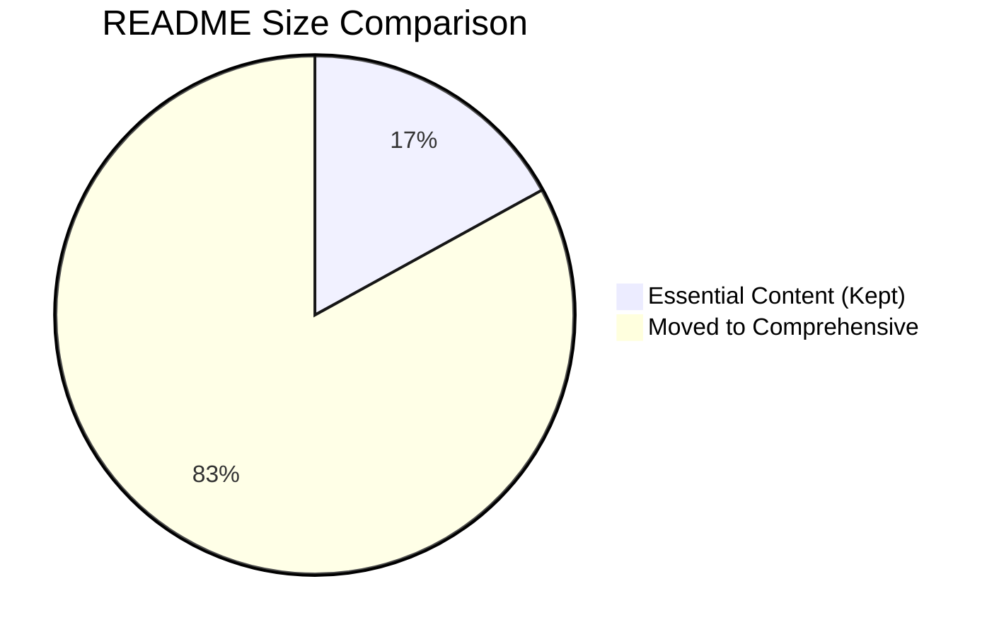
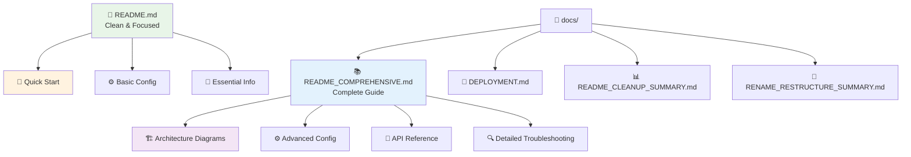

# ✅ README Cleanup Complete

## 📊 Summary

The README has been successfully cleaned and reorganized for better user experience.

### 📏 Size Reduction



- **Before**: 1,411 lines (comprehensive but overwhelming)
- **After**: 249 lines (clean and focused)
- **Reduction**: ~83% smaller while keeping essential information

### 🎯 What's in the New README

#### ✅ **Kept - Essential Information**
- **Quick feature overview** - Key capabilities at a glance
- **Supported formats table** - Clear format support status  
- **Installation steps** - Simple 3-step setup process
- **Basic configuration** - Most common use cases
- **Troubleshooting** - Common issues and solutions
- **Project structure** - High-level organization
- **Contact information** - How to reach maintainers

#### ❌ **Moved - Advanced Content**
- **Comprehensive architecture diagrams** → `docs/README_COMPREHENSIVE.md`
- **Advanced configuration examples** → `config/enhanced_ingestion_examples.yaml`
- **Detailed API reference** → `docs/README_COMPREHENSIVE.md`
- **Extended troubleshooting** → `docs/README_COMPREHENSIVE.md`
- **Development workflows** → `docs/README_COMPREHENSIVE.md`
- **CI/CD examples** → `docs/README_COMPREHENSIVE.md`

### 📚 **New Documentation Structure**



```
README.md                           # ⭐ Clean, user-friendly (249 lines)
├── Quick start guide
├── Essential configuration
└── Basic troubleshooting

docs/
├── README.md                       # 📚 Documentation index
├── README_COMPREHENSIVE.md         # 🔬 Complete technical guide
├── DEPLOYMENT.md                   # 🚀 Deployment strategies  
├── ADDITIONAL_FORMATS_RECOMMENDATION.md
└── ... other technical docs
```

### 🎨 **Improvements Made**

1. **🚀 Faster Onboarding** - Users can get started in minutes
2. **📱 Better Scanning** - Easy to skim for key information
3. **🎯 Focus on Essentials** - Most common use cases covered
4. **📚 Organized Depth** - Advanced topics available but not overwhelming
5. **🔗 Clear Navigation** - Links to detailed docs when needed

### 🔧 **Key Sections in New README**

1. **Features** - Concise bullet points of capabilities
2. **Supported Formats** - Clean table with status indicators
3. **Quick Start** - 3-step installation and setup
4. **Configuration** - Essential options with examples  
5. **Examples** - Common scenarios (AWS, MinIO, Enterprise)
6. **Docker Usage** - Container deployment
7. **Testing** - Verification commands
8. **Troubleshooting** - Most common issues
9. **Project Structure** - High-level overview

### 📈 **User Experience**

**Before**: Overwhelming wall of text that scared new users away
**After**: Clean, scannable guide that gets users productive quickly

### 🎯 **For Different Audiences**

- **👤 New Users**: Main README for quick start
- **👨‍💻 Developers**: `docs/README_COMPREHENSIVE.md` for deep dive
- **🚀 DevOps**: `docs/DEPLOYMENT.md` for production setup
- **🔧 Contributors**: Documentation in `docs/` for development

### ✅ **Ready for GitHub**

The cleaned README is now:
- ✅ **GitHub-optimized** - Perfect length for project overview
- ✅ **Professional** - Clean, organized, easy to scan
- ✅ **Complete** - All essential information included
- ✅ **Scalable** - Advanced docs available but not overwhelming
- ✅ **Maintainable** - Easier to keep updated

## 🎉 Result

A professional, user-friendly README that gets people productive quickly while keeping comprehensive documentation available for those who need it! 🚀
