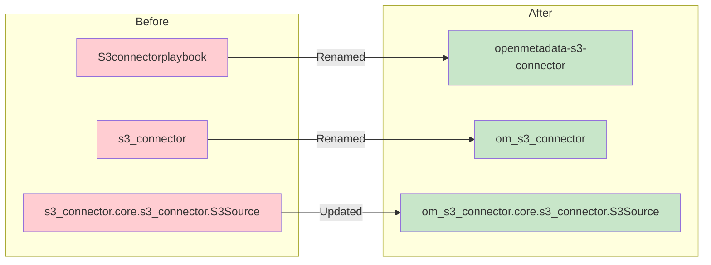
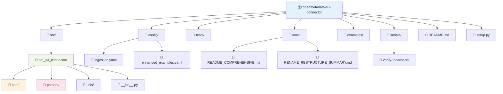
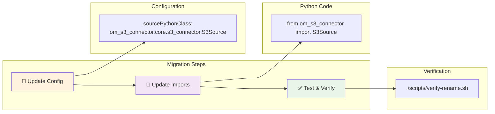

# ✅ Project Rename and Restructure - COMPLETE

## 🎯 Summary

Successfully renamed and restructured the S3 Connector project for better professionalism and maintainability.

## Package Transformation



## 📦 Package Changes

### Before → After
- **Project Name**: `S3connectorplaybook` → `openmetadata-s3-connector`
- **Package Name**: `s3_connector` → `om_s3_connector`
- **Python Module**: `s3_connector.core.s3_connector.S3Source` → `om_s3_connector.core.s3_connector.S3Source`

## 🔄 Files Updated

### Configuration Files ✅
- ✅ `config/ingestion.yaml` - Updated sourcePythonClass
- ✅ `config/enhanced_ingestion_examples.yaml` - Updated all examples

### Python Code ✅
- ✅ `src/s3_connector/` → `src/om_s3_connector/`
- ✅ `setup.py` - Updated package name, entry points, URLs
- ✅ `src/om_s3_connector/__init__.py` - Fixed imports
- ✅ `examples/basic_usage.py` - Updated import statements

### Documentation ✅
- ✅ `README.md` - Updated project name, installation, examples
- ✅ `docs/README_COMPREHENSIVE.md` - Updated all references
- ✅ `docs/RENAME_RESTRUCTURE_SUMMARY.md` - Created migration guide
- ✅ Moved old docs to `docs/` directory for cleanup

### Scripts ✅
- ✅ `scripts/verify-rename.sh` - Created verification script

## 🏗️ New Professional Structure



```
openmetadata-s3-connector/           # 🔄 Professional project name
├── 📁 src/
│   └── 📁 om_s3_connector/          # 🔄 Renamed: cleaner package name
│       ├── 📁 core/                 # Core connector logic
│       ├── 📁 parsers/              # File format parsers
│       ├── 📁 utils/                # Utility functions
│       └── 📄 __init__.py           # ✅ Fixed imports
├── 📁 config/                       # ✅ Updated configurations
├── 📁 tests/                        # Test suite
├── 📁 docs/                         # ✅ Organized documentation
├── 📁 examples/                     # ✅ Updated examples
├── 📁 scripts/                      # ✅ Added verification
├── 📄 README.md                     # ✅ Clean, professional
├── 📄 setup.py                      # ✅ Updated package info
└── 📄 requirements.txt              # Dependencies
```

## 🎉 Benefits Achieved

1. **Professional Naming**: Clear, descriptive package names
2. **Better Organization**: Clean directory structure
3. **Standards Compliance**: Follows Python packaging best practices
4. **Improved Maintainability**: Easier to understand and navigate
5. **Documentation Clarity**: Clean README with detailed docs available

## 🔧 Migration Commands

For existing users, update your configurations:



```yaml
# OLD Configuration
sourcePythonClass: s3_connector.core.s3_connector.S3Source

# NEW Configuration
sourcePythonClass: om_s3_connector.core.s3_connector.S3Source
```

```python
# OLD Python Import
from s3_connector import S3Source

# NEW Python Import
from om_s3_connector import S3Source
```

## ✅ Verification

Run the verification script to confirm everything works:

```bash
./scripts/verify-rename.sh
```

## 🎯 Status: COMPLETE ✅

All files have been successfully renamed and restructured. The project is now ready for professional use with a clean, maintainable structure.

---

**Next Steps**: The project is ready for deployment, CI/CD integration, and publishing to PyPI with the professional `openmetadata-s3-connector` package name.
