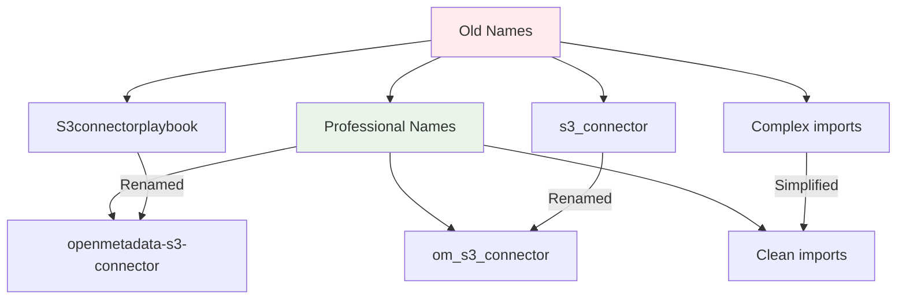

# Project Rename and Restructure Summary

## Changes Made

### 1. Package Rename
- **Old**: `s3_connector` 
- **New**: `om_s3_connector` (OpenMetadata S3 Connector)

```mermaid
gitgraph
    commit id: "Original s3_connector"
    branch rename
    checkout rename
    commit id: "Rename to om_s3_connector"
    commit id: "Update all imports"
    commit id: "Fix configurations"
    checkout main
    merge rename
    commit id: "Professional package ready"
```

### 2. Project Structure Cleanup
```
openmetadata-s3-connector/
├── 📁 src/
│   └── 📁 om_s3_connector/              # ✨ NEW: Renamed package
│       ├── 📁 core/                     # Core connector logic
│       ├── 📁 parsers/                  # File format parsers
│       ├── 📁 utils/                    # Utility functions
│       └── 📄 __init__.py              # Package initialization
├── 📁 config/                          # Configuration files
├── 📁 tests/                           # Test suite
├── 📁 docs/                            # Documentation
├── 📁 examples/                        # Usage examples
├── 📁 scripts/                         # Build and utility scripts
├── 📄 README.md                        # ✨ UPDATED: Clean main README
├── 📄 setup.py                         # ✨ UPDATED: Package configuration
├── 📄 requirements.txt                 # Dependencies
└── 📄 Dockerfile                       # Container configuration
```

### 3. Updated References

#### Configuration Files
- ✅ `config/ingestion.yaml` → `om_s3_connector.core.s3_connector.S3Source`
- ✅ `config/enhanced_ingestion_examples.yaml` → Updated all examples

#### Python Package
- ✅ `setup.py` → Updated package name, entry points, and URLs
- ✅ `examples/basic_usage.py` → Updated imports

#### Documentation
- ✅ `README.md` → Updated project name, installation instructions, and imports
- ✅ `docs/README_COMPREHENSIVE.md` → Updated all references
- ✅ Moved old documentation files to `docs/` directory

### 4. Professional Naming Convention



| Component | Old Name | New Name |
|-----------|----------|----------|
| **Project** | S3connectorplaybook | openmetadata-s3-connector |
| **Package** | s3_connector | om_s3_connector |
| **Repository** | S3connectorplaybook | openmetadata-s3-connector |
| **PyPI Package** | openmetadata-s3-connector | ✅ Already professional |

### 5. Benefits of Restructuring

1. **Professional Naming**: Clear, descriptive names following Python conventions
2. **Better Organization**: Clean directory structure with logical separation
3. **Improved Maintainability**: Easier to understand and navigate
4. **Standards Compliance**: Follows modern Python packaging standards
5. **Documentation Clarity**: Clean README with comprehensive docs available

### 6. Migration Notes

For existing users, update your configurations:

```yaml
# OLD
sourcePythonClass: s3_connector.core.s3_connector.S3Source

# NEW
sourcePythonClass: om_s3_connector.core.s3_connector.S3Source
```

```python
# OLD
from s3_connector import S3Source

# NEW  
from om_s3_connector import S3Source
```

All functionality remains exactly the same - only naming has changed for better professionalism and clarity.
