# 📈 Project Evolution

Complete history of the OpenMetadata S3 Connector project development, restructuring, and improvements.

## Project Timeline


## Development Phases

### Phase 1: Foundation (Initial Development)

#### Objectives
- Establish basic S3 connectivity
- Implement core file parsing
- Create OpenMetadata integration

#### Key Features Implemented
- Basic S3 client connectivity
- CSV and JSON file parsing
- Simple metadata extraction
- OpenMetadata API integration

#### Architecture

```mermaid
graph TD
    User[👤 User] --> Connector[🔌 Basic Connector]
    Connector --> S3[🗄️ S3 Storage]
    Connector --> Parser[🧩 Simple Parser]
    Parser --> OM[📊 OpenMetadata]
    
    style Connector fill:#ffebee
    style Parser fill:#ffebee
```


### Phase 2: Format Expansion

#### Objectives
- Support additional file formats
- Improve parsing reliability
- Add partition detection

#### Key Improvements
- Parquet file support
- Enhanced error handling
- Basic Hive partition detection
- Improved schema inference

#### Architecture Evolution

```mermaid
graph TD
    User[👤 User] --> Connector[🔌 Enhanced Connector]
    Connector --> S3[🗄️ S3 Storage]
    Connector --> Factory[🏭 Parser Factory]
    
    Factory --> CSV[📊 CSV Parser]
    Factory --> JSON[📄 JSON Parser]
    Factory --> Parquet[🗃️ Parquet Parser]
    
    CSV --> OM[📊 OpenMetadata]
    JSON --> OM
    Parquet --> OM
    
    style Factory fill:#fff3e0
```


### Phase 3: Professional Restructuring

#### Objectives
- Modern Python package structure
- Professional naming conventions
- Clean codebase organization

#### Major Changes

```mermaid
graph LR
    subgraph "Before"
        Old[📁 connectors/s3/]
        OldName[s3_connector]
        OldDocs[📄 Mixed Documentation]
    end
    
    subgraph "After"
        New[📁 src/om_s3_connector/]
        NewName[om_s3_connector]
        NewDocs[📚 Organized Documentation]
    end
    
    Old -->|Restructured| New
    OldName -->|Renamed| NewName
    OldDocs -->|Organized| NewDocs
    
    style Old fill:#ffebee
    style New fill:#e8f5e8
```



#### Package Restructuring
- Moved from `connectors/s3/` to `src/om_s3_connector/`
- Renamed package to `om_s3_connector`
- Organized code into `core/`, `parsers/`, `utils/`
- Updated all import paths and references

### Phase 4: Documentation Enhancement

#### Objectives
- Comprehensive documentation
- Visual diagrams and flowcharts
- User-friendly guides

#### Documentation Evolution

```mermaid
graph TD
    Original[📄 Single README] --> Comprehensive[📚 Comprehensive Guide]
    Original --> Clean[📄 Clean README]
    
    Comprehensive --> Architecture[🏗️ Architecture Docs]
    Comprehensive --> Advanced[⚡ Advanced Features]
    
    Clean --> QuickStart[🚀 Quick Start]
    Clean --> BasicConfig[⚙️ Basic Config]
    
    subgraph "Enhanced Documentation"
        Architecture
        Advanced
        QuickStart
        BasicConfig
        Troubleshooting[🔧 Troubleshooting]
        Diagrams[🎨 Mermaid Diagrams]
    end
    
    style Original fill:#ffebee
    style Enhanced fill:#e8f5e8
```


### Phase 5: Format Completion

#### All Supported Formats


#### Parser Architecture

```mermaid
graph TD
    Factory[🏭 Parser Factory] --> Base[🔧 Base Parser]
    
    Base --> Text[📝 Text Parsers]
    Base --> Columnar[🗃️ Columnar Parsers]
    Base --> Office[📋 Office Parsers]
    Base --> Scientific[🔬 Scientific Parsers]
    Base --> Modern[⚡ Modern Parsers]
    
    Text --> CSV[CSV Parser]
    Text --> JSON[JSON Parser]
    Text --> TSV[TSV Parser]
    Text --> JSONL[JSONL Parser]
    
    Columnar --> Parquet[Parquet Parser]
    Columnar --> ORC[ORC Parser]
    Columnar --> Avro[Avro Parser]
    Columnar --> Feather[Feather Parser]
    
    Office --> Excel[Excel Parser]
    
    Scientific --> HDF5[HDF5 Parser]
    Scientific --> Pickle[Pickle Parser]
    
    Modern --> Delta[Delta Parser]
    
    style Factory fill:#e8f5e8
    style Base fill:#e3f2fd
```


## Key Milestones

### Milestone 1: Basic Functionality ✅
- S3 connectivity established
- CSV/JSON parsing working
- OpenMetadata integration complete

### Milestone 2: Format Support ✅
- 15+ file formats supported
- Robust error handling
- Schema inference for all formats

### Milestone 3: Professional Package ✅
- Modern Python package structure
- Professional naming conventions
- Clean, maintainable codebase

### Milestone 4: Production Ready ✅
- Docker containerization
- Comprehensive documentation
- Performance optimization

### Milestone 5: Documentation Excellence ✅
- Restructured documentation
- Visual diagrams and flowcharts
- User and developer guides

## Current Architecture

### Final Architecture Overview

```mermaid
graph TB
    subgraph "User Interface"
        CLI[💻 CLI Interface]
        Docker[🐳 Docker Container]
        K8s[☸️ Kubernetes]
    end
    
    subgraph "Core Engine"
        Source[🔌 S3Source]
        Config[⚙️ Configuration]
        Discovery[🔍 Discovery Engine]
    end
    
    subgraph "Processing Layer"
        Factory[🏭 Parser Factory]
        Parsers[🧩 15+ Parsers]
        Schema[📊 Schema Inference]
    end
    
    subgraph "Data Sources"
        S3[🗄️ AWS S3]
        MinIO[🗄️ MinIO]
        Compatible[🗄️ S3-Compatible]
    end
    
    subgraph "Output"
        OM[📊 OpenMetadata]
        Metadata[🏷️ Rich Metadata]
        Samples[📋 Sample Data]
    end
    
    CLI --> Source
    Docker --> Source
    K8s --> Source
    
    Source --> Config
    Source --> Discovery
    Discovery --> Factory
    
    Factory --> Parsers
    Parsers --> Schema
    
    Discovery --> S3
    Discovery --> MinIO
    Discovery --> Compatible
    
    Schema --> OM
    OM --> Metadata
    OM --> Samples
    
    style Source fill:#e8f5e8
    style Factory fill:#e3f2fd
    style OM fill:#fff3e0
```


## Lessons Learned

### Technical Decisions

1. **Package Structure**: Moving to `src/` layout improved distribution
2. **Parser Factory**: Factory pattern made format support extensible
3. **Error Handling**: Graceful degradation improved reliability
4. **Configuration**: YAML-based config improved usability

### Process Improvements

1. **Documentation-First**: Writing docs before code improved design
2. **Visual Diagrams**: Mermaid diagrams greatly improved understanding
3. **Modular Design**: Separation of concerns made testing easier
4. **Version Control**: Proper branching strategy helped manage changes

## Future Roadmap

### Short Term
- Performance optimization
- Additional authentication methods
- Enhanced error reporting

### Medium Term
- Real-time change detection
- Advanced partitioning strategies
- Custom metadata enrichment

### Long Term
- Multi-cloud support
- Machine learning for schema detection
- Integration with data lineage tools

## Migration Guides

For users upgrading from previous versions:

### From v1.x to v2.x
```yaml
# Old configuration
sourcePythonClass: connectors.s3.s3_connector.S3Source

# New configuration
sourcePythonClass: om_s3_connector.core.s3_connector.S3Source
```

### Import Changes
```python
# Old imports
from connectors.s3.s3_connector import S3Source

# New imports
from om_s3_connector import S3Source
```

## Contributors and Acknowledgments

### Development Team
- **Lead Developer**: Mustapha Fonsau
- **Architecture**: Mustapha Fonsau
- **Documentation**: Mustapha Fonsau

### Community
- OpenMetadata community for feedback
- Python ecosystem for excellent libraries
- S3 ecosystem for compatibility standards

## Related Documents

- 📄 **[Restructuring Steps](RESTRUCTURE_COMPLETE.md)** - Detailed restructuring process
- 🔄 **[Rename Process](RENAME_COMPLETE.md)** - Package renaming details
- 📊 **[Mermaid Diagrams](../reference/mermaid-diagrams.md)** - All project diagrams
- 🏗️ **[Architecture Guide](../developer-guides/architecture.md)** - Technical architecture

---

This evolution represents a journey from a basic proof-of-concept to a production-ready, professionally structured connector that serves as a model for OpenMetadata integrations.
