# 🗂️ Hierarchical Folder Structure Handling

This guide explains how the S3 connector handles complex folder structures and partitioned data.

## 📊 Supported Folder Patterns

```mermaid
graph TB
    subgraph "Hive-style Partitioning"
        Hive[📁 /data/table/year=2024/month=01/day=15/]
        HiveFiles[📄 part-00000.parquet<br/>part-00001.parquet]
    end
    
    subgraph "Date-based Organization"
        Date[📁 /logs/2024/01/15/]
        DateFiles[📄 events.json<br/>metrics.json]
    end
    
    subgraph "Multi-level Grouping"
        Multi[📁 /datasets/region/us-east/type/sales/]
        MultiFiles[📄 quarterly_report.csv<br/>monthly_summary.xlsx]
    end
    
    subgraph "Mixed Structure"
        Mixed[📁 /warehouse/tables/customers/]
        MixedSub[📁 region=US/<br/>region=EU/<br/>raw_data/]
    end
    
    Hive --> HiveFiles
    Date --> DateFiles
    Multi --> MultiFiles
    Mixed --> MixedSub
    
    style Hive fill:#e8f5e8
    style Date fill:#e3f2fd
    style Multi fill:#fff3e0
    style Mixed fill:#f3e5f5
```



## 🏗️ Detection Algorithm

### Pattern Recognition Flow


### Implementation

```python
# src/connectors/s3/parsers/partition_detector.py

import re
from typing import Dict, List, Optional, Tuple
from dataclasses import dataclass
from pathlib import Path

@dataclass
class PartitionInfo:
    """Information about a detected partition"""
    key: str
    value: str
    data_type: str
    path_segment: str

@dataclass
class TableStructure:
    """Logical table structure from file analysis"""
    table_name: str
    base_path: str
    partitions: List[PartitionInfo]
    files: List[str]
    schema_files: List[str]  # Representative files for schema inference

class HierarchicalDetector:
    """Detects and processes hierarchical folder structures"""
    
    def __init__(self):
        self.hive_pattern = re.compile(r'([^/=]+)=([^/]+)')
        self.date_patterns = [
            re.compile(r'year=(\d{4})/month=(\d{1,2})/day=(\d{1,2})'),
            re.compile(r'(\d{4})/(\d{1,2})/(\d{1,2})'),
            re.compile(r'dt=(\d{4}-\d{2}-\d{2})'),
        ]
    
    def analyze_file_structure(self, file_paths: List[str]) -> List[TableStructure]:
        """
        Analyze file paths and group them into logical tables
        """
        # Group files by potential table structure
        path_groups = self._group_by_common_prefix(file_paths)
        
        tables = []
        for base_path, files in path_groups.items():
            table_structure = self._analyze_group(base_path, files)
            if table_structure:
                tables.append(table_structure)
        
        return tables
    
    def _group_by_common_prefix(self, file_paths: List[str]) -> Dict[str, List[str]]:
        """Group files by common directory prefix"""
        groups = {}
        
        for file_path in file_paths:
            # Find the common base directory
            path_parts = file_path.split('/')
            
            # Look for partition patterns to determine table boundaries
            partition_depth = self._find_partition_start_depth(file_path)
            
            if partition_depth > 0:
                base_path = '/'.join(path_parts[:partition_depth])
            else:
                # Use parent directory as base
                base_path = '/'.join(path_parts[:-1])
            
            if base_path not in groups:
                groups[base_path] = []
            groups[base_path].append(file_path)
        
        return groups
    
    def _find_partition_start_depth(self, file_path: str) -> int:
        """Find the depth where partitioning starts"""
        path_parts = file_path.split('/')
        
        for i, part in enumerate(path_parts):
            if self._is_partition_segment(part):
                return i
        
        return len(path_parts) - 1  # Default to parent directory
    
    def _is_partition_segment(self, path_segment: str) -> bool:
        """Check if a path segment represents a partition"""
        # Hive-style partition (key=value)
        if self.hive_pattern.match(path_segment):
            return True
        
        # Date patterns
        for pattern in self.date_patterns:
            if pattern.match(path_segment):
                return True
        
        # Numeric patterns that might be partitions
        if re.match(r'^\d+$', path_segment):  # Pure numeric
            return True
        
        return False
    
    def _analyze_group(self, base_path: str, files: List[str]) -> Optional[TableStructure]:
        """Analyze a group of files to determine table structure"""
        if not files:
            return None
        
        # Extract partition information
        partitions = self._extract_partitions(files)
        
        # Determine table name from base path
        table_name = self._derive_table_name(base_path)
        
        # Select representative files for schema inference
        schema_files = self._select_schema_files(files)
        
        return TableStructure(
            table_name=table_name,
            base_path=base_path,
            partitions=partitions,
            files=files,
            schema_files=schema_files
        )
    
    def _extract_partitions(self, files: List[str]) -> List[PartitionInfo]:
        """Extract partition information from file paths"""
        all_partitions = {}
        
        for file_path in files:
            file_partitions = self._extract_file_partitions(file_path)
            
            for partition in file_partitions:
                key = partition.key
                if key not in all_partitions:
                    all_partitions[key] = {
                        'values': set(),
                        'data_type': partition.data_type,
                        'example_segment': partition.path_segment
                    }
                all_partitions[key]['values'].add(partition.value)
        
        # Convert to list of PartitionInfo
        partitions = []
        for key, info in all_partitions.items():
            partitions.append(PartitionInfo(
                key=key,
                value=f"{len(info['values'])} distinct values",
                data_type=info['data_type'],
                path_segment=info['example_segment']
            ))
        
        return sorted(partitions, key=lambda p: p.key)
    
    def _extract_file_partitions(self, file_path: str) -> List[PartitionInfo]:
        """Extract partitions from a single file path"""
        partitions = []
        path_parts = file_path.split('/')[:-1]  # Exclude filename
        
        for part in path_parts:
            # Hive-style partitions
            hive_match = self.hive_pattern.match(part)
            if hive_match:
                key, value = hive_match.groups()
                data_type = self._infer_partition_data_type(value)
                partitions.append(PartitionInfo(
                    key=key,
                    value=value,
                    data_type=data_type,
                    path_segment=part
                ))
                continue
            
            # Date-based partitions
            for i, pattern in enumerate(self.date_patterns):
                date_match = pattern.match(part)
                if date_match:
                    if i == 0:  # year=YYYY/month=MM/day=DD
                        year, month, day = date_match.groups()
                        partitions.extend([
                            PartitionInfo('year', year, 'INTEGER', f'year={year}'),
                            PartitionInfo('month', month, 'INTEGER', f'month={month}'),
                            PartitionInfo('day', day, 'INTEGER', f'day={day}')
                        ])
                    elif i == 1:  # YYYY/MM/DD
                        year, month, day = date_match.groups()
                        partitions.extend([
                            PartitionInfo('year', year, 'INTEGER', year),
                            PartitionInfo('month', month, 'INTEGER', month),
                            PartitionInfo('day', day, 'INTEGER', day)
                        ])
                    elif i == 2:  # dt=YYYY-MM-DD
                        date_str = date_match.group(1)
                        partitions.append(PartitionInfo(
                            'dt', date_str, 'DATE', part
                        ))
                    break
        
        return partitions
    
    def _infer_partition_data_type(self, value: str) -> str:
        """Infer data type of partition value"""
        # Try integer
        try:
            int(value)
            return 'INTEGER'
        except ValueError:
            pass
        
        # Try float
        try:
            float(value)
            return 'DOUBLE'
        except ValueError:
            pass
        
        # Try date formats
        date_patterns = [
            r'^\d{4}-\d{2}-\d{2}$',  # YYYY-MM-DD
            r'^\d{8}$',               # YYYYMMDD
        ]
        
        for pattern in date_patterns:
            if re.match(pattern, value):
                return 'DATE'
        
        # Default to string
        return 'STRING'
    
    def _derive_table_name(self, base_path: str) -> str:
        """Derive logical table name from base path"""
        # Get the last meaningful directory name
        path_parts = [p for p in base_path.split('/') if p]
        
        if path_parts:
            # Use last directory as table name
            table_name = path_parts[-1]
            
            # Clean up common prefixes/suffixes
            table_name = re.sub(r'^(data|tables?|datasets?)_?', '', table_name)
            table_name = re.sub(r'_?(data|table)$', '', table_name)
            
            return table_name or 'unknown_table'
        
        return 'unknown_table'
    
    def _select_schema_files(self, files: List[str], max_files: int = 3) -> List[str]:
        """Select representative files for schema inference"""
        if len(files) <= max_files:
            return files
        
        # Select files from different partitions if possible
        selected = []
        
        # Group by partition path
        partition_groups = {}
        for file_path in files:
            partition_path = '/'.join(file_path.split('/')[:-1])
            if partition_path not in partition_groups:
                partition_groups[partition_path] = []
            partition_groups[partition_path].append(file_path)
        
        # Select one file from each partition group
        for group_files in partition_groups.values():
            selected.append(group_files[0])
            if len(selected) >= max_files:
                break
        
        return selected[:max_files]
```

## 🔄 Integration with S3 Connector

### Configuration Options

```yaml
# Enhanced configuration for hierarchical structures
source:
  type: customDatabase
  serviceName: "hierarchical-datalake"
  serviceConnection:
    config:
      type: CustomDatabase
      sourcePythonClass: src.connectors.s3.s3_connector.S3Source
      connectionOptions:
        # Standard S3 configuration...
        
        # Hierarchical structure options
        enable_partition_parsing: true
        partition_detection_strategy: "auto"  # auto, hive, date, manual
        max_partition_depth: 5
        
        # Table grouping options
        group_files_by_partition: true
        min_files_per_table: 2
        schema_inference_samples: 3
        
        # Advanced patterns
        custom_partition_patterns:
          - "region=([^/]+)"
          - "environment=([^/]+)"
          - "version=v(\d+)"
        
        # Table naming
        table_name_from_path: true
        table_name_cleanup_patterns:
          - "^data_"
          - "_table$"
```

### Usage in Connector

```python
# src/connectors/s3/s3_connector.py

class S3Source:
    def __init__(self, config):
        self.config = config
        self.hierarchical_detector = HierarchicalDetector()
        self.enable_partitions = config.get('enable_partition_parsing', True)
    
    def process_files(self, file_list: List[str]) -> List[Dict]:
        """Process files with hierarchical structure detection"""
        
        if self.enable_partitions:
            # Group files into logical tables
            table_structures = self.hierarchical_detector.analyze_file_structure(file_list)
            
            entities = []
            for table_structure in table_structures:
                entity = self._create_table_entity(table_structure)
                entities.append(entity)
            
            return entities
        else:
            # Process files individually
            return [self._create_file_entity(f) for f in file_list]
    
    def _create_table_entity(self, table_structure: TableStructure) -> Dict:
        """Create OpenMetadata table entity from table structure"""
        
        # Infer schema from representative files
        combined_schema = self._infer_combined_schema(table_structure.schema_files)
        
        # Add partition columns to schema
        for partition in table_structure.partitions:
            combined_schema['columns'].append({
                'name': partition.key,
                'dataType': partition.data_type,
                'description': f'Partition column: {partition.value}',
                'tags': ['partition']
            })
        
        # Create table entity
        table_entity = {
            'name': table_structure.table_name,
            'displayName': table_structure.table_name.replace('_', ' ').title(),
            'description': f'Partitioned table with {len(table_structure.files)} files',
            'tableType': 'External',
            'columns': combined_schema['columns'],
            'partitions': [
                {
                    'name': p.key,
                    'intervalType': self._get_interval_type(p.data_type),
                    'description': f'Partition by {p.key}'
                }
                for p in table_structure.partitions
            ],
            'location': table_structure.base_path,
            'customProperties': {
                'file_count': len(table_structure.files),
                'partition_count': len(table_structure.partitions),
                'file_formats': list(set(f.split('.')[-1] for f in table_structure.files))
            }
        }
        
        return table_entity
```

## 📊 Advanced Pattern Examples

### Complex Hive Partitioning

```
/warehouse/sales_data/
├── year=2023/
│   ├── quarter=Q1/
│   │   ├── region=US/
│   │   │   ├── 001.parquet
│   │   │   └── 002.parquet
│   │   └── region=EU/
│   │       ├── 001.parquet
│   │       └── 002.parquet
│   └── quarter=Q2/
└── year=2024/
```

**Detected Structure:**
- Table: `sales_data`
- Partitions: `year` (INTEGER), `quarter` (STRING), `region` (STRING)
- Files: 8 parquet files across partitions

### Date-based Organization

```
/logs/application/
├── 2024/
│   ├── 01/
│   │   ├── 01/
│   │   │   ├── app.log
│   │   │   └── error.log
│   │   └── 02/
│   └── 02/
└── 2023/
```

**Detected Structure:**
- Table: `application_logs`
- Partitions: `year` (INTEGER), `month` (INTEGER), `day` (INTEGER)
- Files: Log files organized by date

### Mixed Structure

```mermaid
graph TB
    subgraph "Complex Dataset Structure"
        Root[📁 /data_lake/]
        
        subgraph "Customer Data"
            Customers[📁 customers/]
            CustRaw[📁 raw/]
            CustProc[📁 processed/region=US/]
            CustFiles[📄 customer_001.json<br/>customer_002.json]
        end
        
        subgraph "Sales Data"
            Sales[📁 sales/]
            SalesYear[📁 year=2024/]
            SalesMonth[📁 month=01/]
            SalesFiles[📄 sales_001.parquet<br/>sales_002.parquet]
        end
        
        subgraph "Events"
            Events[📁 events/]
            EventDate[📁 dt=2024-01-15/]
            EventHour[📁 hour=10/]
            EventFiles[📄 events.json]
        end
        
        Root --> Customers
        Root --> Sales  
        Root --> Events
        
        Customers --> CustRaw
        Customers --> CustProc
        CustProc --> CustFiles
        
        Sales --> SalesYear
        SalesYear --> SalesMonth
        SalesMonth --> SalesFiles
        
        Events --> EventDate
        EventDate --> EventHour
        EventHour --> EventFiles
    end
    
    style Root fill:#e8f5e8
    style Customers fill:#e3f2fd
    style Sales fill:#fff3e0
    style Events fill:#f3e5f5
```

## 🧪 Testing Hierarchical Detection

```python
# tests/test_hierarchical_detection.py

def test_hive_partitioning():
    """Test Hive-style partition detection"""
    file_paths = [
        "/data/sales/year=2024/month=01/region=US/data.parquet",
        "/data/sales/year=2024/month=01/region=EU/data.parquet",
        "/data/sales/year=2024/month=02/region=US/data.parquet",
    ]
    
    detector = HierarchicalDetector()
    tables = detector.analyze_file_structure(file_paths)
    
    assert len(tables) == 1
    table = tables[0]
    assert table.table_name == "sales"
    assert len(table.partitions) == 3  # year, month, region
    
    partition_keys = [p.key for p in table.partitions]
    assert 'year' in partition_keys
    assert 'month' in partition_keys
    assert 'region' in partition_keys

def test_date_based_partitioning():
    """Test date-based folder structure"""
    file_paths = [
        "/logs/app/2024/01/15/events.json",
        "/logs/app/2024/01/16/events.json",
        "/logs/app/2024/02/01/events.json",
    ]
    
    detector = HierarchicalDetector()
    tables = detector.analyze_file_structure(file_paths)
    
    assert len(tables) == 1
    table = tables[0]
    assert table.table_name == "app"
    
    # Should detect year, month, day partitions
    partition_keys = [p.key for p in table.partitions]
    assert 'year' in partition_keys
    assert 'month' in partition_keys
    assert 'day' in partition_keys

def test_mixed_structure():
    """Test mixed file structure"""
    file_paths = [
        "/warehouse/customers/raw/customer1.json",
        "/warehouse/customers/raw/customer2.json",
        "/warehouse/sales/year=2024/month=01/sales.parquet",
        "/warehouse/sales/year=2024/month=02/sales.parquet",
    ]
    
    detector = HierarchicalDetector()
    tables = detector.analyze_file_structure(file_paths)
    
    # Should detect 2 separate tables
    assert len(tables) == 2
    
    table_names = [t.table_name for t in tables]
    assert 'customers' in table_names
    assert 'sales' in table_names
```

## 📈 Performance Considerations

### Optimization Strategies

```mermaid
graph LR
    subgraph "Performance Optimization"
        Lazy[⚡ Lazy Loading]
        Cache[🗄️ Path Caching]
        Parallel[📊 Parallel Analysis]
        Sample[🎯 Smart Sampling]
    end
    
    subgraph "Implementation"
        Iterator[File Iterator]
        LRU[LRU Cache]
        ThreadPool[Thread Pool]
        Adaptive[Adaptive Sample Size]
    end
    
    Lazy --> Iterator
    Cache --> LRU
    Parallel --> ThreadPool
    Sample --> Adaptive
    
    style Lazy fill:#e8f5e8
    style Cache fill:#e3f2fd
```



### Efficient Path Processing

```python
def process_large_directory_structure(self, bucket: str, prefix: str = "") -> List[TableStructure]:
    """Efficiently process large directory structures"""
    
    # Use pagination to handle large buckets
    paginator = self.s3_client.get_paginator('list_objects_v2')
    
    file_paths = []
    processed_prefixes = set()
    
    for page in paginator.paginate(Bucket=bucket, Prefix=prefix):
        if 'Contents' not in page:
            continue
        
        for obj in page['Contents']:
            file_path = obj['Key']
            
            # Skip already processed directory trees
            dir_path = '/'.join(file_path.split('/')[:-1])
            if any(dir_path.startswith(p) for p in processed_prefixes):
                continue
            
            file_paths.append(file_path)
            
            # Early detection of table structure
            if len(file_paths) % 1000 == 0:
                partial_tables = self.analyze_file_structure(file_paths[-1000:])
                for table in partial_tables:
                    processed_prefixes.add(table.base_path)
    
    return self.analyze_file_structure(file_paths)
```

## 📚 Next Steps

- [Configuration Guide](../user-guides/configuration.md) - Detailed configuration options
- [Architecture Overview](architecture.md) - Understanding the connector architecture
- [Performance Tuning](performance-tuning.md) - Optimization techniques
