# 🎨 Mermaid Diagrams Added - Complete Summary

## ✅ Overview

Successfully enhanced all markdown documentation files with professional Mermaid diagrams to improve visual understanding and user experience.

## 📊 Diagrams Added by File

### 1. **README.md** (Main)

```mermaid
graph LR
    A[📄 README.md] --> B[🏗️ Architecture Overview]
    A --> C[🧠 Supported File Formats Mindmap]
    A --> D[🔄 Ingestion Workflow Sequence]
```

**Added Diagrams:**
- **Architecture Overview**: Complete system flow from S3 to OpenMetadata
- **File Formats Mindmap**: Visual categorization of supported formats
- **Ingestion Workflow**: Step-by-step sequence diagram

### 2. **RENAME_COMPLETE.md**

```mermaid
graph LR
    A[📄 RENAME_COMPLETE.md] --> B[🔄 Package Transformation]
    A --> C[📁 Project Structure Tree]
    A --> D[🚀 Migration Workflow]
```

**Added Diagrams:**
- **Package Transformation**: Before/after rename visualization
- **Project Structure**: Interactive directory tree
- **Migration Workflow**: Step-by-step migration process

### 3. **docs/RENAME_RESTRUCTURE_SUMMARY.md**

```mermaid
graph LR
    A[📄 RENAME_RESTRUCTURE_SUMMARY.md] --> B[📈 Git History Flow]
    A --> C[🏷️ Naming Convention Flow]
```

**Added Diagrams:**
- **Git History**: Gitgraph showing rename process
- **Naming Convention**: Old vs new name comparison

### 4. **docs/README_COMPREHENSIVE.md**

```mermaid
graph LR
    A[📄 README_COMPREHENSIVE.md] --> B[🎯 File Formats Graph]
```

**Added Diagrams:**
- **Comprehensive File Formats**: Detailed format categorization with connections

### 5. **docs/README_CLEANUP_SUMMARY.md**

```mermaid
graph LR
    A[📄 README_CLEANUP_SUMMARY.md] --> B[📊 Size Reduction Pie Chart]
    A --> C[📚 Documentation Structure Tree]
```

**Added Diagrams:**
- **Size Reduction**: Pie chart showing content distribution
- **Documentation Structure**: Multi-level documentation organization

### 6. **docs/README.md** (Documentation Index)

```mermaid
graph LR
    A[📄 docs/README.md] --> B[🗺️ Documentation Map]
    A --> C[🧠 Standards Mindmap]
```

**Added Diagrams:**
- **Documentation Map**: User journey through documentation
- **Standards Mindmap**: Documentation quality standards

### 7. **config/README.md**

```mermaid
graph LR
    A[📄 config/README.md] --> B[⚙️ Configuration Flow]
```

**Added Diagrams:**
- **Configuration Flow**: Environment selection and customization process

## 🎯 Diagram Types Used

### **Flow Charts** 🌊
- Architecture overviews
- Process workflows
- System connections

### **Mind Maps** 🧠  
- File format categorization
- Documentation standards
- Feature groupings

### **Sequence Diagrams** 📋
- Step-by-step processes
- User interactions
- System communications

### **Pie Charts** 📊
- Data distribution
- Size comparisons
- Percentage breakdowns

### **Git Graphs** 📈
- Version history
- Branching strategies
- Development flow

### **Tree Diagrams** 🌳
- Directory structures
- Hierarchical data
- Navigation flows

## 🎨 Visual Design Principles

### **Color Coding**

```mermaid
graph LR
    Blue[🔵 Blue - Systems] 
    Green[🟢 Green - Success/Ready]
    Orange[🟠 Orange - Processing]
    Pink[🟣 Pink - Features]
    Red[🔴 Red - Warnings/Old]
    
    style Blue fill:#e3f2fd
    style Green fill:#e8f5e8
    style Orange fill:#fff3e0
    style Pink fill:#f3e5f5
    style Red fill:#ffebee
```

### **Icon Usage**
- 📄 Files and documents
- 🗄️ Storage systems
- 🔧 Tools and utilities
- 🚀 Deployment and production
- 👁️ User interfaces
- 🧠 Intelligence and processing

## 📈 Benefits Achieved

### **Improved Understanding** 🎯
- Complex concepts visualized
- Clear process flows
- Better mental models

### **Professional Appearance** ✨
- Modern, clean diagrams
- Consistent styling
- Publication-ready quality

### **Better Navigation** 🧭
- Visual documentation map
- Clear user journeys
- Logical information flow

### **Enhanced User Experience** 👥
- Faster comprehension
- Reduced cognitive load
- More engaging content

## 🎉 Impact Summary

```mermaid
graph TD
    Before[📝 Text-Only Documentation] --> After[🎨 Visual Documentation]
    
    Before --> A1[Harder to understand]
    Before --> A2[Less engaging]
    Before --> A3[More time to process]
    
    After --> B1[Clear visual flow]
    After --> B2[Professional appearance]
    After --> B3[Faster comprehension]
    
    style Before fill:#ffebee
    style After fill:#e8f5e8
    style A1 fill:#ffcdd2
    style A2 fill:#ffcdd2
    style A3 fill:#ffcdd2
    style B1 fill:#c8e6c9
    style B2 fill:#c8e6c9
    style B3 fill:#c8e6c9
```

## ✅ Status: COMPLETE

All markdown files now include professional Mermaid diagrams that enhance understanding, improve visual appeal, and provide better user experience. The documentation is now publication-ready with modern, engaging visuals.

---

**Total Diagrams Added**: 12+ across 7 files
**File Types Enhanced**: README files, documentation guides, configuration docs
**Visual Impact**: Transformed text-heavy documentation into engaging, visual content
