# 🧩 Complete Mermaid Diagrams Reference

This document provides a comprehensive reference for all Mermaid diagrams used throughout the OpenMetadata S3 Connector project documentation.

## 📊 Diagram Categories


## 🏗️ Architecture Diagrams

### System Architecture Overview

```mermaid
graph TB
    subgraph "S3/MinIO Storage"
        S3[🗄️ S3 Bucket]
        Files[📄 Data Files<br/>CSV, JSON, Parquet, etc.]
        Partitions[🗂️ Partitioned Data<br/>region=US/year=2024/]
    end
    
    subgraph "OpenMetadata S3 Connector"
        Disco[🔍 File Discovery]
        Parse[🧩 Format Detection]
        Schema[📊 Schema Inference]
        Part[🗃️ Partition Grouping]
    end
    
    subgraph "OpenMetadata Platform"
        API[🔌 OpenMetadata API]
        UI[👁️ Web Interface]
        Meta[🏷️ Metadata Store]
    end
    
    S3 --> Disco
    Files --> Parse
    Partitions --> Part
    
    Disco --> Parse
    Parse --> Schema
    Schema --> Part
    Part --> API
    
    API --> Meta
    API --> UI
    
    style S3 fill:#e1f5fe
    style API fill:#e8f5e8
    style UI fill:#f3e5f5
```

**Usage**: Main README.md, Architecture Guide
**Purpose**: Shows complete system flow from data source to metadata platform

### Component Architecture

```mermaid
graph TB
    subgraph "Core Components"
        Connector[🔌 S3 Connector]
        Factory[🏭 Parser Factory]
        Discovery[🔍 File Discovery]
        Config[⚙️ Configuration]
    end
    
    subgraph "Parser Layer"
        TextParsers[📝 Text Parsers]
        ColumnarParsers[🗃️ Columnar Parsers]
        OfficeParsers[📋 Office Parsers]
        ScientificParsers[🔬 Scientific Parsers]
        ModernParsers[⚡ Modern Parsers]
    end
    
    subgraph "Processing Pipeline"
        SchemaInference[📊 Schema Inference]
        SampleExtraction[📋 Sample Extraction]
        MetadataBuilder[🏗️ Metadata Builder]
        EntityCreator[🎯 Entity Creator]
    end
    
    subgraph "Output Layer"
        OpenMetadataAPI[🔌 OpenMetadata API]
        Validation[✅ Validation]
        ErrorHandling[❌ Error Handling]
    end
    
    Connector --> Factory
    Factory --> Discovery
    Discovery --> Config
    
    Factory --> TextParsers
    Factory --> ColumnarParsers
    Factory --> OfficeParsers
    Factory --> ScientificParsers
    Factory --> ModernParsers
    
    TextParsers --> SchemaInference
    ColumnarParsers --> SchemaInference
    OfficeParsers --> SchemaInference
    ScientificParsers --> SchemaInference
    ModernParsers --> SchemaInference
    
    SchemaInference --> SampleExtraction
    SampleExtraction --> MetadataBuilder
    MetadataBuilder --> EntityCreator
    
    EntityCreator --> OpenMetadataAPI
    EntityCreator --> Validation
    EntityCreator --> ErrorHandling
    
    style Connector fill:#e8f5e8
    style Factory fill:#e3f2fd
    style SchemaInference fill:#fff3e0
    style OpenMetadataAPI fill:#f3e5f5
```

**Usage**: Developer guides, Architecture documentation
**Purpose**: Detailed component interaction and processing flow

## 📊 File Format Diagrams

### File Format Categories

```mermaid
graph TD
    Connector[🔌 S3 Connector] --> Text[📝 Text Formats]
    Connector --> Columnar[🗃️ Columnar Formats]
    Connector --> Office[📋 Office Formats]
    Connector --> Scientific[🔬 Scientific Formats]
    Connector --> Modern[⚡ Modern Formats]
    
    Text --> CSV[📊 CSV]
    Text --> TSV[📊 TSV]
    Text --> JSON[📄 JSON]
    Text --> JSONL[📄 JSONL]
    
    Columnar --> Parquet[🗃️ Parquet]
    Columnar --> ORC[🗃️ ORC]
    Columnar --> Avro[🗃️ Avro]
    Columnar --> Feather[🗃️ Feather]
    
    Office --> Excel[📋 Excel XLSX]
    Office --> ExcelLegacy[📋 Excel XLS]
    
    Scientific --> HDF5[🔬 HDF5]
    Scientific --> Pickle[🔬 Pickle]
    
    Modern --> Delta[⚡ Delta Lake]
    
    style Connector fill:#e8f5e8
    style Text fill:#e3f2fd
    style Columnar fill:#fff3e0
    style Office fill:#f3e5f5
    style Scientific fill:#e8f5e8
    style Modern fill:#fce4ec
```

**Usage**: Main README, Supported Formats reference
**Purpose**: Visual categorization of all supported file formats

### Format Processing Pipeline

```mermaid
sequenceDiagram
    participant File as 📄 Data File
    participant Detector as 🔍 Format Detector
    participant Factory as 🏭 Parser Factory
    participant Parser as 🧩 Format Parser
    participant Schema as 📊 Schema Builder
    participant Sample as 📋 Sample Extractor
    participant Metadata as 🏗️ Metadata Builder
    participant API as 🔌 OpenMetadata API
    
    File->>Detector: File path & content
    Detector->>Detector: Analyze extension & magic bytes
    Detector->>Factory: Request parser for format
    Factory->>Parser: Create format-specific parser
    
    Parser->>Schema: Parse schema information
    Parser->>Sample: Extract sample data
    Schema->>Metadata: Schema definition
    Sample->>Metadata: Sample rows
    
    Metadata->>API: Create table entity
    API->>API: Validate & store metadata
    
    Note over File,API: Format-specific optimizations<br/>applied at each step
```

**Usage**: Developer guides, Format documentation
**Purpose**: Shows how different formats are processed through the pipeline

### Format Feature Matrix

```mermaid
graph LR
    subgraph "Format Capabilities"
        CSV[📊 CSV<br/>✅ Schema ❌ Nested<br/>❌ Compression ✅ Partitions]
        JSON[📄 JSON<br/>✅ Schema ✅ Nested<br/>❌ Compression ✅ Partitions]
        Parquet[📦 Parquet<br/>✅ Schema ✅ Nested<br/>✅ Compression ✅ Partitions]
        Excel[📋 Excel<br/>✅ Schema ❌ Nested<br/>✅ Compression ✅ Sheets]
        Delta[⚡ Delta<br/>✅ Schema ✅ Nested<br/>✅ Compression ✅ ACID]
    end
    
    subgraph "Performance Levels"
        Fast[⚡ Fast<br/>Feather, Parquet]
        Medium[🚀 Medium<br/>ORC, Avro, HDF5]
        Slow[🐌 Slower<br/>CSV, JSON, Excel]
    end
    
    CSV --> Slow
    JSON --> Slow
    Parquet --> Fast
    Excel --> Slow
    Delta --> Medium
    
    style Fast fill:#e8f5e8
    style Medium fill:#fff3e0
    style Slow fill:#ffebee
```

**Usage**: Format reference, Performance guides
**Purpose**: Quick comparison of format capabilities and performance

## 🔄 Workflow Diagrams

### Ingestion Workflow


**Usage**: Main README, Quick start guide
**Purpose**: Shows step-by-step ingestion process

### Deployment Workflow

```mermaid
graph TB
    subgraph "Development"
        Code[💻 Code Development]
        Test[🧪 Local Testing]
        Build[🔨 Build Package]
    end
    
    subgraph "CI/CD Pipeline"
        CI[🔄 Continuous Integration]
        Docker[🐳 Docker Build]
        Registry[📦 Container Registry]
    end
    
    subgraph "Deployment Targets"
        Local[🖥️ Local Environment]
        K8s[☸️ Kubernetes]
        Cloud[☁️ Cloud Services]
    end
    
    Code --> Test
    Test --> Build
    Build --> CI
    
    CI --> Docker
    Docker --> Registry
    
    Registry --> Local
    Registry --> K8s
    Registry --> Cloud
    
    style Code fill:#e8f5e8
    style CI fill:#e3f2fd
    style K8s fill:#fff3e0
```

**Usage**: Deployment guide, DevOps documentation
**Purpose**: Shows deployment pipeline and target environments

### Error Handling Flow

```mermaid
graph TB
    subgraph "Error Detection"
        FileError[📄 File Access Error]
        ParseError[🧩 Parse Error]
        SchemaError[📊 Schema Error]
        APIError[🔌 API Error]
    end
    
    subgraph "Error Processing"
        Logger[📝 Error Logger]
        Classifier[🏷️ Error Classifier]
        Handler[🔧 Error Handler]
    end
    
    subgraph "Error Recovery"
        Retry[🔄 Retry Logic]
        Skip[⏭️ Skip File]
        Fallback[🔄 Fallback Parser]
        Abort[❌ Abort Process]
    end
    
    subgraph "User Feedback"
        Notification[📧 Notification]
        Report[📋 Error Report]
        Dashboard[📊 Error Dashboard]
    end
    
    FileError --> Logger
    ParseError --> Logger
    SchemaError --> Logger
    APIError --> Logger
    
    Logger --> Classifier
    Classifier --> Handler
    
    Handler --> Retry
    Handler --> Skip
    Handler --> Fallback
    Handler --> Abort
    
    Retry --> Notification
    Skip --> Report
    Fallback --> Report
    Abort --> Dashboard
    
    style FileError fill:#ffebee
    style Logger fill:#fff3e0
    style Retry fill:#e8f5e8
    style Notification fill:#e3f2fd
```

**Usage**: Troubleshooting guide, Error handling documentation
**Purpose**: Shows comprehensive error handling strategy

## 🗂️ Data Structure Diagrams

### Hierarchical Folder Detection

```mermaid
graph TB
    subgraph "Hive-style Partitioning"
        Hive[📁 /data/table/year=2024/month=01/day=15/]
        HiveFiles[📄 part-00000.parquet<br/>part-00001.parquet]
    end
    
    subgraph "Date-based Organization"
        Date[📁 /logs/2024/01/15/]
        DateFiles[📄 events.json<br/>metrics.json]
    end
    
    subgraph "Multi-level Grouping"
        Multi[📁 /datasets/region/us-east/type/sales/]
        MultiFiles[📄 quarterly_report.csv<br/>monthly_summary.xlsx]
    end
    
    subgraph "Mixed Structure"
        Mixed[📁 /warehouse/tables/customers/]
        MixedSub[📁 region=US/<br/>region=EU/<br/>raw_data/]
    end
    
    Hive --> HiveFiles
    Date --> DateFiles
    Multi --> MultiFiles
    Mixed --> MixedSub
    
    style Hive fill:#e8f5e8
    style Date fill:#e3f2fd
    style Multi fill:#fff3e0
    style Mixed fill:#f3e5f5
```

**Usage**: Hierarchical folders reference, Advanced configuration
**Purpose**: Shows different folder structure patterns supported

### Schema Evolution Timeline

```mermaid
gitgraph
    commit id: "Initial Schema"
    commit id: "Add customer_id"
    branch feature-address
    commit id: "Add address fields"
    commit id: "Normalize address"
    checkout main
    merge feature-address
    commit id: "Add phone number"
    branch feature-preferences
    commit id: "Add preferences"
    checkout main
    commit id: "Remove deprecated field"
    merge feature-preferences
    commit id: "Current Schema"
```

**Usage**: Schema evolution documentation, Version management
**Purpose**: Shows how schemas evolve over time

## 📈 Performance Diagrams

### Processing Performance

```mermaid
graph LR
    subgraph "File Size Impact"
        Small[📄 Small Files<br/>< 10MB]
        Medium[📄 Medium Files<br/>10MB - 1GB]
        Large[📄 Large Files<br/>> 1GB]
    end
    
    subgraph "Processing Strategy"
        InMemory[💾 In-Memory<br/>Fast Processing]
        Streaming[🌊 Streaming<br/>Memory Efficient]
        Chunked[🧩 Chunked<br/>Balanced Approach]
    end
    
    subgraph "Performance Result"
        FastResult[⚡ Fast<br/>< 1 second]
        MediumResult[🚀 Medium<br/>1-30 seconds]
        SlowResult[🐌 Slow<br/>> 30 seconds]
    end
    
    Small --> InMemory --> FastResult
    Medium --> Chunked --> MediumResult
    Large --> Streaming --> SlowResult
    
    style Small fill:#e8f5e8
    style InMemory fill:#e3f2fd
    style FastResult fill:#c8e6c9
```

**Usage**: Performance tuning guide, Optimization documentation
**Purpose**: Shows relationship between file size and processing strategy

### Memory Usage Patterns


**Usage**: Performance analysis, Resource planning
**Purpose**: Shows relative memory consumption by format

## 🚀 Project Management Diagrams

### Documentation Structure

```mermaid
graph TD
    Start[👋 New User] --> Quick[🚀 Quick Start Guide]
    Start --> Main[📄 Main README]
    
    Quick --> UserGuides[📖 User Guides]
    Main --> UserGuides
    
    UserGuides --> Config[⚙️ Configuration]
    UserGuides --> Comprehensive[📚 Comprehensive Guide]
    UserGuides --> Troubleshoot[🔧 Troubleshooting]
    
    Main --> DevGuides[👨‍💻 Developer Guides]
    DevGuides --> Architecture[🏗️ Architecture]
    DevGuides --> AddFormats[➕ Adding Formats]
    
    Main --> Deploy[🚀 Deployment]
    Deploy --> DeployGuide[📋 Deployment Guide]
    Deploy --> README[📄 Installation Notes]
    
    Main --> Reference[📚 Reference]
    Reference --> Formats[📊 Supported Formats]
    Reference --> Hierarchical[🗂️ Hierarchical Folders]
    Reference --> Mermaid[🧩 Mermaid Diagrams]
    
    Main --> History[📜 Project History]
    History --> Evolution[🔄 Project Evolution]
    History --> Restructure[📝 Restructure Plans]
    History --> Cleanup[🧹 Cleanup Summaries]
    
    style Start fill:#e8f5e8
    style UserGuides fill:#e3f2fd
    style DevGuides fill:#fff3e0
    style Deploy fill:#f3e5f5
    style Reference fill:#e1f5fe
    style History fill:#fce4ec
```

**Usage**: Documentation index, Navigation help
**Purpose**: Shows complete documentation organization

### Project Evolution Timeline


**Usage**: Project history, Evolution documentation
**Purpose**: Shows development milestones and feature additions

## 🎨 Diagram Style Guide

### Color Scheme

| Category | Color | Usage |
|----------|-------|-------|
| **Primary** | `#e8f5e8` | Main components, start points |
| **Secondary** | `#e3f2fd` | Processing steps, pipelines |
| **Accent** | `#fff3e0` | Results, outputs |
| **Warning** | `#ffebee` | Errors, warnings |
| **Info** | `#e1f5fe` | Information, references |
| **Success** | `#c8e6c9` | Successful outcomes |

### Icon Conventions

| Icon | Meaning | Usage |
|------|---------|-------|
| 🔌 | Connector/Integration | System connections |
| 📄 | File/Document | Data files, documents |
| 🏗️ | Architecture/Structure | System design |
| 🧩 | Parser/Component | Processing components |
| 📊 | Data/Analytics | Data processing, statistics |
| ⚡ | Performance/Speed | Fast operations |
| 🔧 | Configuration/Tools | Settings, utilities |
| 📚 | Documentation/Reference | Guides, manuals |
| 🚀 | Deployment/Launch | Production deployment |
| ❌ | Error/Failure | Error conditions |
| ✅ | Success/Complete | Successful operations |

### Diagram Types Used

1. **Flowcharts** - Process flows, decision trees
2. **Sequence Diagrams** - Time-based interactions
3. **Mind Maps** - Hierarchical categorization
4. **Pie Charts** - Statistical distributions
5. **Git Graphs** - Version control history
6. **Timelines** - Project evolution
7. **Architecture Diagrams** - System design

## 📊 Usage Statistics


- **Total Diagrams**: 25+ across all documentation
- **Most Used Type**: Flowcharts (40%)
- **Interactive Elements**: All diagrams support click navigation
- **Responsive Design**: Diagrams scale across devices

## 🔗 Quick Navigation

### By Document Type

- **User Guides**: Architecture, workflow, and process diagrams
- **Developer Guides**: Component, technical, and implementation diagrams  
- **Reference**: Format comparison, feature matrix, performance charts
- **Deployment**: Infrastructure, pipeline, and environment diagrams

### By Complexity Level

- **Beginner**: Simple flowcharts, basic architecture
- **Intermediate**: Detailed workflows, component interactions
- **Advanced**: Technical internals, performance analysis, optimization

---

## 📚 Related Documentation

- [Supported Formats](supported-formats.md) - Complete format documentation
- [Architecture Guide](../developer-guides/architecture.md) - System architecture details
- [Quick Start Guide](../user-guides/quick-start.md) - Getting started with diagrams
- [Deployment Guide](../deployment/deployment-guide.md) - Infrastructure diagrams

**Added Diagrams:**
- **Comprehensive File Formats**: Detailed format categorization with connections

### 5. **docs/README_CLEANUP_SUMMARY.md**


**Added Diagrams:**
- **Size Reduction**: Pie chart showing content distribution
- **Documentation Structure**: Multi-level documentation organization

### 6. **docs/README.md** (Documentation Index)
```mermaid
graph LR
    A[📄 docs/README.md] --> B[🗺️ Documentation Map]
    A --> C[🧠 Standards Mindmap]
```

**Added Diagrams:**
- **Documentation Map**: User journey through documentation
- **Standards Mindmap**: Documentation quality standards

### 7. **config/README.md**


**Added Diagrams:**
- **Configuration Flow**: Environment selection and customization process

## 🎯 Diagram Types Used

### **Flow Charts** 🌊
- Architecture overviews
- Process workflows
- System connections

### **Mind Maps** 🧠  
- File format categorization
- Documentation standards
- Feature groupings

### **Sequence Diagrams** 📋
- Step-by-step processes
- User interactions
- System communications

### **Pie Charts** 📊
- Data distribution
- Size comparisons
- Percentage breakdowns

### **Git Graphs** 📈
- Version history
- Branching strategies
- Development flow

### **Tree Diagrams** 🌳
- Directory structures
- Hierarchical data
- Navigation flows

## 🎨 Visual Design Principles

### **Color Coding**
```mermaid
graph LR
    Blue[🔵 Blue - Systems] 
    Green[🟢 Green - Success/Ready]
    Orange[🟠 Orange - Processing]
    Pink[🟣 Pink - Features]
    Red[🔴 Red - Warnings/Old]
    
    style Blue fill:#e3f2fd
    style Green fill:#e8f5e8
    style Orange fill:#fff3e0
    style Pink fill:#f3e5f5
    style Red fill:#ffebee
```

### **Icon Usage**
- 📄 Files and documents
- 🗄️ Storage systems
- 🔧 Tools and utilities
- 🚀 Deployment and production
- 👁️ User interfaces
- 🧠 Intelligence and processing

## 📈 Benefits Achieved

### **Improved Understanding** 🎯
- Complex concepts visualized
- Clear process flows
- Better mental models

### **Professional Appearance** ✨
- Modern, clean diagrams
- Consistent styling
- Publication-ready quality

### **Better Navigation** 🧭
- Visual documentation map
- Clear user journeys
- Logical information flow

### **Enhanced User Experience** 👥
- Faster comprehension
- Reduced cognitive load
- More engaging content

## 🎉 Impact Summary

```mermaid
graph TD
    Before[📝 Text-Only Documentation] --> After[🎨 Visual Documentation]
    
    Before --> A1[Harder to understand]
    Before --> A2[Less engaging]
    Before --> A3[More time to process]
    
    After --> B1[Clear visual flow]
    After --> B2[Professional appearance]
    After --> B3[Faster comprehension]
    
    style Before fill:#ffebee
    style After fill:#e8f5e8
    style A1 fill:#ffcdd2
    style A2 fill:#ffcdd2
    style A3 fill:#ffcdd2
    style B1 fill:#c8e6c9
    style B2 fill:#c8e6c9
    style B3 fill:#c8e6c9
```

## ✅ Status: COMPLETE

All markdown files now include professional Mermaid diagrams that enhance understanding, improve visual appeal, and provide better user experience. The documentation is now publication-ready with modern, engaging visuals.

---

**Total Diagrams Added**: 12+ across 7 files
**File Types Enhanced**: README files, documentation guides, configuration docs
**Visual Impact**: Transformed text-heavy documentation into engaging, visual content
