# 🔐 Security & Authentication Guide

Comprehensive guide for authentication methods and Role-Based Access Control (RBAC) integration with OpenMetadata.

## 🏛️ Authentication Architecture

```mermaid
graph TB
    subgraph "S3 Authentication Layer"
        S3Auth[🔑 S3 Authentication]
        AccessKey[🗝️ Access Key/Secret]
        IAMRole[👤 IAM Role]
        STSToken[🎫 STS Token]
        Profile[📋 AWS Profile]
        IRSA[☁️ IRSA (EKS)]
    end
    
    subgraph "OpenMetadata Authentication"
        OMAuth[🏢 OpenMetadata Auth]
        JWTToken[🎫 JWT Token]
        OAuth[🔐 OAuth 2.0]
        OIDC[🌐 OpenID Connect]
        LDAP[📁 LDAP]
        SAML[🎯 SAML 2.0]
        BasicAuth[🔑 Basic Auth]
    end
    
    subgraph "RBAC & Permissions"
        RBAC[👥 Role-Based Access Control]
        DataSteward[👨‍💼 Data Steward]
        DataConsumer[👨‍💻 Data Consumer]
        Admin[👑 Admin]
        Custom[⚙️ Custom Roles]
    end
    
    subgraph "Security Features"
        Encryption[🔒 Encryption]
        Audit[📊 Audit Logging]
        MFA[🛡️ Multi-Factor Auth]
        TokenRefresh[🔄 Token Refresh]
    end
    
    S3Auth --> AccessKey
    S3Auth --> IAMRole
    S3Auth --> STSToken
    S3Auth --> Profile
    S3Auth --> IRSA
    
    OMAuth --> JWTToken
    OMAuth --> OAuth
    OMAuth --> OIDC
    OMAuth --> LDAP
    OMAuth --> SAML
    OMAuth --> BasicAuth
    
    OMAuth --> RBAC
    RBAC --> DataSteward
    RBAC --> DataConsumer
    RBAC --> Admin
    RBAC --> Custom
    
    OMAuth --> Encryption
    OMAuth --> Audit
    OMAuth --> MFA
    OMAuth --> TokenRefresh
    
    style S3Auth fill:#e8f5e8
    style OMAuth fill:#e3f2fd
    style RBAC fill:#fff3e0
    style Encryption fill:#f3e5f5
```

## 🔑 S3 Authentication Methods

### 1. Access Key Authentication

```yaml
# Basic Access Key Method
source:
  serviceConnection:
    config:
      connectionOptions:
        # S3 Credentials
        awsAccessKeyId: "${AWS_ACCESS_KEY_ID}"
        awsSecretAccessKey: "${AWS_SECRET_ACCESS_KEY}"
        awsRegion: "us-east-1"
        securityProtocol: "access_key"
        
        # Optional: Session token for temporary credentials
        awsSessionToken: "${AWS_SESSION_TOKEN}"
```

**Security Best Practices:**
- ✅ Store credentials in secure secret management
- ✅ Use temporary credentials when possible  
- ✅ Rotate keys regularly (90 days max)
- ✅ Apply principle of least privilege
- ❌ Never hardcode credentials in configuration files

### 2. IAM Role Authentication (Recommended)

```yaml
# IAM Role Method - Most Secure
source:
  serviceConnection:
    config:
      connectionOptions:
        # IAM Role Configuration
        securityProtocol: "iam_role"
        roleArn: "arn:aws:iam::123456789012:role/OpenMetadataS3ConnectorRole"
        roleSessionName: "openmetadata-s3-ingestion"
        
        # Optional: External ID for cross-account access
        externalId: "unique-external-id-12345"
        
        # Optional: Role duration (max 12 hours)
        durationSeconds: 3600
        
        # Region configuration
        awsRegion: "us-east-1"
```

**IAM Role Policy Example:**
```json
{
  "Version": "2012-10-17",
  "Statement": [
    {
      "Sid": "S3ReadAccess",
      "Effect": "Allow",
      "Action": [
        "s3:GetObject",
        "s3:GetObjectVersion",
        "s3:ListBucket",
        "s3:GetBucketLocation",
        "s3:GetBucketVersioning"
      ],
      "Resource": [
        "arn:aws:s3:::your-data-lake-bucket",
        "arn:aws:s3:::your-data-lake-bucket/*"
      ]
    },
    {
      "Sid": "S3ListBuckets",
      "Effect": "Allow",
      "Action": [
        "s3:ListAllMyBuckets",
        "s3:HeadBucket"
      ],
      "Resource": "*"
    }
  ]
}
```

**Trust Policy for Role:**
```json
{
  "Version": "2012-10-17",
  "Statement": [
    {
      "Effect": "Allow",
      "Principal": {
        "AWS": "arn:aws:iam::123456789012:user/openmetadata-connector"
      },
      "Action": "sts:AssumeRole",
      "Condition": {
        "StringEquals": {
          "sts:ExternalId": "unique-external-id-12345"
        },
        "IpAddress": {
          "aws:SourceIp": ["10.0.0.0/16", "203.0.113.0/24"]
        }
      }
    }
  ]
}
```

### 3. STS Token Authentication

```yaml
# STS Temporary Credentials
source:
  serviceConnection:
    config:
      connectionOptions:
        securityProtocol: "sts_token"
        
        # STS Configuration
        stsEndpoint: "https://sts.amazonaws.com"
        roleArn: "arn:aws:iam::123456789012:role/CrossAccountRole"
        roleSessionName: "openmetadata-cross-account"
        
        # MFA Configuration (if required)
        mfaSerialNumber: "arn:aws:iam::123456789012:mfa/username"
        mfaTokenCode: "${MFA_TOKEN}"
        
        # Duration and region
        durationSeconds: 3600
        awsRegion: "us-east-1"
```

### 4. Instance Profile / IRSA (Kubernetes)

```yaml
# Instance Profile (EC2) or IRSA (EKS)
source:
  serviceConnection:
    config:
      connectionOptions:
        securityProtocol: "instance_profile"
        awsRegion: "us-east-1"
        
        # Optional: Override default instance profile
        instanceProfileName: "OpenMetadataS3ConnectorProfile"
```

**EKS IRSA Configuration:**
```yaml
# Kubernetes Service Account with IRSA
apiVersion: v1
kind: ServiceAccount
metadata:
  name: openmetadata-s3-connector
  namespace: openmetadata
  annotations:
    eks.amazonaws.com/role-arn: arn:aws:iam::123456789012:role/OpenMetadataS3ConnectorRole
---
apiVersion: apps/v1
kind: Deployment
metadata:
  name: s3-connector
spec:
  template:
    spec:
      serviceAccountName: openmetadata-s3-connector
      containers:
      - name: s3-connector
        image: openmetadata/s3-connector:latest
        env:
        - name: AWS_REGION
          value: "us-east-1"
        - name: AWS_ROLE_ARN
          value: "arn:aws:iam::123456789012:role/OpenMetadataS3ConnectorRole"
        - name: AWS_WEB_IDENTITY_TOKEN_FILE
          value: "/var/run/secrets/eks.amazonaws.com/serviceaccount/token"
```

## 🏢 OpenMetadata Authentication Methods

### 1. JWT Token Authentication (Default)

```yaml
workflowConfig:
  openMetadataServerConfig:
    hostPort: "http://localhost:8585/api"
    authProvider: "openmetadata"
    securityConfig:
      jwtToken: "${OPENMETADATA_JWT_TOKEN}"
```

**JWT Token Management:**


**Creating Bot Account for Ingestion:**
```bash
# Create ingestion bot account
curl -X POST "http://localhost:8585/api/v1/bots" \
  -H "Content-Type: application/json" \
  -H "Authorization: Bearer ${ADMIN_JWT_TOKEN}" \
  -d '{
    "name": "s3-ingestion-bot",
    "displayName": "S3 Connector Ingestion Bot",
    "description": "Bot account for S3 connector ingestion",
    "botUser": {
      "email": "s3-bot@company.com",
      "displayName": "S3 Ingestion Bot"
    }
  }'

# Generate JWT token for bot
curl -X POST "http://localhost:8585/api/v1/auth/generateToken" \
  -H "Content-Type: application/json" \
  -H "Authorization: Bearer ${ADMIN_JWT_TOKEN}" \
  -d '{
    "user": "s3-ingestion-bot",
    "expiry": "P30D"
  }'
```

### 2. OAuth 2.0 Authentication

```yaml
workflowConfig:
  openMetadataServerConfig:
    hostPort: "http://localhost:8585/api"
    authProvider: "oauth2"
    securityConfig:
      clientId: "${OAUTH_CLIENT_ID}"
      clientSecret: "${OAUTH_CLIENT_SECRET}"
      tokenEndpoint: "https://auth.company.com/oauth/token"
      scopes: ["read:metadata", "write:metadata"]
      
      # Optional: Refresh token configuration
      refreshToken: "${OAUTH_REFRESH_TOKEN}"
      refreshTokenEndpoint: "https://auth.company.com/oauth/refresh"
```

### 3. OpenID Connect (OIDC)

```yaml
workflowConfig:
  openMetadataServerConfig:
    hostPort: "http://localhost:8585/api"
    authProvider: "oidc"
    securityConfig:
      clientId: "${OIDC_CLIENT_ID}"
      clientSecret: "${OIDC_CLIENT_SECRET}"
      issuer: "https://auth.company.com"
      
      # Optional: Custom claims mapping
      claimsMapping:
        email: "preferred_username"
        roles: "groups"
        name: "full_name"
```

### 4. LDAP Authentication

```yaml
workflowConfig:
  openMetadataServerConfig:
    hostPort: "http://localhost:8585/api"
    authProvider: "ldap"
    securityConfig:
      username: "${LDAP_USERNAME}"
      password: "${LDAP_PASSWORD}"
      
      # LDAP Server Configuration
      ldapUrl: "ldap://ldap.company.com:389"
      baseDN: "dc=company,dc=com"
      userSearchBase: "ou=users"
      groupSearchBase: "ou=groups"
      
      # Optional: SSL/TLS configuration
      useSsl: true
      trustStore: "/path/to/truststore.jks"
      trustStorePassword: "${TRUSTSTORE_PASSWORD}"
```

### 5. SAML 2.0 Authentication

```yaml
workflowConfig:
  openMetadataServerConfig:
    hostPort: "http://localhost:8585/api"
    authProvider: "saml"
    securityConfig:
      # SAML Configuration
      idpEntityId: "https://idp.company.com/saml/metadata"
      spEntityId: "openmetadata-s3-connector"
      ssoUrl: "https://idp.company.com/saml/sso"
      
      # Certificate configuration
      x509Certificate: "${SAML_CERTIFICATE}"
      privateKey: "${SAML_PRIVATE_KEY}"
      
      # Attribute mapping
      attributeMapping:
        email: "http://schemas.xmlsoap.org/ws/2005/05/identity/claims/emailaddress"
        roles: "http://schemas.microsoft.com/ws/2008/06/identity/claims/groups"
```

## 🌐 Advanced Authentication Scenarios

### Cross-Account S3 Access

```yaml
# Cross-account S3 access with assume role chain
source:
  serviceConnection:
    config:
      connectionOptions:
        securityProtocol: "iam_role"
        
        # Primary role in target account
        roleArn: "arn:aws:iam::TARGET-ACCOUNT:role/S3DataLakeRole"
        roleSessionName: "openmetadata-cross-account"
        externalId: "unique-external-id-12345"
        
        # Optional: Assume role chain for complex setups
        sourceRoleArn: "arn:aws:iam::SOURCE-ACCOUNT:role/ConnectorRole"
        
        # Cross-account trust configuration
        crossAccountTrust: true
        assumeRoleDuration: 3600
        
        awsRegion: "us-west-2"
        bucketName: "cross-account-data-lake"
```

**Cross-Account Trust Policy:**
```json
{
  "Version": "2012-10-17",
  "Statement": [
    {
      "Effect": "Allow",
      "Principal": {
        "AWS": [
          "arn:aws:iam::SOURCE-ACCOUNT:role/ConnectorRole",
          "arn:aws:iam::SOURCE-ACCOUNT:user/openmetadata-service"
        ]
      },
      "Action": "sts:AssumeRole",
      "Condition": {
        "StringEquals": {
          "sts:ExternalId": "unique-external-id-12345"
        },
        "StringLike": {
          "aws:RequestedRegion": ["us-west-*", "us-east-*"]
        },
        "DateGreaterThan": {
          "aws:CurrentTime": "2024-01-01T00:00:00Z"
        },
        "IpAddress": {
          "aws:SourceIp": [
            "10.0.0.0/8",
            "172.16.0.0/12"
          ]
        }
      }
    }
  ]
}
```

### Federated Authentication with Web Identity

```yaml
# Web Identity Federation (for OIDC/SAML federated users)
source:
  serviceConnection:
    config:
      connectionOptions:
        securityProtocol: "web_identity"
        
        # Web Identity Token Configuration
        webIdentityTokenFile: "/var/run/secrets/identity/token"
        roleArn: "arn:aws:iam::123456789012:role/FederatedS3Role"
        roleSessionName: "federated-openmetadata-session"
        
        # OIDC Provider Configuration
        oidcProvider: "arn:aws:iam::123456789012:oidc-provider/oidc.company.com"
        audience: "openmetadata-s3-connector"
        
        awsRegion: "us-east-1"
        durationSeconds: 3600
```

### Service-to-Service Authentication

```yaml
# Service Account Authentication for Kubernetes
workflowConfig:
  openMetadataServerConfig:
    hostPort: "http://openmetadata.company.com/api"
    authProvider: "custom"
    securityConfig:
      # Service account authentication
      clientId: "${SERVICE_ACCOUNT_CLIENT_ID}"
      clientSecret: "${SERVICE_ACCOUNT_CLIENT_SECRET}"
      tokenEndpoint: "https://auth.company.com/v1/token"
      grantType: "client_credentials"
      scope: "metadata:read metadata:write"
      
      # Custom headers for internal services
      customHeaders:
        "X-Service-Name": "s3-connector"
        "X-Service-Version": "1.0.0"
        "X-Request-ID": "${WORKFLOW_RUN_ID}"
```

### Multi-Environment Configuration

```yaml
# Environment-specific authentication
environments:
  development:
    s3:
      securityProtocol: "access_key"
      awsAccessKeyId: "${DEV_AWS_ACCESS_KEY}"
      awsSecretAccessKey: "${DEV_AWS_SECRET_KEY}"
      endPointURL: "http://minio-dev.company.com:9000"
    openmetadata:
      authProvider: "openmetadata"
      jwtToken: "${DEV_OM_JWT_TOKEN}"
      hostPort: "http://openmetadata-dev.company.com/api"
      
  staging:
    s3:
      securityProtocol: "iam_role"
      roleArn: "arn:aws:iam::123456789012:role/StagingS3Role"
      awsRegion: "us-west-2"
    openmetadata:
      authProvider: "oauth2"
      clientId: "${STAGING_OAUTH_CLIENT_ID}"
      clientSecret: "${STAGING_OAUTH_CLIENT_SECRET}"
      tokenEndpoint: "https://auth-staging.company.com/oauth/token"
      hostPort: "http://openmetadata-staging.company.com/api"
      
  production:
    s3:
      securityProtocol: "instance_profile"
      awsRegion: "us-west-2"
    openmetadata:
      authProvider: "oidc"
      clientId: "${PROD_OIDC_CLIENT_ID}"
      issuer: "https://auth.company.com"
      hostPort: "https://openmetadata.company.com/api"
```

### Zero-Trust Security Model

```yaml
# Zero-trust authentication with mutual TLS
source:
  serviceConnection:
    config:
      connectionOptions:
        # mTLS Configuration for S3
        useSSL: true
        verifySSL: true
        caCertFile: "/etc/ssl/certs/ca-certificates.crt"
        clientCertFile: "/etc/ssl/client/client.crt"
        clientKeyFile: "/etc/ssl/client/client.key"
        
        # Certificate-based authentication
        securityProtocol: "certificate"
        certificateArn: "arn:aws:acm::123456789012:certificate/12345678-1234-1234-1234-123456789012"
        
workflowConfig:
  openMetadataServerConfig:
    # mTLS for OpenMetadata API
    enableMutualTLS: true
    clientCertificate: "/etc/ssl/client/openmetadata-client.crt"
    clientPrivateKey: "/etc/ssl/client/openmetadata-client.key"
    caCertificate: "/etc/ssl/ca/openmetadata-ca.crt"
    
    authProvider: "certificate"
    securityConfig:
      certificateChain: "/etc/ssl/chain/cert-chain.pem"
      subjectDN: "CN=s3-connector,OU=DataEngineering,O=Company,C=US"
```

### Service Mesh Authentication (Istio/Envoy)

```yaml
# Service mesh authentication with mutual TLS
source:
  serviceConnection:
    config:
      connectionOptions:
        # Service mesh configuration
        serviceMeshEnabled: true
        istioSidecar: true
        
        # mTLS configuration managed by service mesh
        mtlsMode: "STRICT"
        trustDomain: "company.local"
        serviceAccount: "s3-connector"
        
        # JWT token from service mesh
        jwtAudience: "s3-data-lake.company.local"
        jwtIssuer: "https://istio-pilot.istio-system.svc.cluster.local"

workflowConfig:
  openMetadataServerConfig:
    # Service mesh integration
    serviceMeshConfig:
      enabled: true
      namespace: "openmetadata"
      virtualService: "openmetadata-vs"
      destinationRule: "openmetadata-dr"
      
      # Authentication through service mesh
      authProvider: "istio"
      securityConfig:
        # JWT from service mesh
        jwtToken: "${ISTIO_JWT_TOKEN}"
        # Service identity verification
        spiffeId: "spiffe://company.local/ns/openmetadata/sa/default"
```

### API Gateway Authentication

```yaml
# API Gateway authentication patterns
workflowConfig:
  openMetadataServerConfig:
    hostPort: "https://api-gateway.company.com/openmetadata/api"
    authProvider: "api_gateway"
    securityConfig:
      # API Gateway authentication
      apiKey: "${API_GATEWAY_KEY}"
      clientId: "${API_GATEWAY_CLIENT_ID}"
      
      # Request signing for additional security
      signRequests: true
      signingKey: "${API_GATEWAY_SIGNING_KEY}"
      
      # Rate limiting tokens
      rateLimitToken: "${RATE_LIMIT_TOKEN}"
      
      # Custom headers required by gateway
      customHeaders:
        "X-API-Version": "v1"
        "X-Client-Type": "s3-connector"
        "X-Correlation-ID": "${CORRELATION_ID}"
```

## 👥 Advanced Role-Based Access Control (RBAC)

### Advanced RBAC Implementation

```mermaid
graph TB
    subgraph "Data Governance Hierarchy"
        DataOwner[👑 Data Owner]
        DomainSteward[🏛️ Domain Steward] 
        TeamLead[👨‍💼 Team Lead]
        DataEngineer[⚙️ Data Engineer]
        DataAnalyst[📊 Data Analyst]
        BusinessUser[👤 Business User]
    end
    
    subgraph "Resource Scopes"
        GlobalScope[🌍 Global]
        DomainScope[🏢 Domain]
        TeamScope[👥 Team]
        ProjectScope[📁 Project]
        DatasetScope[📊 Dataset]
    end
    
    subgraph "Access Patterns"
        FullAccess[🔓 Full Access]
        ReadWrite[✏️ Read/Write]
        ReadOnly[👁️ Read Only]
        RestrictedView[🔒 Restricted View]
        NoAccess[❌ No Access]
    end
    
    DataOwner --> GlobalScope
    DataOwner --> FullAccess
    
    DomainSteward --> DomainScope
    DomainSteward --> ReadWrite
    
    TeamLead --> TeamScope
    TeamLead --> ReadWrite
    
    DataEngineer --> ProjectScope
    DataEngineer --> ReadWrite
    
    DataAnalyst --> DatasetScope
    DataAnalyst --> ReadOnly
    
    BusinessUser --> DatasetScope
    BusinessUser --> RestrictedView
    
    style DataOwner fill:#ff6b6b
    style DomainSteward fill:#4ecdc4
    style TeamLead fill:#45b7d1
    style DataEngineer fill:#96ceb4
    style DataAnalyst fill:#ffeaa7
    style BusinessUser fill:#ddd
```



### Dynamic Role Assignment

```yaml
# Dynamic roles based on data classification and user attributes
dynamicRoles:
  rules:
    - name: "PII_Data_Access"
      condition: 
        dataClassification: ["PII", "SENSITIVE"]
        userAttributes:
          department: ["Legal", "Compliance", "HR"]
          clearanceLevel: ["HIGH", "CONFIDENTIAL"]
      assignedRole: "SensitiveDataSteward"
      
    - name: "Financial_Data_Access"
      condition:
        dataClassification: ["FINANCIAL", "REVENUE"]
        userAttributes:
          department: ["Finance", "Accounting", "Executive"]
          businessUnit: ["Corporate"]
      assignedRole: "FinancialDataAnalyst"
      
    - name: "Public_Data_Access"
      condition:
        dataClassification: ["PUBLIC", "UNRESTRICTED"]
      assignedRole: "DataConsumer"
      defaultAccess: true

  escalationRules:
    - trigger: "highValueDataAccess"
      approvers: ["data.steward@company.com", "security.officer@company.com"]
      autoApprove: false
      maxDuration: "8h"
      
    - trigger: "crossDomainAccess"
      approvers: ["domain.owner@company.com"]
      autoApprove: true
      maxDuration: "24h"
```

### Data Domain-Based RBAC

```yaml
# Domain-specific access control
dataDomains:
  customer:
    name: "Customer Domain"
    owner: "customer.domain.owner@company.com"
    stewards: 
      - "customer.steward1@company.com"
      - "customer.steward2@company.com"
    classification: "CONFIDENTIAL"
    
    accessPolicies:
      - role: "CustomerDataAnalyst"
        permissions: ["View", "Query", "Export"]
        conditions:
          datasetTags: ["customer.*"]
          excludeTags: ["pii", "sensitive"]
          
      - role: "CustomerDataEngineer" 
        permissions: ["View", "Edit", "Create", "Delete"]
        conditions:
          datasetTags: ["customer.*"]
          operations: ["ingestion", "transformation"]
          
  financial:
    name: "Financial Domain"
    owner: "finance.domain.owner@company.com"
    stewards: ["finance.steward@company.com"]
    classification: "RESTRICTED"
    
    accessPolicies:
      - role: "FinancialAnalyst"
        permissions: ["View", "Query"]
        conditions:
          datasetTags: ["finance.*", "revenue.*"]
          timeRestriction: "business_hours"
          ipRestriction: ["10.0.0.0/8"]
          
  marketing:
    name: "Marketing Domain"  
    owner: "marketing.domain.owner@company.com"
    stewards: ["marketing.steward@company.com"]
    classification: "INTERNAL"
    
    accessPolicies:
      - role: "MarketingAnalyst"
        permissions: ["View", "Query", "Export"]
        conditions:
          datasetTags: ["marketing.*", "campaign.*"]
          excludeColumns: ["email", "phone"]
```

### Attribute-Based Access Control (ABAC)

```yaml
# Advanced ABAC policies for fine-grained control
abacPolicies:
  - name: "TimeBasedAccess"
    effect: "Allow"
    subjects:
      roles: ["DataAnalyst", "BusinessUser"]
    resources:
      datasets: ["*.reports.*", "*.analytics.*"]
    actions: ["View", "Query"]
    conditions:
      timeOfDay: 
        start: "08:00"
        end: "18:00"
      daysOfWeek: ["Monday", "Tuesday", "Wednesday", "Thursday", "Friday"]
      
  - name: "LocationBasedAccess"
    effect: "Allow"
    subjects:
      users: ["external.contractor@partner.com"]
    resources:
      datasets: ["public.*"]
    actions: ["View"]
    conditions:
      sourceIP: ["203.0.113.0/24", "198.51.100.0/24"]
      vpnRequired: true
      
  - name: "DataClassificationAccess"
    effect: "Deny"
    subjects:
      roles: ["Intern", "Contractor"]
    resources:
      datasets: ["*"]
    actions: ["*"]
    conditions:
      dataClassification: ["CONFIDENTIAL", "RESTRICTED", "TOP_SECRET"]
```

### Team-Based Access Control

```yaml
# Team configuration with role inheritance
teams:
  - name: "DataLakeTeam"
    displayName: "Data Lake Team"
    description: "Team responsible for data lake management"
    teamType: "Department"
    
    members:
      - email: "data.engineer@company.com"
        role: "DataEngineer"
        permissions: ["ingestion", "transformation", "metadata_management"]
        
      - email: "data.steward@company.com"
        role: "DataSteward"
        permissions: ["quality_management", "governance", "metadata_curation"]
        
      - email: "analytics.lead@company.com"
        role: "TeamLead"
        permissions: ["team_management", "resource_allocation", "strategy"]
    
    # Inherited permissions for all team members
    teamPermissions:
      datasets: ["s3://data-lake/*"]
      operations: ["View", "Query", "CreateDashboard"]
      restrictions:
        - noDeleteAccess: true
        - requireApprovalFor: ["ExportData", "ShareExternally"]
        
  - name: "BusinessIntelligenceTeam"
    displayName: "Business Intelligence Team"
    teamType: "CrossFunctional"
    
    members:
      - email: "bi.analyst1@company.com"
        role: "DataAnalyst"
      - email: "bi.analyst2@company.com" 
        role: "DataAnalyst"
      - email: "bi.manager@company.com"
        role: "TeamLead"
        
    teamPermissions:
      datasets: ["s3://reports/*", "s3://analytics/*"]
      operations: ["View", "Query", "Export", "CreateReport"]
      schedules:
        - accessWindow: "business_hours"
        - maxSessionDuration: "8h"
```

### Custom Role Creation

```yaml
# Advanced custom roles with granular permissions
customRoles:
  - name: "S3DataLakeAdministrator"
    displayName: "S3 Data Lake Administrator"
    description: "Full administrative access to S3 data lake operations"
    
    permissions:
      # Metadata permissions
      metadata:
        - "Create:Database"
        - "Edit:Database"
        - "Delete:Database"
        - "View:Database"
        - "Create:Table"
        - "Edit:Table"
        - "Delete:Table"
        - "View:Table"
        - "ManageLineage"
        - "ManageGlossary"
        
      # Data permissions  
      data:
        - "ViewSampleData"
        - "ViewProfileData"
        - "ExportData"
        - "QueryData"
        
      # Administrative permissions
      admin:
        - "ManageIngestion"
        - "ManageConnections"
        - "ViewAuditLogs"
        - "ManageTeams"
        - "AssignRoles"
        
    # Resource scope restrictions
    resourceScope:
      services: ["s3-data-lake", "s3-analytics"]
      databases: ["s3://data-lake/*"]
      
    # Conditional access
    conditions:
      ipWhitelist: ["10.0.0.0/8", "172.16.0.0/12"]
      requireMFA: true
      maxSessionDuration: "12h"
      
  - name: "S3DataConsumer"
    displayName: "S3 Data Consumer"
    description: "Read-only access to approved S3 datasets"
    
    permissions:
      metadata:
        - "View:Database"
        - "View:Table"
        - "View:Schema"
        - "ViewLineage"
        
      data:
        - "ViewSampleData"
        - "QueryData"
        
    resourceScope:
      databases: ["s3://public/*", "s3://reports/*"]
      excludePatterns: ["*/sensitive/*", "*/pii/*"]
      
    conditions:
      requireDataClassification: ["PUBLIC", "INTERNAL"]
      maxQueryRows: 10000
      allowedFormats: ["csv", "json", "parquet"]
```

## 🔒 Enhanced Security Best Practices

### Multi-Layer Security Architecture

```mermaid
graph TB
    subgraph "Network Security"
        VPC[🌐 VPC/Network Isolation]
        SecurityGroups[🛡️ Security Groups]
        NACLs[📋 Network ACLs]
        PrivateEndpoints[🔗 VPC Endpoints]
    end
    
    subgraph "Authentication Security"
        MFA[🛡️ Multi-Factor Authentication]
        StrongPasswords[🔐 Strong Passwords]
        TokenRotation[🔄 Token Rotation]
        SessionTimeout[⏰ Session Timeout]
    end
    
    subgraph "Authorization Security"
        LeastPrivilege[⚖️ Least Privilege]
        RoleReview[🔍 Regular Role Reviews]
        ResourceTags[🏷️ Resource Tagging]
        ConditionalAccess[📋 Conditional Access]
    end
    
    subgraph "Data Security"
        EncryptionInTransit[🔒 Encryption in Transit]
        EncryptionAtRest[🔐 Encryption at Rest]
        DataMasking[🎭 Data Masking]
        AuditLogging[📊 Audit Logging]
    end
    
    subgraph "Operational Security"
        SecretManagement[🔑 Secret Management]
        VulnerabilityScanning[🔍 Vulnerability Scanning]
        SecurityMonitoring[📊 Security Monitoring]
        IncidentResponse[🚨 Incident Response]
    end
    
    style VPC fill:#e8f5e8
    style MFA fill:#e3f2fd
    style LeastPrivilege fill:#fff3e0
    style EncryptionInTransit fill:#f3e5f5
    style SecretManagement fill:#e1f5fe
```



### 1. Credential Management

```yaml
# Use external secret management
source:
  serviceConnection:
    config:
      connectionOptions:
        # AWS Secrets Manager
        awsAccessKeyId: "${AWS_SM_SECRET:data-lake-credentials:access_key}"
        awsSecretAccessKey: "${AWS_SM_SECRET:data-lake-credentials:secret_key}"
        
        # HashiCorp Vault
        awsAccessKeyId: "${VAULT_SECRET:kv/data/aws:access_key}"
        awsSecretAccessKey: "${VAULT_SECRET:kv/data/aws:secret_key}"
        
        # Kubernetes Secrets
        awsAccessKeyId: "${K8S_SECRET:aws-credentials:access-key-id}"
        awsSecretAccessKey: "${K8S_SECRET:aws-credentials:secret-access-key}"

workflowConfig:
  openMetadataServerConfig:
    securityConfig:
      # Environment variable for JWT token
      jwtToken: "${OPENMETADATA_JWT_TOKEN}"
      
      # Secret management integration
      jwtToken: "${VAULT_SECRET:kv/openmetadata:jwt_token}"
```

### 2. Network Security

```yaml
# VPC Endpoint configuration for S3 access
source:
  serviceConnection:
    config:
      connectionOptions:
        # Use VPC endpoint instead of public S3
        endPointURL: "https://vpce-1234567-abcd1234.s3.us-east-1.vpce.amazonaws.com"
        
        # Force path-style addressing for VPC endpoints
        forcePathStyle: true
        
        # Enable SSL verification
        useSSL: true
        verifySSL: true
        
        # Custom CA bundle for corporate networks
        caBundlePath: "/etc/ssl/certs/corporate-ca-bundle.pem"
```

### 3. Audit and Monitoring

```yaml
# Comprehensive audit configuration
auditConfig:
  enableAuditLogging: true
  auditLogLevel: "INFO"
  
  # Audit destinations
  auditDestinations:
    - type: "file"
      path: "/var/log/openmetadata/audit.log"
      format: "json"
      
    - type: "syslog"
      host: "syslog.company.com"
      port: 514
      facility: "LOCAL0"
      
    - type: "cloudwatch"
      logGroup: "/openmetadata/audit"
      region: "us-east-1"
      
    - type: "elasticsearch"
      host: "elasticsearch.company.com"
      port: 9200
      index: "openmetadata-audit"
  
  # Events to audit
  auditEvents:
    - "authentication"
    - "authorization" 
    - "dataAccess"
    - "configurationChange"
    - "ingestionStart"
    - "ingestionComplete"
    - "ingestionFailure"
```

### 4. Data Privacy and Compliance

```yaml
# Data privacy and compliance features
privacyConfig:
  # PII Detection and Classification
  enablePIIDetection: true
  piiPatterns:
    - name: "SSN"
      pattern: "\\b\\d{3}-\\d{2}-\\d{4}\\b"
      classification: "SENSITIVE"
      
    - name: "Email"
      pattern: "\\b[A-Za-z0-9._%+-]+@[A-Za-z0-9.-]+\\.[A-Z|a-z]{2,}\\b"
      classification: "PERSONAL"
      
    - name: "CreditCard"
      pattern: "\\b(?:\\d{4}[- ]?){3}\\d{4}\\b"
      classification: "FINANCIAL"
  
  # Data masking for sample data
  enableDataMasking: true
  maskingRules:
    - columnPattern: ".*email.*"
      maskingType: "EMAIL"
      
    - columnPattern: ".*ssn.*|.*social.*"
      maskingType: "SSN"
      
    - columnPattern: ".*phone.*|.*mobile.*"
      maskingType: "PHONE"
  
  # Data retention policies
  dataRetentionDays: 2555  # 7 years
  auditRetentionDays: 365   # 1 year
  
  # Compliance frameworks
  complianceFrameworks:
    - "GDPR"
    - "CCPA" 
    - "HIPAA"
    - "SOX"
```

## 🚨 Security Troubleshooting

### Common Authentication Issues

```mermaid
flowchart TD
    AuthFail[🚨 Authentication Failure] --> CheckCreds{Check Credentials}
    
    CheckCreds -->|Valid| CheckPerms[🔍 Check Permissions]
    CheckCreds -->|Invalid| UpdateCreds[🔄 Update Credentials]
    
    CheckPerms --> IAMPolicy{IAM Policy Correct?}
    IAMPolicy -->|No| FixPolicy[🔧 Fix IAM Policy]
    IAMPolicy -->|Yes| CheckNetwork[🌐 Check Network]
    
    CheckNetwork --> VPCEndpoint{Using VPC Endpoint?}
    VPCEndpoint -->|Yes| CheckVPCConfig[⚙️ Check VPC Config]
    VPCEndpoint -->|No| CheckPublicAccess[🌍 Check Public Access]
    
    UpdateCreds --> TestAuth[🧪 Test Authentication]
    FixPolicy --> TestAuth
    CheckVPCConfig --> TestAuth
    CheckPublicAccess --> TestAuth
    
    TestAuth --> Success[✅ Success]
    TestAuth --> AuthFail
    
    style AuthFail fill:#ffebee
    style Success fill:#e8f5e8
    style UpdateCreds fill:#fff3e0
    style FixPolicy fill:#e3f2fd
```



### Authentication Debugging

```bash
# Test S3 authentication
aws s3 ls s3://your-bucket-name --profile your-profile

# Test OpenMetadata API authentication
curl -H "Authorization: Bearer ${JWT_TOKEN}" \
     -H "Content-Type: application/json" \
     "http://localhost:8585/api/v1/users/me"

# Validate JWT token
python3 -c "
import jwt
import json
token = '${JWT_TOKEN}'
decoded = jwt.decode(token, options={'verify_signature': False})
print(json.dumps(decoded, indent=2))
"

# Test IAM role assumption
aws sts assume-role \
  --role-arn "arn:aws:iam::123456789012:role/OpenMetadataS3Role" \
  --role-session-name "test-session"

# Check current AWS identity
aws sts get-caller-identity
```

### Permission Validation

```bash
# Test S3 permissions
aws s3api head-bucket --bucket your-bucket-name
aws s3api get-bucket-location --bucket your-bucket-name
aws s3api list-objects-v2 --bucket your-bucket-name --max-items 1

# Test specific IAM permissions
aws iam simulate-principal-policy \
  --policy-source-arn "arn:aws:iam::123456789012:role/OpenMetadataS3Role" \
  --action-names "s3:GetObject" "s3:ListBucket" \
  --resource-arns "arn:aws:s3:::your-bucket-name" "arn:aws:s3:::your-bucket-name/*"
```

## 📋 Security Checklist

### Pre-Deployment Security Review

- [ ] **Credentials Security**
  - [ ] No hardcoded credentials in configuration files
  - [ ] Credentials stored in secure secret management system
  - [ ] Regular credential rotation schedule established
  - [ ] Temporary credentials used where possible

- [ ] **Network Security**
  - [ ] VPC endpoints configured for S3 access
  - [ ] Security groups restrict access to necessary ports
  - [ ] Network ACLs provide additional layer of protection
  - [ ] SSL/TLS enabled for all communications

- [ ] **Authentication & Authorization**
  - [ ] Multi-factor authentication enabled
  - [ ] Principle of least privilege applied
  - [ ] Role-based access control configured
  - [ ] Regular access reviews scheduled

- [ ] **Audit & Monitoring**
  - [ ] Comprehensive audit logging enabled
  - [ ] Security monitoring configured
  - [ ] Alerting for suspicious activities
  - [ ] Log retention policies defined

- [ ] **Data Protection**
  - [ ] Encryption at rest enabled
  - [ ] Encryption in transit enforced
  - [ ] PII detection and classification configured
  - [ ] Data masking for sensitive information

## 📚 Related Documentation

- [Configuration Guide](../user-guides/configuration.md) - Detailed configuration options
- [Deployment Guide](../deployment/deployment-guide.md) - Secure deployment practices  
- [Troubleshooting Guide](../user-guides/troubleshooting.md) - Common security issues
- [Architecture Overview](../developer-guides/architecture.md) - Security architecture details
