# 📊 Supported File Formats

Complete reference for all file formats supported by the OpenMetadata S3 Connector.

## Format Overview

```mermaid
graph TD
    Connector[🔌 S3 Connector] --> Text[📝 Text Formats]
    Connector --> Columnar[🗃️ Columnar Formats]
    Connector --> Office[📋 Office Formats]
    Connector --> Scientific[🔬 Scientific Formats]
    Connector --> Modern[⚡ Modern Formats]
    
    Text --> CSV[📊 CSV]
    Text --> TSV[📊 TSV]
    Text --> JSON[📄 JSON]
    Text --> JSONL[📄 JSONL]
    
    Columnar --> Parquet[🗃️ Parquet]
    Columnar --> ORC[🗃️ ORC]
    Columnar --> Avro[🗃️ Avro]
    Columnar --> Feather[🗃️ Feather]
    
    Office --> Excel[📋 Excel XLSX]
    Office --> ExcelLegacy[📋 Excel XLS]
    
    Scientific --> HDF5[🔬 HDF5]
    Scientific --> Pickle[🔬 Pickle]
    
    Modern --> Delta[⚡ Delta Lake]
    
    style Connector fill:#e8f5e8
    style Text fill:#e3f2fd
    style Columnar fill:#fff3e0
    style Office fill:#f3e5f5
    style Scientific fill:#e8f5e8
    style Modern fill:#fce4ec
```



## Detailed Format Support

### Text Formats

#### CSV (Comma-Separated Values)
- **Extensions**: `.csv`
- **Status**: ✅ Full Support
- **Schema Detection**: ✅ Automatic
- **Sample Data**: ✅ Supported
- **Partition Support**: ✅ Hive-style

**Features**:
- Automatic delimiter detection
- Header row detection
- Data type inference
- Encoding detection (UTF-8, Latin-1)
- Custom separators support

**Configuration**:
```yaml
connectionOptions:
  file_formats: "csv"
  csv_delimiter: ","      # Optional: auto-detected
  csv_header: "true"      # Optional: auto-detected
  csv_encoding: "utf-8"   # Optional: auto-detected
```

#### TSV (Tab-Separated Values)
- **Extensions**: `.tsv`
- **Status**: ✅ Full Support
- **Schema Detection**: ✅ Automatic
- **Sample Data**: ✅ Supported
- **Partition Support**: ✅ Hive-style

**Features**:
- Tab delimiter handling
- Similar to CSV with tab separation
- Robust parsing for complex data

#### JSON (JavaScript Object Notation)
- **Extensions**: `.json`
- **Status**: ✅ Full Support
- **Schema Detection**: ✅ Nested structures
- **Sample Data**: ✅ Supported
- **Partition Support**: ✅ Hive-style

**Features**:
- Nested object flattening
- Array handling
- Complex data type support
- Schema inference from structure

#### JSONL (JSON Lines)
- **Extensions**: `.jsonl`, `.ndjson`
- **Status**: ✅ Full Support
- **Schema Detection**: ✅ Automatic
- **Sample Data**: ✅ Supported
- **Partition Support**: ✅ Hive-style

**Features**:
- Line-by-line JSON processing
- Large file streaming support
- Memory-efficient parsing
- Schema merging across records

### Columnar Formats

#### Parquet
- **Extensions**: `.parquet`
- **Status**: ✅ Full Support
- **Schema Detection**: ✅ Native schema
- **Sample Data**: ✅ Supported
- **Partition Support**: ✅ Native + Hive

**Features**:
- Native schema preservation
- Efficient compression
- Nested data structures
- Predicate pushdown for sampling

**Metadata Extracted**:

```mermaid
graph LR
    Parquet[📄 Parquet File] --> Schema[📋 Schema]
    Parquet --> Stats[📊 Statistics]
    Parquet --> Compression[🗜️ Compression Info]
    
    Schema --> Columns[📝 Column Names]
    Schema --> Types[🏷️ Data Types]
    Schema --> Nested[🌳 Nested Structures]
    
    Stats --> RowCount[📊 Row Count]
    Stats --> FileSize[📏 File Size]
    Stats --> Partitions[🗂️ Partition Info]
```


#### ORC (Optimized Row Columnar)
- **Extensions**: `.orc`
- **Status**: ✅ Full Support
- **Schema Detection**: ✅ Native schema
- **Sample Data**: ✅ Supported
- **Partition Support**: ✅ Native + Hive

**Features**:
- Native ORC schema reading
- Stripe-level metadata
- Built-in compression support
- ACID transaction information

#### Avro
- **Extensions**: `.avro`
- **Status**: ✅ Full Support
- **Schema Detection**: ✅ Embedded schema
- **Sample Data**: ✅ Supported
- **Partition Support**: ✅ Hive-style

**Features**:
- Embedded schema evolution
- Complex data types (unions, arrays, maps)
- Schema registry integration ready
- Compression codec support

#### Feather
- **Extensions**: `.feather`
- **Status**: ✅ Full Support
- **Schema Detection**: ✅ Native schema
- **Sample Data**: ✅ Supported
- **Partition Support**: ✅ Hive-style

**Features**:
- Apache Arrow format
- Fast read/write operations
- Cross-language compatibility
- Memory-mapped access

### Office Formats

#### Excel XLSX
- **Extensions**: `.xlsx`
- **Status**: ✅ Full Support
- **Schema Detection**: ✅ Multi-sheet
- **Sample Data**: ✅ Supported
- **Partition Support**: ✅ Sheet-based

**Features**:
- Multiple worksheet support
- Header row detection
- Data type inference
- Cell formatting preservation

**Excel-Specific Configuration**:
```yaml
connectionOptions:
  excel_sheet_name: "Sheet1"    # Optional: process specific sheet
  excel_header_row: "1"         # Optional: header row number
  excel_skip_rows: "0"          # Optional: rows to skip
```

#### Excel XLS (Legacy)
- **Extensions**: `.xls`
- **Status**: ✅ Full Support
- **Schema Detection**: ✅ Multi-sheet
- **Sample Data**: ✅ Supported
- **Partition Support**: ✅ Sheet-based

### Scientific Formats

#### HDF5 (Hierarchical Data Format)
- **Extensions**: `.h5`, `.hdf5`
- **Status**: ✅ Full Support
- **Schema Detection**: ✅ Dataset structure
- **Sample Data**: ✅ Supported
- **Partition Support**: ✅ Group-based

**Features**:
- Hierarchical dataset structure
- Multi-dimensional arrays
- Metadata preservation
- Group and dataset browsing

**HDF5 Structure Mapping**:

```mermaid
graph TD
    HDF5[📄 HDF5 File] --> Root[🌳 Root Group]
    Root --> Groups[📁 Groups]
    Root --> Datasets[📊 Datasets]
    
    Groups --> SubGroups[📁 Sub-groups]
    Groups --> SubDatasets[📊 Sub-datasets]
    
    Datasets --> Arrays[🔢 N-D Arrays]
    Datasets --> Metadata[🏷️ Attributes]
    
    Arrays --> Dimensions[📏 Dimensions]
    Arrays --> DataTypes[🏷️ Data Types]
```


#### Pickle
- **Extensions**: `.pkl`, `.pickle`
- **Status**: ✅ Full Support
- **Schema Detection**: ✅ Object inspection
- **Sample Data**: ✅ Supported
- **Partition Support**: ✅ Hive-style

**Features**:
- Python object serialization
- Complex object structure support
- Pandas DataFrame detection
- Security considerations handled

### Modern Formats

#### Delta Lake
- **Extensions**: `.delta` (directory-based)
- **Status**: ✅ Full Support
- **Schema Detection**: ✅ Transaction log
- **Sample Data**: ✅ Supported
- **Partition Support**: ✅ Native partitioning

**Features**:
- ACID transactions
- Time travel capabilities
- Schema evolution tracking
- Optimize and vacuum operations

**Delta Lake Metadata**:

```mermaid
graph LR
    Delta[📁 Delta Table] --> Log[📝 Transaction Log]
    Delta --> Data[📄 Parquet Files]
    
    Log --> Commits[📋 Commits]
    Log --> Schema[📊 Schema History]
    Log --> Partitions[🗂️ Partition Info]
    
    Data --> Current[📄 Current Data]
    Data --> Historical[📄 Historical Data]
```


## Format Detection Logic


## Performance Characteristics

### Read Performance

| Format | Small Files | Large Files | Memory Usage | CPU Usage |
|--------|-------------|-------------|--------------|-----------|
| CSV | ⭐⭐⭐ | ⭐⭐ | 🟢 Low | 🟢 Low |
| JSON | ⭐⭐ | ⭐ | 🟡 Medium | 🟡 Medium |
| Parquet | ⭐⭐⭐⭐ | ⭐⭐⭐⭐⭐ | 🟢 Low | 🟢 Low |
| ORC | ⭐⭐⭐⭐ | ⭐⭐⭐⭐⭐ | 🟢 Low | 🟢 Low |
| Avro | ⭐⭐⭐ | ⭐⭐⭐⭐ | 🟡 Medium | 🟡 Medium |
| Excel | ⭐⭐ | ⭐ | 🟡 Medium | 🟡 Medium |
| HDF5 | ⭐⭐⭐ | ⭐⭐⭐⭐ | 🟡 Medium | 🟡 Medium |
| Delta | ⭐⭐⭐⭐ | ⭐⭐⭐⭐⭐ | 🟢 Low | 🟢 Low |

### Schema Detection Speed


## Configuration Examples

### All Formats Enabled
```yaml
connectionOptions:
  file_formats: "csv,tsv,json,jsonl,parquet,orc,avro,feather,xlsx,xls,h5,hdf5,pkl,pickle,delta"
```

### Performance Optimized
```yaml
connectionOptions:
  file_formats: "parquet,orc,delta"  # Fast columnar formats only
  max_sample_rows: "1000"
```

### Text-Only Processing
```yaml
connectionOptions:
  file_formats: "csv,tsv,json,jsonl"
  text_encoding: "utf-8"
```

### Scientific Data Focus
```yaml
connectionOptions:
  file_formats: "hdf5,pickle,parquet"
  enable_nested_schema: "true"
```

## Limitations and Considerations

### File Size Limits
- **Large Files**: Files > 1GB may require streaming mode
- **Memory Usage**: Configure `max_sample_rows` for large files
- **Timeout Settings**: Adjust for slow network connections

### Format-Specific Limitations

#### Excel
- Maximum 1,048,576 rows per sheet
- Complex formulas not evaluated
- Merged cells handled as single values

#### HDF5
- Very large datasets may require chunked reading
- Complex hierarchies can impact performance

#### Pickle
- Security considerations with untrusted files
- Python version compatibility requirements

## Error Handling

### Common Error Patterns

```mermaid
graph TD
    Error[❌ Parsing Error] --> Type{Error Type}
    
    Type -->|Format| UnsupportedFormat[🚫 Unsupported Format]
    Type -->|Corruption| CorruptedFile[💥 Corrupted File]
    Type -->|Access| AccessDenied[🔒 Access Denied]
    Type -->|Memory| OutOfMemory[💾 Out of Memory]
    
    UnsupportedFormat --> Skip[⏭️ Skip File]
    CorruptedFile --> Log[📝 Log Warning]
    AccessDenied --> Retry[🔄 Retry with Auth]
    OutOfMemory --> Reduce[📉 Reduce Sample Size]
    
    Skip --> Continue[✅ Continue Processing]
    Log --> Continue
    Retry --> Continue
    Reduce --> Continue
```


### Graceful Degradation
- Unsupported formats are skipped with warnings
- Partial schema extraction for corrupted files
- Fallback to basic metadata for complex structures

## Future Format Support

### Planned Additions
- **Apache Iceberg**: Modern table format
- **Apache Hudi**: Incremental data processing
- **Protocol Buffers**: Serialized structured data
- **MessagePack**: Efficient binary serialization

### Community Requests
- **XML**: Structured markup language
- **YAML**: Human-readable data serialization
- **Apache Arrow**: In-memory columnar format

## Next Steps

- 🚀 **[Quick Start](../user-guides/quick-start.md)** - Get started with file formats
- ⚙️ **[Configuration](../user-guides/configuration.md)** - Format-specific configuration
- 🏗️ **[Architecture](../developer-guides/architecture.md)** - Parser architecture
- 🔧 **[Extending Parsers](../developer-guides/extending-parsers.md)** - Add new formats
