# 📊 Supported File Formats - Complete Reference

Comprehensive documentation for all 15+ file formats supported by the OpenMetadata S3 Connector.

## 🗂️ Format Categories


## 🚀 Quick Format Matrix

| Format | Extension | Status | Schema | Sample | Partitions | Compression | Nested Data |
|--------|-----------|--------|--------|--------|------------|-------------|-------------|
| **CSV** | `.csv` | ✅ Full | ✅ Auto | ✅ Yes | ✅ Hive | ❌ None | ❌ Flat |
| **TSV** | `.tsv` | ✅ Full | ✅ Auto | ✅ Yes | ✅ Hive | ❌ None | ❌ Flat |
| **JSON** | `.json` | ✅ Full | ✅ Auto | ✅ Yes | ✅ Hive | ❌ None | ✅ Full |
| **JSONL** | `.jsonl`, `.ndjson` | ✅ Full | ✅ Auto | ✅ Yes | ✅ Hive | ❌ None | ✅ Full |
| **Parquet** | `.parquet` | ✅ Full | ✅ Native | ✅ Yes | ✅ Native | ✅ Multiple | ✅ Full |
| **ORC** | `.orc` | ✅ Full | ✅ Native | ✅ Yes | ✅ Native | ✅ Multiple | ✅ Full |
| **Avro** | `.avro` | ✅ Full | ✅ Embedded | ✅ Yes | ✅ Hive | ✅ Deflate/Snappy | ✅ Full |
| **Feather** | `.feather` | ✅ Full | ✅ Native | ✅ Yes | ✅ Hive | ✅ LZ4/ZSTD | ❌ Flat |
| **Excel XLSX** | `.xlsx` | ✅ Full | ✅ Multi-sheet | ✅ Yes | ✅ Sheet-based | ✅ ZIP | ❌ Flat |
| **Excel XLS** | `.xls` | ⚠️ Basic | ✅ Auto | ✅ Yes | ✅ Sheet-based | ❌ None | ❌ Flat |
| **HDF5** | `.h5`, `.hdf5` | ✅ Full | ✅ Hierarchical | ✅ Yes | ✅ Group-based | ✅ Multiple | ✅ Multi-dim |
| **Pickle** | `.pkl`, `.pickle` | ✅ Full | ✅ Object | ✅ Yes | ✅ Hive | ✅ Protocol | ✅ Any Python |
| **Delta Lake** | `.delta` | ✅ Full | ✅ Versioned | ✅ Yes | ✅ Native | ✅ Parquet | ✅ Full |

## 📝 Text-Based Formats

### CSV (Comma-Separated Values)

```mermaid
graph TB
    subgraph "CSV Processing Pipeline"
        File[📄 CSV File] --> Detection[🔍 Auto Detection]
        Detection --> Delimiter[📊 Delimiter Detection]
        Detection --> Header[📋 Header Detection]
        Detection --> Encoding[🔤 Encoding Detection]
        
        Delimiter --> Parse[🧩 Pandas Parser]
        Header --> Parse
        Encoding --> Parse
        
        Parse --> Schema[📋 Schema Inference]
        Parse --> Sample[📊 Sample Data]
        Parse --> Stats[📈 Statistics]
        
        Schema --> Types[🏷️ Data Types]
        Schema --> Nullable[❓ Nullable Columns]
        Schema --> Description[📝 Descriptions]
    end
    
    style File fill:#e8f5e8
    style Parse fill:#e3f2fd
    style Schema fill:#fff3e0
```

**Supported Features:**
- ✅ **Automatic delimiter detection** (`,`, `;`, `|`, `\t`)
- ✅ **Header row auto-detection**
- ✅ **Encoding detection** (UTF-8, Latin-1, Windows-1252)
- ✅ **Data type inference** (int, float, datetime, string)
- ✅ **Missing value handling** (None, NaN, empty strings)
- ✅ **Quote character handling** (`"`, `'`)
- ✅ **Escape character support**
- ✅ **Large file streaming** (memory efficient)

**Configuration Options:**
```yaml
connectionOptions:
  file_formats: "csv"
  csv_delimiter: ","           # Optional: auto-detected
  csv_quote_char: '"'          # Optional: auto-detected
  csv_escape_char: "\\"        # Optional: auto-detected
  csv_header: "true"           # Optional: auto-detected
  csv_encoding: "utf-8"        # Optional: auto-detected
  csv_skip_rows: 0             # Optional: rows to skip
  csv_max_rows: null           # Optional: limit rows
```

**Example Schema Output:**
```json
{
  "columns": [
    {
      "name": "customer_id",
      "dataType": "BIGINT",
      "nullable": false,
      "description": "Unique customer identifier"
    },
    {
      "name": "purchase_date",
      "dataType": "TIMESTAMP",
      "nullable": true,
      "description": "Date of purchase"
    },
    {
      "name": "amount",
      "dataType": "DOUBLE",
      "nullable": false,
      "description": "Purchase amount"
    }
  ],
  "rowCount": 150000,
  "fileSize": "12.5 MB"
}
```

### TSV (Tab-Separated Values)

```mermaid
graph LR
    TSV[📄 TSV File] --> TabDetection[🔍 Tab Detection]
    TabDetection --> CSVPipeline[🔄 CSV Pipeline]
    CSVPipeline --> Result[📊 Parsed Data]
    
    Note[📝 Note: TSV uses<br/>same pipeline as CSV<br/>with tab delimiter]
    
    style TSV fill:#e8f5e8
    style Result fill:#e3f2fd
```

**Inherits all CSV features with:**
- ✅ **Tab delimiter** (`\t`) as default
- ✅ **Excel compatibility** for exports
- ✅ **Robust tab handling** (mixed tabs/spaces)

### JSON (JavaScript Object Notation)

```mermaid
graph TB
    subgraph "JSON Processing"
        JSONFile[📄 JSON File] --> Validate[🔍 JSON Validation]
        Validate --> Structure[🏗️ Structure Analysis]
        
        Structure --> Simple[📝 Simple Object]
        Structure --> Array[📋 Array of Objects]
        Structure --> Nested[🌳 Nested Structure]
        
        Simple --> Flatten[🔄 Flatten]
        Array --> Normalize[🔄 Normalize]
        Nested --> Flatten
        
        Flatten --> Schema[📋 Schema Generation]
        Normalize --> Schema
        
        Schema --> DataFrame[📊 DataFrame]
        DataFrame --> Sample[📊 Sample Data]
        DataFrame --> Metadata[📋 Metadata]
    end
    
    style JSONFile fill:#e8f5e8
    style Schema fill:#e3f2fd
    style DataFrame fill:#fff3e0
```

**Advanced JSON Features:**
- ✅ **Nested object flattening** (`user.address.city` → `user_address_city`)
- ✅ **Array expansion** (arrays become separate rows)
- ✅ **Complex type detection** (objects, arrays, primitives)
- ✅ **Schema inference** from structure
- ✅ **Unicode support** (full UTF-8)
- ✅ **Large file streaming** (line-by-line processing)

**Nested Structure Handling:**
```json
// Input JSON
{
  "user": {
    "id": 123,
    "profile": {
      "name": "John Doe",
      "address": {
        "city": "New York",
        "country": "USA"
      }
    },
    "orders": [
      {"id": 1, "amount": 100.50},
      {"id": 2, "amount": 75.25}
    ]
  }
}

// Flattened Schema
user_id                    : BIGINT
user_profile_name         : STRING  
user_profile_address_city : STRING
user_profile_address_country : STRING
user_orders              : ARRAY<STRUCT<id:BIGINT, amount:DOUBLE>>
```

### JSONL (JSON Lines)

```mermaid
sequenceDiagram
    participant File as 📄 JSONL File
    participant Reader as 📖 Line Reader
    participant Parser as 🧩 JSON Parser
    participant Schema as 📋 Schema Builder
    participant Result as 📊 Result
    
    File->>Reader: Read line by line
    loop For each line
        Reader->>Parser: Parse JSON object
        Parser->>Schema: Update schema
        Schema->>Schema: Merge types
    end
    Schema->>Result: Final schema
    Reader->>Result: Sample data
    
    Note over File,Result: Memory efficient processing<br/>of large JSON datasets
```

**JSONL Advantages:**
- ✅ **Memory efficient** (streaming line-by-line)
- ✅ **Append friendly** (new records at end)
- ✅ **Partial failure recovery** (skip corrupted lines)
- ✅ **Schema evolution** (merge schemas across lines)
- ✅ **Big data compatible** (works with Spark, etc.)

## 🗃️ Columnar Formats

### Parquet (Apache Parquet)

```mermaid
graph TB
    subgraph "Parquet Advanced Features"
        ParquetFile[📄 Parquet File] --> Metadata[📋 File Metadata]
        ParquetFile --> Schema[🏗️ Schema]
        ParquetFile --> RowGroups[📊 Row Groups]
        ParquetFile --> Stats[📈 Statistics]
        
        Metadata --> Version[📌 Format Version]
        Metadata --> Creator[👤 Created By]
        Metadata --> Compression[🗜️ Compression]
        
        Schema --> Columns[📝 Column Info]
        Schema --> Nested[🌳 Nested Types]
        Schema --> Logical[🧠 Logical Types]
        
        RowGroups --> RowCount[📊 Row Count]
        RowGroups --> Size[📏 Compressed Size]
        
        Stats --> MinMax[📊 Min/Max Values]
        Stats --> NullCount[❓ Null Counts]
        Stats --> Distinct[🔢 Distinct Count]
        
        Logical --> Timestamp[⏰ Timestamp]
        Logical --> Decimal[💰 Decimal]
        Logical --> UUID[🆔 UUID]
        Logical --> JSON2[📋 JSON]
    end
    
    style ParquetFile fill:#e8f5e8
    style Schema fill:#e3f2fd
    style Stats fill:#fff3e0
```

**Parquet Native Features:**
- ✅ **Rich type system** (timestamp, decimal, UUID, JSON)
- ✅ **Nested structures** (arrays, maps, structs)
- ✅ **Column statistics** (min/max, null count, distinct count)
- ✅ **Compression codecs** (SNAPPY, GZIP, LZ4, ZSTD, BROTLI)
- ✅ **Predicate pushdown** (efficient sampling)
- ✅ **Schema evolution** (add/remove columns)
- ✅ **Partition pruning** (directory-based partitioning)

**Extracted Metadata:**
```json
{
  "format": "parquet",
  "version": "2.6",
  "compression": "SNAPPY",
  "rowGroups": 4,
  "totalRows": 1000000,
  "columns": [
    {
      "name": "timestamp_col",
      "logicalType": "TIMESTAMP(MILLIS,true)",
      "physicalType": "INT64",
      "compression": "SNAPPY",
      "statistics": {
        "min": "2024-01-01T00:00:00Z",
        "max": "2024-12-31T23:59:59Z",
        "nullCount": 0,
        "distinctCount": 850000
      }
    }
  ]
}
```

### ORC (Optimized Row Columnar)

```mermaid
graph TB
    subgraph "ORC File Structure"
        ORCFile[📄 ORC File] --> FileFooter[📋 File Footer]
        ORCFile --> Stripes[📊 Stripes]
        ORCFile --> PostScript[📝 PostScript]
        
        FileFooter --> FileStats[📈 File Statistics]
        FileFooter --> SchemaInfo[🏗️ Schema]
        FileFooter --> StripeInfo[📊 Stripe Info]
        
        Stripes --> StripeFooter[📋 Stripe Footer]
        Stripes --> IndexData[🗂️ Index Data]
        Stripes --> ColumnData[📊 Column Data]
        
        StripeFooter --> ColumnStats[📈 Column Stats]
        StripeFooter --> Encoding[🔤 Encoding Info]
        
        PostScript --> Compression[🗜️ Compression]
        PostScript --> CompressionSize[📏 Block Size]
        PostScript --> Version[📌 Version]
        
        SchemaInfo --> ACID[🔄 ACID Info]
        SchemaInfo --> Types[🏷️ Type System]
    end
    
    style ORCFile fill:#e8f5e8
    style FileFooter fill:#e3f2fd
    style Stripes fill:#fff3e0
```

**ORC Specialized Features:**
- ✅ **ACID transactions** (insert, update, delete tracking)
- ✅ **Stripe-level statistics** (fine-grained pruning)
- ✅ **Built-in indexes** (bloom filters, min/max indexes)
- ✅ **Advanced compression** (ZLIB, SNAPPY, LZO, LZ4, ZSTD)
- ✅ **Vectorized reading** (batch processing)
- ✅ **Schema evolution** (add/rename/drop columns)

### Avro (Apache Avro)

```mermaid
graph TB
    subgraph "Avro Schema Evolution"
        AvroFile[📄 Avro File] --> Header[📋 File Header]
        AvroFile --> DataBlocks[📊 Data Blocks]
        AvroFile --> SyncMarkers[🔄 Sync Markers]
        
        Header --> Magic[🎭 Magic Bytes]
        Header --> EmbeddedSchema[🏗️ Embedded Schema]
        Header --> Codec[🗜️ Compression Codec]
        
        EmbeddedSchema --> PrimitiveTypes[🔤 Primitive Types]
        EmbeddedSchema --> ComplexTypes[🌳 Complex Types]
        EmbeddedSchema --> UnionTypes[🔄 Union Types]
        EmbeddedSchema --> LogicalTypes[🧠 Logical Types]
        
        ComplexTypes --> Records[📋 Records]
        ComplexTypes --> Arrays[📊 Arrays]
        ComplexTypes --> Maps[🗺️ Maps]
        
        UnionTypes --> Optional[❓ Optional Fields]
        UnionTypes --> MultiType[🔄 Multi-type Fields]
        
        LogicalTypes --> DecimalType[💰 Decimal]
        LogicalTypes --> TimestampType[⏰ Timestamp]
        LogicalTypes --> UUIDType[🆔 UUID]
        LogicalTypes --> DateType[📅 Date]
    end
    
    style AvroFile fill:#e8f5e8
    style EmbeddedSchema fill:#e3f2fd
    style ComplexTypes fill:#fff3e0
```

**Avro Schema Evolution Support:**
```json
{
  "type": "record",
  "name": "User",
  "fields": [
    {"name": "id", "type": "long"},
    {"name": "name", "type": "string"},
    {"name": "email", "type": ["null", "string"], "default": null},
    {
      "name": "address", 
      "type": {
        "type": "record",
        "name": "Address",
        "fields": [
          {"name": "street", "type": "string"},
          {"name": "city", "type": "string"},
          {"name": "zipcode", "type": ["null", "string"], "default": null}
        ]
      }
    },
    {
      "name": "phone_numbers",
      "type": {"type": "array", "items": "string"},
      "default": []
    }
  ]
}
```

**Advanced Avro Features:**
- ✅ **Schema fingerprinting** (compatibility checking)
- ✅ **Forward/backward compatibility** (schema evolution)
- ✅ **Union types** (optional and multi-type fields)
- ✅ **Logical types** (decimals, timestamps, UUIDs)
- ✅ **Code generation** (strongly typed objects)
- ✅ **Cross-language support** (Java, Python, C++, etc.)

### Feather (Apache Arrow)


**Arrow/Feather Benefits:**
- ✅ **Memory-mapped access** (no loading overhead)
- ✅ **Zero-copy reads** (direct memory access)
- ✅ **Cross-language compatibility** (R, Python, Java, etc.)
- ✅ **Vectorized operations** (SIMD optimized)
- ✅ **Compression support** (LZ4, ZSTD)
- ✅ **Streaming capable** (incremental processing)

## 📋 Office Formats

### Excel XLSX (OpenXML)

```mermaid
graph TB
    subgraph "Excel XLSX Processing"
        XLSXFile[📄 XLSX File] --> ZIPExtract[📦 ZIP Extraction]
        ZIPExtract --> XMLFiles[📄 XML Files]
        
        XMLFiles --> Workbook[📚 Workbook.xml]
        XMLFiles --> Worksheets[📊 Worksheet XMLs]
        XMLFiles --> SharedStrings[📝 Shared Strings]
        XMLFiles --> Styles[🎨 Styles.xml]
        
        Workbook --> SheetList[📋 Sheet List]
        Workbook --> DefinedNames[🏷️ Named Ranges]
        
        Worksheets --> CellData[📊 Cell Data]
        Worksheets --> Formulas[🧮 Formulas]
        Worksheets --> Charts[📈 Charts]
        
        SharedStrings --> StringPool[📝 String Pool]
        
        Styles --> CellFormats[🎨 Cell Formats]
        Styles --> NumberFormats[🔢 Number Formats]
        
        CellData --> DataTypes[🏷️ Data Types]
        CellData --> Values[📊 Values]
        
        DataTypes --> Numbers[🔢 Numbers]
        DataTypes --> Dates[📅 Dates]
        DataTypes --> Strings[📝 Strings]
        DataTypes --> Booleans[✅ Booleans]
    end
    
    style XLSXFile fill:#e8f5e8
    style XMLFiles fill:#e3f2fd
    style CellData fill:#fff3e0
```

**Excel XLSX Advanced Features:**
- ✅ **Multi-worksheet support** (process all sheets)
- ✅ **Rich data types** (numbers, dates, text, boolean)
- ✅ **Formula preservation** (formula text extraction)
- ✅ **Cell formatting** (number formats, styles)
- ✅ **Named ranges** (defined name support)
- ✅ **Chart metadata** (chart type, data ranges)
- ✅ **Hyperlinks** (external and internal links)
- ✅ **Comments and notes** (cell annotations)

**Excel Configuration:**
```yaml
connectionOptions:
  excel_sheet_names: ["Sheet1", "Data", "Summary"]  # Specific sheets
  excel_header_row: 1                               # Header row number
  excel_skip_rows: 0                               # Rows to skip
  excel_max_rows: null                             # Limit rows
  excel_process_formulas: true                     # Extract formulas
  excel_include_charts: true                       # Chart metadata
  excel_date_format: "auto"                        # Date parsing
```

**Multi-Sheet Schema:**
```json
{
  "sheets": [
    {
      "name": "Sales_Data",
      "columns": [
        {"name": "Date", "dataType": "DATE"},
        {"name": "Amount", "dataType": "DOUBLE"},
        {"name": "Region", "dataType": "STRING"}
      ],
      "rowCount": 15000,
      "hasFormulas": true,
      "hasCharts": false
    },
    {
      "name": "Summary",
      "columns": [
        {"name": "Month", "dataType": "STRING"},
        {"name": "Total_Sales", "dataType": "DOUBLE"}
      ],
      "rowCount": 12,
      "hasFormulas": true,
      "hasCharts": true
    }
  ]
}
```

## 🔬 Scientific Formats

### HDF5 (Hierarchical Data Format)

```mermaid
graph TB
    subgraph "HDF5 Hierarchical Structure"
        HDF5File[📄 HDF5 File] --> RootGroup[📁 Root Group '/']
        
        RootGroup --> Groups[📁 Groups]
        RootGroup --> Datasets[📊 Datasets]
        RootGroup --> Attributes[🏷️ Attributes]
        
        Groups --> SubGroups[📁 Sub Groups]
        Groups --> GroupAttrs[🏷️ Group Attributes]
        
        SubGroups --> NestedData[📊 Nested Datasets]
        SubGroups --> MoreGroups[📁 More Groups]
        
        Datasets --> DataArrays[📊 Data Arrays]
        Datasets --> DataTypes[🏷️ Data Types]
        Datasets --> Dimensions[📏 Dimensions]
        Datasets --> DataAttrs[🏷️ Dataset Attributes]
        
        DataArrays --> MultiDim[📊 Multi-dimensional]
        DataArrays --> Chunked[🧩 Chunked Storage]
        DataArrays --> Compressed[🗜️ Compressed]
        
        DataTypes --> Numeric[🔢 Numeric Types]
        DataTypes --> Strings[📝 String Types]
        DataTypes --> Compound[🏗️ Compound Types]
        DataTypes --> Custom[⚙️ Custom Types]
        
        Attributes --> Metadata[📋 Metadata]
        Attributes --> Units[📏 Units]
        Attributes --> Descriptions[📝 Descriptions]
    end
    
    style HDF5File fill:#e8f5e8
    style RootGroup fill:#e3f2fd
    style Datasets fill:#fff3e0
```

**HDF5 Scientific Features:**
- ✅ **Hierarchical organization** (groups and subgroups)
- ✅ **Multi-dimensional arrays** (up to 32 dimensions)
- ✅ **Rich metadata** (attributes at all levels)
- ✅ **Chunked storage** (efficient access patterns)
- ✅ **Compression** (GZIP, SZIP, LZF, Blosc)
- ✅ **Partial reading** (hyperslab selection)
- ✅ **Custom data types** (compound, variable-length)
- ✅ **Units and descriptions** (scientific metadata)

**HDF5 Structure Example:**
```
/
├── experiment_data/
│   ├── raw_measurements (Dataset: 1000x500x3 float64)
│   ├── processed_data (Dataset: 1000x500 float64)
│   └── metadata (Attributes: instrument, date, temperature)
├── calibration/
│   ├── coefficients (Dataset: 500 float64)
│   └── reference_data (Dataset: 100x500 float64)
└── analysis_results/
    ├── statistics (Dataset: compound type)
    └── plots/ (Group with image datasets)
```

### Pickle (Python Serialization)

```mermaid
graph TB
    subgraph "Pickle Object Serialization"
        PickleFile[📄 Pickle File] --> Protocol[📋 Pickle Protocol]
        Protocol --> Objects[🧩 Python Objects]
        
        Objects --> Primitives[🔤 Primitives]
        Objects --> Collections[📦 Collections]
        Objects --> CustomObjects[⚙️ Custom Objects]
        Objects --> Functions[🔧 Functions]
        
        Primitives --> Numbers[🔢 Numbers]
        Primitives --> Strings[📝 Strings]
        Primitives --> Booleans[✅ Booleans]
        Primitives --> None[❌ None]
        
        Collections --> Lists[📋 Lists]
        Collections --> Tuples[📦 Tuples]
        Collections --> Dicts[🗺️ Dictionaries]
        Collections --> Sets[🔧 Sets]
        
        CustomObjects --> Classes[🏗️ Class Instances]
        CustomObjects --> DataFrames[📊 DataFrames]
        CustomObjects --> Models[🤖 ML Models]
        
        Functions --> LambdaFunc[λ Lambda Functions]
        Functions --> UserFunc[👤 User Functions]
        
        Protocol --> Protocol0[📝 Protocol 0 (ASCII)]
        Protocol --> Protocol1[📦 Protocol 1 (Binary)]
        Protocol --> Protocol2[🚀 Protocol 2 (Python 2.3+)]
        Protocol --> Protocol3[⚡ Protocol 3 (Python 3.0+)]
        Protocol --> Protocol4[🔥 Protocol 4 (Python 3.4+)]
        Protocol --> Protocol5[💫 Protocol 5 (Python 3.8+)]
    end
    
    style PickleFile fill:#e8f5e8
    style Objects fill:#e3f2fd
    style CustomObjects fill:#fff3e0
```

**Pickle Advanced Capabilities:**
- ✅ **Complete Python object serialization** (any Python object)
- ✅ **Protocol versioning** (backward compatibility)
- ✅ **Circular reference handling** (object graphs)
- ✅ **Custom serialization** (`__getstate__`, `__setstate__`)
- ✅ **Memory efficiency** (shared object references)
- ✅ **Machine learning models** (scikit-learn, TensorFlow, PyTorch)

**Security Considerations:**
```python
# Pickle security analysis
{
  "security_level": "HIGH_RISK",
  "risks": [
    "Arbitrary code execution",
    "Malicious object instantiation",
    "System command injection"
  ],
  "recommendations": [
    "Only unpickle trusted sources",
    "Use restricted unpicklers",
    "Validate object types",
    "Sandbox execution environment"
  ],
  "safe_alternatives": [
    "JSON for simple data",
    "Parquet for DataFrames",
    "HDF5 for scientific data"
  ]
}
```

## ⚡ Modern Lakehouse Formats

### Delta Lake


**Delta Lake Advanced Features:**
- ✅ **ACID transactions** (atomicity, consistency, isolation, durability)
- ✅ **Time travel** (query historical versions)
- ✅ **Schema evolution** (add/rename/drop columns)
- ✅ **Upserts and deletes** (MERGE, UPDATE, DELETE operations)
- ✅ **Concurrent writes** (optimistic concurrency control)
- ✅ **Data quality constraints** (CHECK constraints)
- ✅ **Z-order optimization** (multi-dimensional clustering)
- ✅ **Vacuum operations** (garbage collection)

**Delta Lake Transaction Log:**
```json
{
  "add": {
    "path": "part-00000-a1b2c3d4.snappy.parquet",
    "partitionValues": {"year": "2024", "month": "01"},
    "size": 12345678,
    "modificationTime": 1640995200000,
    "dataChange": true,
    "stats": "{\"numRecords\":1000,\"minValues\":{\"id\":1},\"maxValues\":{\"id\":1000}}"
  },
  "commitInfo": {
    "timestamp": 1640995200000,
    "operation": "WRITE",
    "operationParameters": {"mode": "Append"},
    "readVersion": 0,
    "isBlindAppend": true
  }
}
```

**Time Travel Capabilities:**
```sql
-- Version-based time travel
SELECT * FROM delta_table VERSION AS OF 5

-- Timestamp-based time travel  
SELECT * FROM delta_table TIMESTAMP AS OF '2024-01-01 12:00:00'

-- Schema evolution tracking
DESCRIBE HISTORY delta_table
```

## 🔧 Configuration Examples

### Complete Multi-Format Configuration

```yaml
source:
  type: customDatabase
  serviceName: "comprehensive-datalake"
  serviceConnection:
    config:
      type: CustomDatabase
      sourcePythonClass: om_s3_connector.core.s3_connector.S3Source
      connectionOptions:
        # Connection settings
        awsAccessKeyId: "${AWS_ACCESS_KEY_ID}"
        awsSecretAccessKey: "${AWS_SECRET_ACCESS_KEY}"
        awsRegion: "us-east-1"
        endPointURL: "https://s3.amazonaws.com"
        bucketName: "my-comprehensive-bucket"
        
        # Format support - ALL FORMATS
        file_formats: "csv,tsv,json,jsonl,parquet,orc,avro,feather,xlsx,xls,h5,hdf5,pkl,pickle,delta"
        
        # Text format options
        csv_delimiter: ","
        csv_encoding: "utf-8"
        csv_header: "auto"
        json_lines_format: "auto"
        
        # Columnar format options
        parquet_use_pandas_metadata: true
        orc_stripe_size: "64MB"
        avro_compression: "snappy"
        
        # Excel options
        excel_sheet_names: "all"
        excel_header_row: 1
        excel_process_formulas: true
        
        # HDF5 options
        hdf5_max_groups: 1000
        hdf5_include_attributes: true
        
        # Delta Lake options
        delta_read_version: "latest"
        delta_include_history: true
        
        # Partitioning
        enable_partition_parsing: true
        partition_detection_strategy: "auto"
        max_partition_depth: 5
        
        # Performance
        max_sample_rows: 1000
        parallel_processing: true
        memory_limit: "4GB"
        
        # Security
        enable_security_scanning: true
        allowed_file_sizes: "10GB"
```

### Format-Specific Processing Pipeline

```mermaid
sequenceDiagram
    participant Client as 📱 Client
    participant Connector as 🔌 S3 Connector
    participant Factory as 🏭 Parser Factory
    participant TextParser as 📝 Text Parser
    participant ColumnarParser as 🗃️ Columnar Parser
    participant OfficeParser as 📋 Office Parser
    participant SciParser as 🔬 Scientific Parser
    participant ModernParser as ⚡ Modern Parser
    participant OpenMetadata as 🏢 OpenMetadata
    
    Client->>Connector: Start Ingestion
    Connector->>Factory: Get Parser for file.csv
    Factory->>TextParser: CSV Parser
    TextParser->>Connector: Schema + Sample
    
    Connector->>Factory: Get Parser for file.parquet
    Factory->>ColumnarParser: Parquet Parser
    ColumnarParser->>Connector: Native Schema + Stats
    
    Connector->>Factory: Get Parser for file.xlsx
    Factory->>OfficeParser: Excel Parser
    OfficeParser->>Connector: Multi-sheet Schema
    
    Connector->>Factory: Get Parser for file.h5
    Factory->>SciParser: HDF5 Parser
    SciParser->>Connector: Hierarchical Schema
    
    Connector->>Factory: Get Parser for delta_table
    Factory->>ModernParser: Delta Parser
    ModernParser->>Connector: Versioned Schema + History
    
    Connector->>OpenMetadata: Create Table Entities
    OpenMetadata->>Client: Ingestion Complete
    
    Note over Client,OpenMetadata: All 15+ formats processed<br/>with format-specific optimizations
```

## 📈 Performance Characteristics

### Format Processing Speed Comparison

```mermaid
graph LR
    subgraph "Reading Speed (Relative)"
        Feather[🗃️ Feather<br/>⚡ 100%]
        Parquet[📦 Parquet<br/>⚡ 95%]
        HDF5[🔬 HDF5<br/>⚡ 90%]
        Pickle[🥒 Pickle<br/>⚡ 85%]
        ORC[🗃️ ORC<br/>⚡ 80%]
        Avro[📦 Avro<br/>⚡ 75%]
        Delta[⚡ Delta<br/>⚡ 70%]
        JSONL[📄 JSONL<br/>⚡ 60%]
        CSV[📊 CSV<br/>⚡ 50%]
        JSON[📄 JSON<br/>⚡ 40%]
        Excel[📋 Excel<br/>⚡ 30%]
        TSV[📊 TSV<br/>⚡ 45%]
    end
    
    subgraph "Schema Richness"
        ParquetRich[📦 Parquet<br/>🏆 Rich]
        ORCRich[🗃️ ORC<br/>🏆 Rich]
        AvroRich[📦 Avro<br/>🏆 Rich]
        DeltaRich[⚡ Delta<br/>🏆 Rich]
        HDF5Rich[🔬 HDF5<br/>🥈 Medium]
        FeatherRich[🗃️ Feather<br/>🥈 Medium]
        ExcelRich[📋 Excel<br/>🥈 Medium]
        JSONRich[📄 JSON<br/>🥉 Basic]
        CSVRich[📊 CSV<br/>🥉 Basic]
    end
    
    style Feather fill:#e8f5e8
    style ParquetRich fill:#e3f2fd
    style ORCRich fill:#fff3e0
```

### Memory Usage Patterns

| Format | Memory Pattern | Best For | Avoid When |
|--------|----------------|----------|------------|
| **Feather** | Low (memory-mapped) | Interactive analysis | Small files |
| **Parquet** | Low (columnar) | Analytics workloads | Row-by-row access |
| **ORC** | Low (vectorized) | Hive/Spark processing | Ad-hoc queries |
| **Avro** | Medium (streaming) | Schema evolution | Simple data |
| **Delta** | Medium (versioned) | Lakehouse architecture | Simple append-only |
| **CSV** | High (text parsing) | Human-readable data | Large datasets |
| **JSON** | High (nested parsing) | APIs and web data | Flat tabular data |
| **Excel** | High (rich formatting) | Business reports | Automated processing |
| **HDF5** | Variable (chunked) | Scientific data | Simple tabular data |
| **Pickle** | High (object graphs) | Python ecosystems | Cross-language use |

## 🎯 Best Practices

### Format Selection Guide

```mermaid
flowchart TD
    Start[📊 Choose File Format] --> DataType{Data Type?}
    
    DataType -->|Tabular| Tabular[📊 Tabular Data]
    DataType -->|Nested| Nested[🌳 Nested/Hierarchical]
    DataType -->|Scientific| Scientific[🔬 Scientific Data]
    DataType -->|Business| Business[📋 Business Documents]
    
    Tabular --> Analytics{Analytics Use?}
    Analytics -->|Yes| Columnar[🗃️ Use Columnar Formats]
    Analytics -->|No| TextFormat[📝 Use Text Formats]
    
    Columnar --> ParquetChoice[📦 Parquet - Best overall]
    Columnar --> ORCChoice[🗃️ ORC - Hive ecosystem]
    Columnar --> FeatherChoice[🗃️ Feather - Fast access]
    
    TextFormat --> CSVChoice[📊 CSV - Human readable]
    TextFormat --> JSONChoice[📄 JSON - APIs/web]
    
    Nested --> JSONNested[📄 JSON/JSONL]
    Nested --> ParquetNested[📦 Parquet with nesting]
    Nested --> AvroNested[📦 Avro with schemas]
    
    Scientific --> HDF5Choice[🔬 HDF5 - Multi-dimensional]
    Scientific --> ParquetSci[📦 Parquet - Columnar science]
    
    Business --> ExcelChoice[📋 Excel - Reports/dashboards]
    Business --> CSVBusiness[📊 CSV - Simple exports]
    
    style Start fill:#e8f5e8
    style Columnar fill:#e3f2fd
    style ParquetChoice fill:#fff3e0
```

### Performance Optimization Tips

1. **For Large Datasets:**
   - Use **Parquet** or **ORC** for best compression and query performance
   - Enable **partitioning** by date/region for pruning
   - Use **columnar compression** (SNAPPY, ZSTD)

2. **For Streaming Data:**
   - Use **JSONL** for append-friendly ingestion
   - Use **Avro** for schema evolution
   - Use **Delta Lake** for ACID guarantees

3. **For Analytics:**
   - **Parquet** for general analytics
   - **ORC** for Hive/Spark ecosystems
   - **Feather** for interactive exploration

4. **For Interoperability:**
   - **CSV** for maximum compatibility
   - **JSON** for web/API integration
   - **Excel** for business users

---

## 📚 Related Documentation

- [Architecture Overview](../developer-guides/architecture.md) - System design
- [Adding New Formats](../developer-guides/adding-formats.md) - Extend format support
- [Configuration Guide](../user-guides/configuration.md) - Detailed configuration
- [Troubleshooting](../user-guides/troubleshooting.md) - Common issues
- Line-by-line JSON processing
- Large file streaming support
- Memory-efficient parsing
- Schema merging across records

### Columnar Formats

#### Parquet
- **Extensions**: `.parquet`
- **Status**: ✅ Full Support
- **Schema Detection**: ✅ Native schema
- **Sample Data**: ✅ Supported
- **Partition Support**: ✅ Native + Hive

**Features**:
- Native schema preservation
- Efficient compression
- Nested data structures
- Predicate pushdown for sampling

**Metadata Extracted**:
```mermaid
graph LR
    Parquet[📄 Parquet File] --> Schema[📋 Schema]
    Parquet --> Stats[📊 Statistics]
    Parquet --> Compression[🗜️ Compression Info]
    
    Schema --> Columns[📝 Column Names]
    Schema --> Types[🏷️ Data Types]
    Schema --> Nested[🌳 Nested Structures]
    
    Stats --> RowCount[📊 Row Count]
    Stats --> FileSize[📏 File Size]
    Stats --> Partitions[🗂️ Partition Info]
```

#### ORC (Optimized Row Columnar)
- **Extensions**: `.orc`
- **Status**: ✅ Full Support
- **Schema Detection**: ✅ Native schema
- **Sample Data**: ✅ Supported
- **Partition Support**: ✅ Native + Hive

**Features**:
- Native ORC schema reading
- Stripe-level metadata
- Built-in compression support
- ACID transaction information

#### Avro
- **Extensions**: `.avro`
- **Status**: ✅ Full Support
- **Schema Detection**: ✅ Embedded schema
- **Sample Data**: ✅ Supported
- **Partition Support**: ✅ Hive-style

**Features**:
- Embedded schema evolution
- Complex data types (unions, arrays, maps)
- Schema registry integration ready
- Compression codec support

#### Feather
- **Extensions**: `.feather`
- **Status**: ✅ Full Support
- **Schema Detection**: ✅ Native schema
- **Sample Data**: ✅ Supported
- **Partition Support**: ✅ Hive-style

**Features**:
- Apache Arrow format
- Fast read/write operations
- Cross-language compatibility
- Memory-mapped access

### Office Formats

#### Excel XLSX
- **Extensions**: `.xlsx`
- **Status**: ✅ Full Support
- **Schema Detection**: ✅ Multi-sheet
- **Sample Data**: ✅ Supported
- **Partition Support**: ✅ Sheet-based

**Features**:
- Multiple worksheet support
- Header row detection
- Data type inference
- Cell formatting preservation

**Excel-Specific Configuration**:
```yaml
connectionOptions:
  excel_sheet_name: "Sheet1"    # Optional: process specific sheet
  excel_header_row: "1"         # Optional: header row number
  excel_skip_rows: "0"          # Optional: rows to skip
```

#### Excel XLS (Legacy)
- **Extensions**: `.xls`
- **Status**: ✅ Full Support
- **Schema Detection**: ✅ Multi-sheet
- **Sample Data**: ✅ Supported
- **Partition Support**: ✅ Sheet-based

### Scientific Formats

#### HDF5 (Hierarchical Data Format)
- **Extensions**: `.h5`, `.hdf5`
- **Status**: ✅ Full Support
- **Schema Detection**: ✅ Dataset structure
- **Sample Data**: ✅ Supported
- **Partition Support**: ✅ Group-based

**Features**:
- Hierarchical dataset structure
- Multi-dimensional arrays
- Metadata preservation
- Group and dataset browsing

**HDF5 Structure Mapping**:
```mermaid
graph TD
    HDF5[📄 HDF5 File] --> Root[🌳 Root Group]
    Root --> Groups[📁 Groups]
    Root --> Datasets[📊 Datasets]
    
    Groups --> SubGroups[📁 Sub-groups]
    Groups --> SubDatasets[📊 Sub-datasets]
    
    Datasets --> Arrays[🔢 N-D Arrays]
    Datasets --> Metadata[🏷️ Attributes]
    
    Arrays --> Dimensions[📏 Dimensions]
    Arrays --> DataTypes[🏷️ Data Types]
```

#### Pickle
- **Extensions**: `.pkl`, `.pickle`
- **Status**: ✅ Full Support
- **Schema Detection**: ✅ Object inspection
- **Sample Data**: ✅ Supported
- **Partition Support**: ✅ Hive-style

**Features**:
- Python object serialization
- Complex object structure support
- Pandas DataFrame detection
- Security considerations handled

### Modern Formats

#### Delta Lake
- **Extensions**: `.delta` (directory-based)
- **Status**: ✅ Full Support
- **Schema Detection**: ✅ Transaction log
- **Sample Data**: ✅ Supported
- **Partition Support**: ✅ Native partitioning

**Features**:
- ACID transactions
- Time travel capabilities
- Schema evolution tracking
- Optimize and vacuum operations

**Delta Lake Metadata**:
```mermaid
graph LR
    Delta[📁 Delta Table] --> Log[📝 Transaction Log]
    Delta --> Data[📄 Parquet Files]
    
    Log --> Commits[📋 Commits]
    Log --> Schema[📊 Schema History]
    Log --> Partitions[🗂️ Partition Info]
    
    Data --> Current[📄 Current Data]
    Data --> Historical[📄 Historical Data]
```

## Format Detection Logic


## Performance Characteristics

### Read Performance

| Format | Small Files | Large Files | Memory Usage | CPU Usage |
|--------|-------------|-------------|--------------|-----------|
| CSV | ⭐⭐⭐ | ⭐⭐ | 🟢 Low | 🟢 Low |
| JSON | ⭐⭐ | ⭐ | 🟡 Medium | 🟡 Medium |
| Parquet | ⭐⭐⭐⭐ | ⭐⭐⭐⭐⭐ | 🟢 Low | 🟢 Low |
| ORC | ⭐⭐⭐⭐ | ⭐⭐⭐⭐⭐ | 🟢 Low | 🟢 Low |
| Avro | ⭐⭐⭐ | ⭐⭐⭐⭐ | 🟡 Medium | 🟡 Medium |
| Excel | ⭐⭐ | ⭐ | 🟡 Medium | 🟡 Medium |
| HDF5 | ⭐⭐⭐ | ⭐⭐⭐⭐ | 🟡 Medium | 🟡 Medium |
| Delta | ⭐⭐⭐⭐ | ⭐⭐⭐⭐⭐ | 🟢 Low | 🟢 Low |

### Schema Detection Speed

```mermaid
xychart-beta
    title "Schema Detection Performance"
    x-axis [CSV, JSON, Parquet, ORC, Avro, Excel, HDF5, Delta]
    y-axis "Time (seconds)" 0 --> 10
    bar [2, 4, 1, 1, 2, 6, 3, 1]
```

## Configuration Examples

### All Formats Enabled
```yaml
connectionOptions:
  file_formats: "csv,tsv,json,jsonl,parquet,orc,avro,feather,xlsx,xls,h5,hdf5,pkl,pickle,delta"
```

### Performance Optimized
```yaml
connectionOptions:
  file_formats: "parquet,orc,delta"  # Fast columnar formats only
  max_sample_rows: "1000"
```

### Text-Only Processing
```yaml
connectionOptions:
  file_formats: "csv,tsv,json,jsonl"
  text_encoding: "utf-8"
```

### Scientific Data Focus
```yaml
connectionOptions:
  file_formats: "hdf5,pickle,parquet"
  enable_nested_schema: "true"
```

## Limitations and Considerations

### File Size Limits
- **Large Files**: Files > 1GB may require streaming mode
- **Memory Usage**: Configure `max_sample_rows` for large files
- **Timeout Settings**: Adjust for slow network connections

### Format-Specific Limitations

#### Excel
- Maximum 1,048,576 rows per sheet
- Complex formulas not evaluated
- Merged cells handled as single values

#### HDF5
- Very large datasets may require chunked reading
- Complex hierarchies can impact performance

#### Pickle
- Security considerations with untrusted files
- Python version compatibility requirements

## Error Handling

### Common Error Patterns
```mermaid
graph TD
    Error[❌ Parsing Error] --> Type{Error Type}
    
    Type -->|Format| UnsupportedFormat[🚫 Unsupported Format]
    Type -->|Corruption| CorruptedFile[💥 Corrupted File]
    Type -->|Access| AccessDenied[🔒 Access Denied]
    Type -->|Memory| OutOfMemory[💾 Out of Memory]
    
    UnsupportedFormat --> Skip[⏭️ Skip File]
    CorruptedFile --> Log[📝 Log Warning]
    AccessDenied --> Retry[🔄 Retry with Auth]
    OutOfMemory --> Reduce[📉 Reduce Sample Size]
    
    Skip --> Continue[✅ Continue Processing]
    Log --> Continue
    Retry --> Continue
    Reduce --> Continue
```

### Graceful Degradation
- Unsupported formats are skipped with warnings
- Partial schema extraction for corrupted files
- Fallback to basic metadata for complex structures

## Future Format Support

### Planned Additions
- **Apache Iceberg**: Modern table format
- **Apache Hudi**: Incremental data processing
- **Protocol Buffers**: Serialized structured data
- **MessagePack**: Efficient binary serialization

### Community Requests
- **XML**: Structured markup language
- **YAML**: Human-readable data serialization
- **Apache Arrow**: In-memory columnar format

## Next Steps

- 🚀 **[Quick Start](../user-guides/quick-start.md)** - Get started with file formats
- ⚙️ **[Configuration](../user-guides/configuration.md)** - Format-specific configuration
- 🏗️ **[Architecture](../developer-guides/architecture.md)** - Parser architecture
- 🔧 **[Extending Parsers](../developer-guides/extending-parsers.md)** - Add new formats
