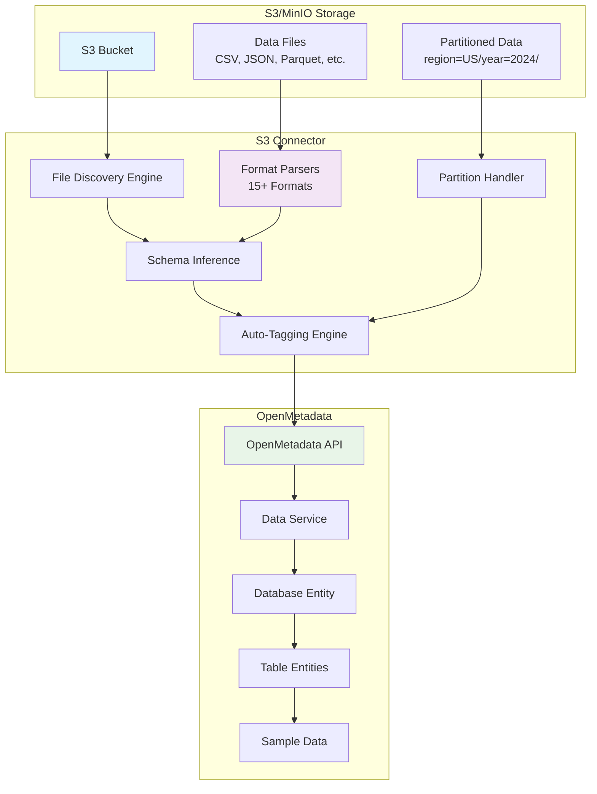
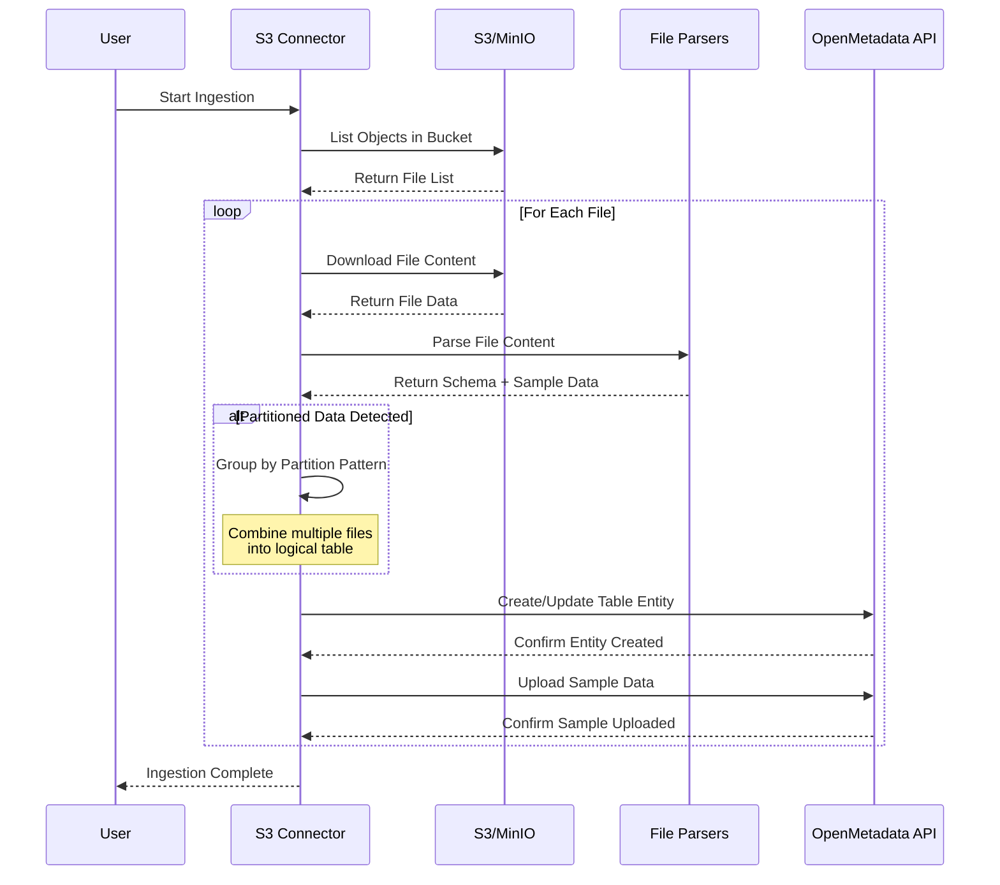
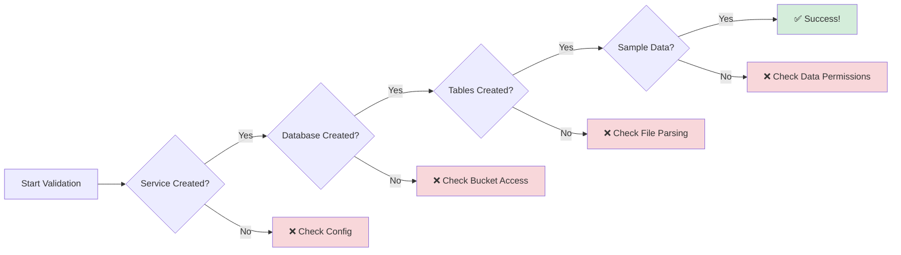
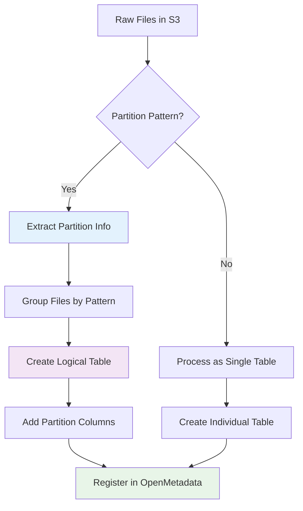
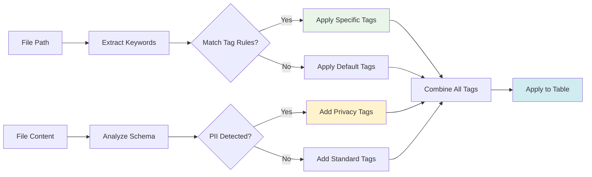
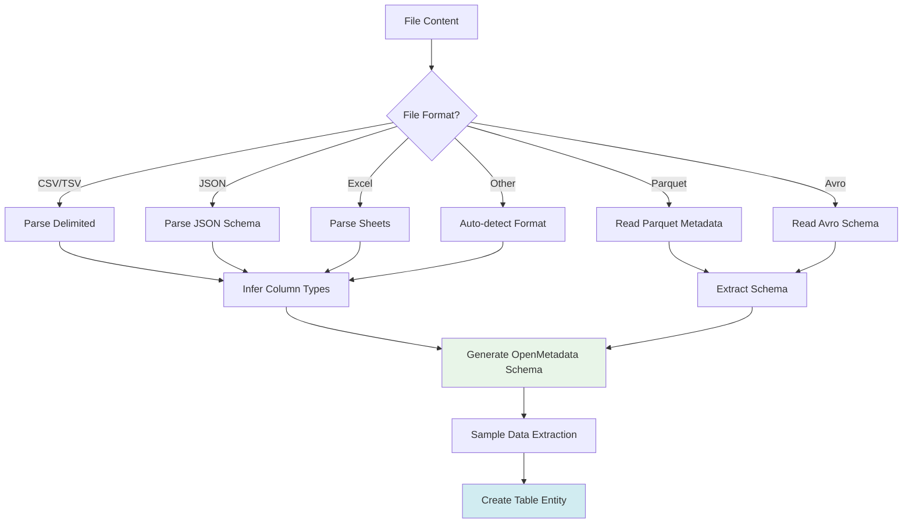
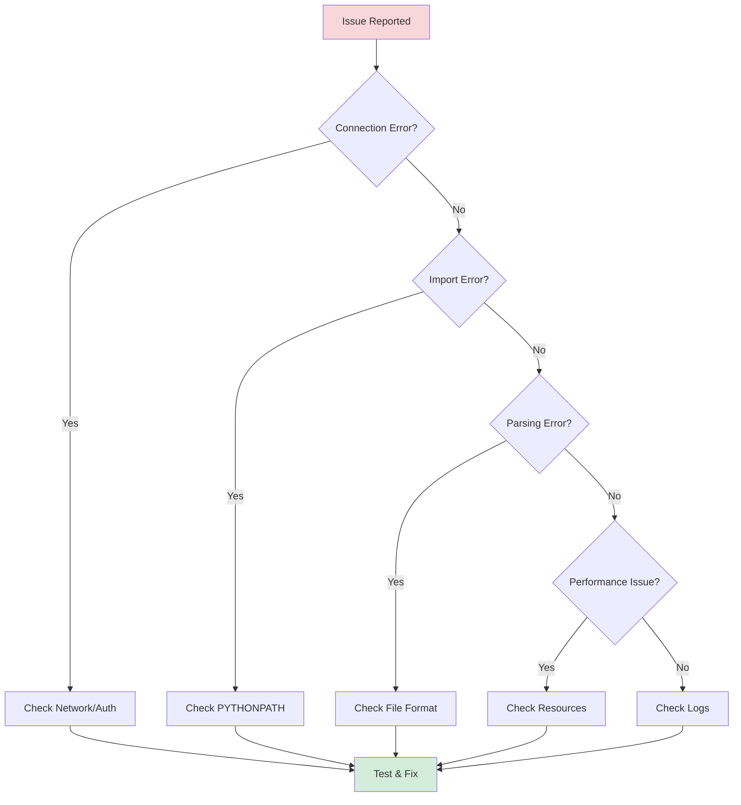
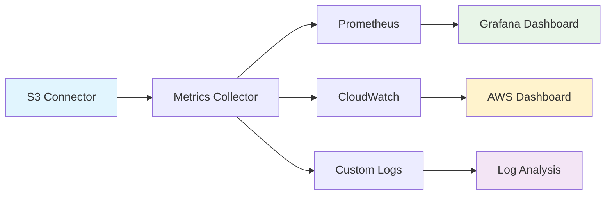

# 🚀 Custom S3/MinIO Connector for OpenMetadata

[](https://opensource.org/licenses/MIT)
[](https://www.python.org/downloads/)
[](https://open-metadata.org/)

A comprehensive, production-ready connector for OpenMetadata designed to seamlessly ingest metadata from S3-compatible object storage services, including AWS S3, MinIO, and other S3-compatible systems.

## 🌟 Key Features

- **🔍 Automatic File Discovery**: Intelligent scanning of S3/MinIO buckets with configurable file type filtering
- **🧩 Intelligent Partition Handling**: Advanced detection of Hive-style partitioned data with logical table grouping
- **📊 Multi-Format Schema Inference**: Support for 15+ file formats with automatic schema detection
- **🔄 Autonomous Metadata Lifecycle**: Complete metadata management from discovery to ingestion
- **👀 Sample Data Preview**: Automatic ingestion of sample data for immediate exploration
- **🏷️ Smart Auto-Tagging**: Rule-based and path-based tagging for enhanced data governance
- **🔒 Enterprise Security**: Support for various authentication methods and secure connections
- **📈 Scalable Architecture**: Optimized for large-scale data lake environments

## 🎯 Supported File Formats

```mermaid
graph TD
    subgraph "Text Formats"
        CSV[📊 CSV]
        TSV[📊 TSV]
        JSON[📄 JSON]
        JSONL[📄 JSONL]
    end
    
    subgraph "Columnar Formats"
        Parquet[🗃️ Parquet]
        ORC[🗃️ ORC]
        Avro[🗃️ Avro]
        Feather[🗃️ Feather]
    end
    
    subgraph "Office Formats"
        Excel[📋 Excel]
        XLSX[📋 XLSX]
    end
    
    subgraph "Scientific Formats"
        HDF5[🔬 HDF5]
        Pickle[🔬 Pickle]
    end
    
    subgraph "Modern Formats"
        Delta[⚡ Delta Lake]
    end
    
    Connector[🔧 om_s3_connector] --> CSV
    Connector --> TSV
    Connector --> JSON
    Connector --> JSONL
    Connector --> Parquet
    Connector --> ORC
    Connector --> Avro
    Connector --> Feather
    Connector --> Excel
    Connector --> XLSX
    Connector --> HDF5
    Connector --> Pickle
    Connector --> Delta
    
    style Connector fill:#e3f2fd
    style CSV fill:#c8e6c9
    style Parquet fill:#fff3e0
    style Excel fill:#f3e5f5
    style HDF5 fill:#e8f5e8
    style Delta fill:#fce4ec
```



| Format | Extension | Parser Status | Description |
|--------|-----------|---------------|-------------|
| CSV | `.csv` | ✅ Complete | Comma-separated values |
| TSV | `.tsv` | ✅ Complete | Tab-separated values |
| JSON | `.json` | ✅ Complete | JavaScript Object Notation |
| JSONL | `.jsonl`, `.ndjson` | ✅ Complete | JSON Lines format |
| Parquet | `.parquet` | ✅ Complete | Apache Parquet columnar format |
| Avro | `.avro` | ✅ Complete | Apache Avro binary format |
| ORC | `.orc` | ✅ Complete | Apache ORC columnar format |
| Excel | `.xlsx`, `.xls` | ✅ Complete | Microsoft Excel files |
| Feather | `.feather` | ✅ Complete | Apache Arrow Feather format |
| HDF5 | `.h5`, `.hdf5` | ✅ Complete | Hierarchical Data Format |
| Pickle | `.pkl`, `.pickle` | ✅ Complete | Python pickle format |
| Delta | `.delta` | ✅ Complete | Delta Lake format |

---

## 🏗️ Architecture Overview



## 🔄 Data Ingestion Flow



## 📁 Project Structure

```
S3connectorplaybook/
├── 📁 connectors/                    # Main connector package
│   └── 📁 s3/
│       ├── 📄 __init__.py
│       ├── 📄 om_s3_connector.py        # 🔧 Core connector logic
│       ├── 📄 connector.py           # 🔗 S3 client wrapper
│       ├── 📄 config.py              # ⚙️ Configuration models
│       ├── 📄 security.py            # 🔒 Authentication handlers
│       └── 📁 parsers/               # 📊 File format parsers
│           ├── 📄 __init__.py
│           ├── 📄 base_parser.py     # 🏗️ Abstract parser base
│           ├── 📄 factory.py         # 🏭 Parser factory
│           ├── 📄 csv_parser.py      # 📋 CSV format support
│           ├── 📄 json_parser.py     # 🔧 JSON format support
│           ├── 📄 jsonl_parser.py    # 📝 JSON Lines support
│           ├── 📄 parquet_parser.py  # 📊 Parquet format support
│           ├── 📄 avro_parser.py     # 🎯 Avro format support
│           ├── 📄 orc_parser.py      # 🗂️ ORC format support
│           ├── 📄 excel_parser.py    # 📈 Excel format support
│           ├── 📄 feather_parser.py  # 🪶 Feather format support
│           ├── 📄 hdf5_parser.py     # 🔬 HDF5 format support
│           ├── 📄 pickle_parser.py   # 🥒 Pickle format support
│           ├── 📄 delta_parser.py    # 📐 Delta Lake support
│           └── 📄 tsv_parser.py      # 📋 TSV format support
├── 📁 playbooks/                     # Configuration templates
│   ├── 📄 ingestion.yaml            # 🔧 Main workflow config
│   └── 📄 enhanced_ingestion_examples.yaml
├── 📁 deployment/                    # Deployment resources
│   ├── 📄 kubernetes-manifest.yaml  # ☸️ Kubernetes deployment
│   ├── 📁 docker-hotdeploy/         # 🐳 Hot deployment scripts
│   └── 📁 artifacts/
├── 📁 tests/                         # Test suite
│   └── 📄 test_connector.py
├── 📄 requirements.txt               # 📦 Python dependencies
├── 📄 setup.py                       # 📦 Package setup
├── 📄 Dockerfile                     # 🐳 Container definition
└── 📄 README.md                      # 📖 This file
```

## 🚀 Quick Start Guide

### 📋 Prerequisites

Before you begin, ensure you have the following:

- **Python 3.8+** installed on your system
- **OpenMetadata instance** running (local or remote)
- **S3/MinIO access** with valid credentials
- **Git** for version control (optional but recommended)

### 🔧 Installation

#### 1. Clone the Repository

```bash
# Clone the repository
git clone <your-repo-url>
cd S3connectorplaybook

# Or download and extract the ZIP file
```

#### 2. Install Dependencies

```bash
# Install required Python packages
pip install -r requirements.txt

# Alternative: Install with specific extras
pip install "openmetadata-ingestion[pandas]" boto3 faker tqdm pyarrow fastparquet xlrd openpyxl h5py tables
```

#### 3. Verify Installation

```bash
# Test the connector import
python -c "from connectors.s3.om_s3_connector import S3Source; print('✅ Installation successful!')"
```

### ⚙️ Configuration

#### 1. Basic Configuration

Create or edit `playbooks/ingestion.yaml`:

```yaml
# Basic S3/MinIO Connector Configuration
source:
  type: customDatabase
  serviceName: "s3-data-lake"              # 📝 Service name in OpenMetadata
  serviceConnection:
    config:
      type: CustomDatabase
      sourcePythonClass: connectors.s3.om_s3_connector.S3Source
      connectionOptions:
        # 🔐 S3/MinIO Connection Details
        awsAccessKeyId: "YOUR_ACCESS_KEY"
        awsSecretAccessKey: "YOUR_SECRET_KEY"
        awsRegion: "us-east-1"
        endPointURL: "http://localhost:9000"  # MinIO endpoint
        bucketName: "data-lake"
        
        # 📊 File Processing Options
        file_formats: "csv,json,parquet,avro,orc,excel,feather"
        enable_partition_parsing: "true"
        max_sample_rows: "100"
        
        # 🏷️ Tagging Configuration
        tag_mapping: "users:PII.Sensitive;transactions:Finance.Critical"
        default_tags: "Tier.Bronze,Source.S3"

# 🎯 OpenMetadata Connection
sink:
  type: metadata-rest
  config: {}

workflowConfig:
  loggerLevel: INFO
  openMetadataServerConfig:
    hostPort: "http://localhost:8585/api"
    authProvider: "openmetadata"
    securityConfig:
      jwtToken: "YOUR_JWT_TOKEN_HERE"
```

#### 2. Advanced Configuration Examples

<details>
<summary>🔒 AWS S3 with IAM Roles</summary>

```yaml
connectionOptions:
  awsRegion: "us-west-2"
  bucketName: "my-data-lake"
  # Use IAM roles instead of access keys
  useInstanceProfile: "true"
  file_formats: "parquet,delta,avro"
  enable_partition_parsing: "true"
```
</details>

<details>
<summary>🏢 Enterprise MinIO with Custom SSL</summary>

```yaml
connectionOptions:
  awsAccessKeyId: "admin"
  awsSecretAccessKey: "password123"
  awsRegion: "us-east-1"
  endPointURL: "https://minio.company.com:9000"
  bucketName: "enterprise-data"
  verifySSL: "true"
  sslCertPath: "/path/to/cert.pem"
```
</details>

<details>
<summary>🎯 Advanced Tagging & Filtering</summary>

```yaml
connectionOptions:
  # ... connection details ...
  
  # Advanced file filtering
  include_patterns: "data/prod/*,analytics/*"
  exclude_patterns: "*/temp/*,*/staging/*"
  
  # Sophisticated tagging rules
  tag_mapping: |
    pii:PII.PersonalData;
    financial:Finance.Sensitive;
    analytics:Analytics.Processed;
    raw:DataQuality.Raw
  
  # Path-based classification
  path_classification:
    "/sensitive/": "Classification.Confidential"
    "/public/": "Classification.Public"
```
</details>

### 🏃‍♂️ Running the Connector

#### Method 1: Direct Execution

```bash
# Set Python path and run ingestion
export PYTHONPATH="."
metadata ingest -c playbooks/ingestion.yaml
```

#### Method 2: Using the Build Script

```bash
# Make the script executable and run
chmod +x build.sh
./build.sh
```

#### Method 3: Docker Execution

```bash
# Build the Docker image
docker build -t s3-connector:latest .

# Run the connector in Docker
docker run --rm \
  -v $(pwd)/playbooks:/app/playbooks \
  -e PYTHONPATH="/app" \
  s3-connector:latest \
  metadata ingest -c playbooks/ingestion.yaml
```

### 🔍 Monitoring & Validation

#### 1. Check Ingestion Progress

```bash
# Monitor logs during ingestion
tail -f openmetadata-logs/ingestion.log

# Check for errors
grep -i "error\|exception" openmetadata-logs/ingestion.log
```

#### 2. Validate in OpenMetadata UI

1. 🌐 Open OpenMetadata UI: `http://localhost:8585`
2. 🔍 Navigate to **Services** → **Database Services**
3. 📊 Find your service (e.g., "s3-data-lake")
4. ✅ Verify tables and schemas are created
5. 👀 Check sample data is available

#### 3. Verify Specific Components



## 🔧 Advanced Features

### 🧩 Partition Detection

The connector automatically detects Hive-style partitioned data:



**Example Partition Structures:**
```
bucket/
├── sales/
│   ├── region=US/
│   │   ├── year=2024/
│   │   │   ├── month=01/data.parquet
│   │   │   └── month=02/data.parquet
│   │   └── year=2023/
│   │       └── month=12/data.parquet
│   └── region=EU/
│       └── year=2024/
│           └── month=01/data.parquet
```

Results in a single logical table: `sales` with columns: `region`, `year`, `month`, plus data columns.

### 🏷️ Smart Tagging System



**Tagging Configuration Examples:**

```yaml
# Path-based tagging
tag_mapping: |
  pii:PII.PersonalData;
  financial:Finance.CriticalData;
  public:Classification.Public;
  internal:Classification.Internal

# Content-based tagging (automatic)
# - Email patterns → PII.Email
# - SSN patterns → PII.SSN  
# - Credit card patterns → PII.Financial

# Default organizational tags
default_tags: "Source.S3,Tier.Bronze,Team.DataEngineering"
```

### 📊 Schema Inference Engine



### 🔒 Security & Authentication

The connector supports multiple authentication methods:

#### 1. AWS IAM (Recommended for AWS)
```yaml
connectionOptions:
  awsRegion: "us-west-2"
  useInstanceProfile: "true"  # Use EC2 instance profile
  # OR
  roleArn: "arn:aws:iam::123456789012:role/S3AccessRole"
```

#### 2. Access Keys
```yaml
connectionOptions:
  awsAccessKeyId: "AKIA..."
  awsSecretAccessKey: "secret..."
  awsSessionToken: "token..."  # For temporary credentials
```

#### 3. MinIO/Custom S3
```yaml
connectionOptions:
  endPointURL: "https://s3.company.com"
  awsAccessKeyId: "minioadmin"
  awsSecretAccessKey: "minioadmin"
  verifySSL: "false"  # For development only
```

## 🐳 Docker Deployment

### Building the Container

```bash
# Build the Docker image
docker build -t s3-connector:latest .

# Build with specific OpenMetadata version
docker build --build-arg OM_VERSION="1.8.1" -t s3-connector:1.8.1 .
```

### Running with Docker

```bash
# Basic run with volume mount
docker run --rm \
  -v $(pwd)/playbooks:/app/playbooks \
  -v $(pwd)/logs:/app/logs \
  s3-connector:latest

# Run with environment variables
docker run --rm \
  -e AWS_ACCESS_KEY_ID="your-key" \
  -e AWS_SECRET_ACCESS_KEY="your-secret" \
  -e OM_JWT_TOKEN="your-token" \
  s3-connector:latest
```

### Docker Compose

```yaml
version: '3.8'
services:
  s3-connector:
    build: .
    volumes:
      - ./playbooks:/app/playbooks
      - ./logs:/app/logs
    environment:
      - PYTHONPATH=/app
      - AWS_ACCESS_KEY_ID=${AWS_ACCESS_KEY_ID}
      - AWS_SECRET_ACCESS_KEY=${AWS_SECRET_ACCESS_KEY}
    command: metadata ingest -c playbooks/ingestion.yaml
```

## ☸️ Kubernetes Deployment

### Basic Deployment

```yaml
apiVersion: batch/v1
kind: Job
metadata:
  name: s3-connector-ingestion
spec:
  template:
    spec:
      containers:
      - name: s3-connector
        image: s3-connector:latest
        env:
        - name: PYTHONPATH
          value: "/app"
        volumeMounts:
        - name: config
          mountPath: /app/playbooks
      volumes:
      - name: config
        configMap:
          name: s3-connector-config
      restartPolicy: OnFailure
```

### CronJob for Regular Ingestion

```yaml
apiVersion: batch/v1
kind: CronJob
metadata:
  name: s3-connector-scheduled
spec:
  schedule: "0 2 * * *"  # Daily at 2 AM
  jobTemplate:
    spec:
      template:
        spec:
          containers:
          - name: s3-connector
            image: s3-connector:latest
            env:
            - name: PYTHONPATH
              value: "/app"
          restartPolicy: OnFailure
```

## 🛠️ Troubleshooting

### Common Issues & Solutions

#### 1. Module Import Errors

```bash
❌ ModuleNotFoundError: No module named 'connectors'
```

**Solutions:**
```bash
# Ensure you're in the project root
pwd  # Should show your project directory

# Set Python path correctly
export PYTHONPATH="$(pwd)"

# Verify __init__.py files exist
find connectors -name "__init__.py" -type f
```

#### 2. Authentication Issues

```bash
❌ NoCredentialsError: Unable to locate credentials
```

**Solutions:**
```bash
# Check AWS credentials
aws configure list

# For MinIO, verify endpoint and credentials
aws --endpoint-url http://localhost:9000 s3 ls

# Test connection with boto3
python -c "
import boto3
client = boto3.client('s3', 
    endpoint_url='http://localhost:9000',
    aws_access_key_id='your-key',
    aws_secret_access_key='your-secret'
)
print(client.list_buckets())
"
```

#### 3. OpenMetadata Connection Issues

```bash
❌ ConnectionError: Failed to connect to OpenMetadata
```

**Solutions:**
```bash
# Test OpenMetadata API
curl -X GET "http://localhost:8585/api/v1/system/version"

# Verify JWT token
python -c "
import jwt
token = 'your-jwt-token'
print(jwt.decode(token, verify=False))
"

# Check network connectivity
telnet localhost 8585
```

#### 4. File Parsing Errors

```bash
❌ ValueError: Failed to parse file format
```

**Debug Steps:**
```bash
# Test individual file parsing
python -c "
from connectors.s3.parsers.factory import ParserFactory
content = open('test-file.csv', 'rb').read()
parser = ParserFactory.get_parser('csv')
df = parser.parse(content)
print(df.head())
"

# Check file format detection
file test-file.csv
```

### Debugging Workflow



### Performance Optimization

#### 1. Large File Handling

```yaml
connectionOptions:
  # Limit sample data for large files
  max_sample_rows: "1000"
  
  # Skip very large files
  max_file_size_mb: "500"
  
  # Process files in batches
  batch_size: "50"
```

#### 2. Memory Management

```yaml
workflowConfig:
  # Increase memory limits
  javaOpts: "-Xmx4g -Xms2g"
  
  # Enable garbage collection
  gcOpts: "-XX:+UseG1GC"
```

#### 3. Parallel Processing

```python
# Custom configuration for high-throughput
connectionOptions:
  max_workers: "4"  # Parallel file processing
  chunk_size: "1000"  # Process in chunks
  enable_caching: "true"  # Cache parsed schemas
```

## 🔍 API Reference

### Core Classes

#### S3Source
Main connector class that orchestrates the ingestion process.

```python
from connectors.s3.om_s3_connector import S3Source

# Key methods:
# - get_database_names() -> Iterable[str]
# - get_database_schema_names() -> Iterable[str] 
# - get_tables_name_and_type() -> Iterable[Tuple[str, str]]
# - get_table_entity() -> Table
```

#### ParserFactory
Factory class for creating file format parsers.

```python
from connectors.s3.parsers.factory import ParserFactory

# Get parser for specific format
parser = ParserFactory.get_parser('parquet')
df = parser.parse(file_content)
```

### Configuration Options

| Option | Type | Default | Description |
|--------|------|---------|-------------|
| `awsAccessKeyId` | string | - | AWS/S3 access key |
| `awsSecretAccessKey` | string | - | AWS/S3 secret key |
| `awsRegion` | string | `us-east-1` | AWS region |
| `endPointURL` | string | - | Custom S3 endpoint (MinIO) |
| `bucketName` | string | - | Target S3 bucket name |
| `file_formats` | string | `csv,json,parquet` | Supported file extensions |
| `enable_partition_parsing` | boolean | `true` | Enable Hive partition detection |
| `max_sample_rows` | integer | `100` | Max rows for sample data |
| `tag_mapping` | string | - | Path-based tagging rules |
| `default_tags` | string | - | Default tags for all tables |
| `include_patterns` | string | - | Path inclusion patterns |
| `exclude_patterns` | string | - | Path exclusion patterns |

## 🧪 Testing

### Running Tests

```bash
# Run all tests
python -m pytest tests/ -v

# Run specific test categories
python -m pytest tests/test_parsers.py -v
python -m pytest tests/test_connector.py -v

# Run with coverage
python -m pytest tests/ --cov=connectors --cov-report=html
```

### Manual Testing

```bash
# Test S3 connection
python simple_test.py

# Test specific parser
python test_parsers.py

# Validate hierarchical logic
python test_hierarchical_logic.py
```

### Test Data Setup

```bash
# Create test bucket in MinIO
aws --endpoint-url http://localhost:9000 s3 mb s3://test-bucket

# Upload test files
aws --endpoint-url http://localhost:9000 s3 cp test-data/ s3://test-bucket/ --recursive
```

## 🚀 Extending the Connector

### Adding New File Formats

1. **Create Parser Class**

```python
# connectors/s3/parsers/my_format_parser.py
from .base_parser import FileParser
import pandas as pd

class MyFormatParser(FileParser):
    def parse(self, content: bytes) -> pd.DataFrame:
        # Implement your parsing logic
        return df
```

2. **Register in Factory**

```python
# connectors/s3/parsers/factory.py
PARSERS = {
    # ...existing parsers...
    'myformat': 'connectors.s3.parsers.my_format_parser.MyFormatParser',
}
```

3. **Update Configuration**

```yaml
connectionOptions:
  file_formats: "csv,json,parquet,myformat"
```

### Custom Tagging Rules

```python
# Add to om_s3_connector.py
def apply_custom_tags(self, table_name: str, file_path: str) -> List[str]:
    tags = []
    
    # Business logic-based tagging
    if 'customer' in table_name.lower():
        tags.append('Domain.Customer')
    
    if 'transaction' in file_path:
        tags.append('Domain.Finance')
    
    # Size-based tagging
    if self.file_size > 1024 * 1024 * 100:  # > 100MB
        tags.append('Size.Large')
    
    return tags
```

### Performance Monitoring

```python
# Add monitoring to connector
import time
from functools import wraps

def monitor_performance(func):
    @wraps(func)
    def wrapper(*args, **kwargs):
        start = time.time()
        result = func(*args, **kwargs)
        duration = time.time() - start
        logger.info(f"{func.__name__} took {duration:.2f}s")
        return result
    return wrapper

@monitor_performance
def parse_file(self, file_content: bytes) -> pd.DataFrame:
    # Your parsing logic
    pass
```

## 📊 Monitoring & Observability

### Metrics Collection



### Key Metrics to Monitor

- **Ingestion Rate**: Files processed per minute
- **Error Rate**: Failed parsing attempts
- **Schema Changes**: Detected schema modifications
- **Data Quality**: Sample data validation results
- **Performance**: Processing time per file type

### Logging Configuration

```python
import logging

# Configure detailed logging
logging.basicConfig(
    level=logging.INFO,
    format='%(asctime)s - %(name)s - %(levelname)s - %(message)s',
    handlers=[
        logging.FileHandler('om_s3_connector.log'),
        logging.StreamHandler()
    ]
)

# Add structured logging
import structlog

logger = structlog.get_logger()
logger.info("Processing file", 
           file_name="data.parquet", 
           size_mb=45.2, 
           partition_count=12)
```

## 🔗 Integration Examples

### Apache Airflow

```python
# airflow/dags/s3_ingestion_dag.py
from airflow import DAG
from airflow.operators.bash_operator import BashOperator
from datetime import datetime, timedelta

default_args = {
    'owner': 'data-team',
    'depends_on_past': False,
    'start_date': datetime(2024, 1, 1),
    'retries': 1,
    'retry_delay': timedelta(minutes=5)
}

dag = DAG(
    's3_metadata_ingestion',
    default_args=default_args,
    description='S3 metadata ingestion workflow',
    schedule_interval='@daily',
    catchup=False
)

ingest_task = BashOperator(
    task_id='ingest_s3_metadata',
    bash_command='''
    cd /path/to/S3connectorplaybook
    export PYTHONPATH="."
    metadata ingest -c playbooks/ingestion.yaml
    ''',
    dag=dag
)
```

### GitHub Actions CI/CD

```yaml
# .github/workflows/ingestion.yml
name: S3 Metadata Ingestion

on:
  schedule:
    - cron: '0 2 * * *'  # Daily at 2 AM
  workflow_dispatch:

jobs:
  ingest:
    runs-on: ubuntu-latest
    steps:
    - uses: actions/checkout@v3
    
    - name: Set up Python
      uses: actions/setup-python@v4
      with:
        python-version: '3.9'
    
    - name: Install dependencies
      run: |
        pip install -r requirements.txt
    
    - name: Run ingestion
      env:
        AWS_ACCESS_KEY_ID: ${{ secrets.AWS_ACCESS_KEY_ID }}
        AWS_SECRET_ACCESS_KEY: ${{ secrets.AWS_SECRET_ACCESS_KEY }}
        OM_JWT_TOKEN: ${{ secrets.OM_JWT_TOKEN }}
      run: |
        export PYTHONPATH="."
        metadata ingest -c playbooks/ingestion.yaml
```

## 📚 Additional Resources

### 📖 Documentation Links

- [OpenMetadata Documentation](https://docs.open-metadata.org/)
- [OpenMetadata Python SDK](https://docs.open-metadata.org/sdk/python)
- [Custom Connectors Guide](https://docs.open-metadata.org/connectors/custom-connectors)
- [AWS S3 API Reference](https://docs.aws.amazon.com/s3/latest/API/)
- [MinIO Documentation](https://docs.min.io/)

### 🎓 Learning Resources

- [Data Catalog Best Practices](https://open-metadata.org/blog/data-catalog-best-practices)
- [Metadata Management Strategies](https://open-metadata.org/blog/metadata-management)
- [Data Governance with OpenMetadata](https://open-metadata.org/blog/data-governance)

### 🛠️ Tools & Utilities

#### Schema Validation Tool

```python
# utils/validate_schema.py
from connectors.s3.parsers.factory import ParserFactory
import sys

def validate_file_schema(file_path: str, format_type: str):
    """Validate that a file can be parsed correctly."""
    try:
        with open(file_path, 'rb') as f:
            content = f.read()
        
        parser = ParserFactory.get_parser(format_type)
        df = parser.parse(content)
        
        print(f"✅ File parsed successfully!")
        print(f"📊 Shape: {df.shape}")
        print(f"📋 Columns: {list(df.columns)}")
        print(f"🔍 Sample data:\n{df.head()}")
        
    except Exception as e:
        print(f"❌ Parsing failed: {e}")
        sys.exit(1)

if __name__ == "__main__":
    if len(sys.argv) != 3:
        print("Usage: python validate_schema.py <file_path> <format>")
        sys.exit(1)
    
    validate_file_schema(sys.argv[1], sys.argv[2])
```

#### Bulk Configuration Generator

```python
# utils/generate_configs.py
import yaml
from pathlib import Path

def generate_config_variants():
    """Generate configuration files for different environments."""
    
    base_config = {
        'source': {
            'type': 'customDatabase',
            'serviceName': '',
            'serviceConnection': {
                'config': {
                    'type': 'CustomDatabase',
                    'sourcePythonClass': 'connectors.s3.om_s3_connector.S3Source',
                    'connectionOptions': {}
                }
            }
        },
        'sink': {'type': 'metadata-rest', 'config': {}},
        'workflowConfig': {
            'loggerLevel': 'INFO',
            'openMetadataServerConfig': {
                'hostPort': '',
                'authProvider': 'openmetadata',
                'securityConfig': {'jwtToken': ''}
            }
        }
    }
    
    environments = {
        'development': {
            'serviceName': 'dev-s3-lake',
            'hostPort': 'http://localhost:8585/api',
            'endPointURL': 'http://localhost:9000',
            'bucketName': 'dev-bucket'
        },
        'staging': {
            'serviceName': 'staging-s3-lake', 
            'hostPort': 'http://staging-om:8585/api',
            'endPointURL': 'http://staging-s3:9000',
            'bucketName': 'staging-bucket'
        },
        'production': {
            'serviceName': 'prod-s3-lake',
            'hostPort': 'http://prod-om:8585/api', 
            'awsRegion': 'us-west-2',
            'bucketName': 'prod-data-lake'
        }
    }
    
    for env, config in environments.items():
        env_config = base_config.copy()
        env_config['source']['serviceName'] = config['serviceName']
        env_config['workflowConfig']['openMetadataServerConfig']['hostPort'] = config['hostPort']
        
        # Environment-specific connection options
        conn_opts = env_config['source']['serviceConnection']['config']['connectionOptions']
        if 'endPointURL' in config:
            conn_opts['endPointURL'] = config['endPointURL']
        if 'awsRegion' in config:
            conn_opts['awsRegion'] = config['awsRegion']
        conn_opts['bucketName'] = config['bucketName']
        
        # Write to file
        output_path = Path(f'playbooks/ingestion-{env}.yaml')
        with open(output_path, 'w') as f:
            yaml.dump(env_config, f, default_flow_style=False, indent=2)
        
        print(f"✅ Generated {output_path}")

if __name__ == "__main__":
    generate_config_variants()
```

### 🔧 Maintenance Scripts

#### Health Check Script

```bash
#!/bin/bash
# scripts/health_check.sh

echo "🔍 S3 Connector Health Check"
echo "=============================="

# Check Python environment
echo "📊 Python Environment:"
python --version
echo "PYTHONPATH: $PYTHONPATH"

# Check dependencies
echo -e "\n📦 Dependencies:"
pip list | grep -E "(openmetadata|boto3|pandas|pyarrow)"

# Test imports
echo -e "\n🐍 Import Test:"
python -c "
try:
    from connectors.s3.om_s3_connector import S3Source
    print('✅ S3Source import successful')
except Exception as e:
    print(f'❌ Import failed: {e}')
"

# Test S3 connection
echo -e "\n🔗 S3 Connection Test:"
python -c "
import boto3
import os
try:
    client = boto3.client('s3',
        endpoint_url=os.getenv('S3_ENDPOINT', 'http://localhost:9000'),
        aws_access_key_id=os.getenv('AWS_ACCESS_KEY_ID', 'minioadmin'),
        aws_secret_access_key=os.getenv('AWS_SECRET_ACCESS_KEY', 'minioadmin')
    )
    response = client.list_buckets()
    print(f'✅ S3 connection successful. Found {len(response[\"Buckets\"])} buckets')
except Exception as e:
    print(f'❌ S3 connection failed: {e}')
"

# Test OpenMetadata connection
echo -e "\n🌐 OpenMetadata Connection Test:"
OM_HOST=${OM_HOST:-"http://localhost:8585"}
curl -s -o /dev/null -w "%{http_code}" "$OM_HOST/api/v1/system/version" | {
    read response
    if [ "$response" = "200" ]; then
        echo "✅ OpenMetadata connection successful"
    else
        echo "❌ OpenMetadata connection failed (HTTP: $response)"
    fi
}

echo -e "\n🎯 Health Check Complete!"
```

#### Cleanup Script

```python
# scripts/cleanup_metadata.py
"""Clean up test metadata from OpenMetadata."""

from metadata.generated.schema.entity.services.databaseService import DatabaseService
from metadata.generated.schema.entity.data.database import Database
from metadata.generated.schema.entity.data.table import Table
from metadata.ingestion.ometa.ometa_api import OpenMetadata
from metadata.generated.schema.security.client.openMetadataJWTClientConfig import OpenMetadataJWTClientConfig
from metadata.generated.schema.entity.services.connections.metadata.openMetadataConnection import OpenMetadataConnection

def cleanup_test_services():
    """Remove test services and their associated entities."""
    
    # Configure OpenMetadata client
    server_config = OpenMetadataConnection(
        hostPort="http://localhost:8585/api",
        authProvider="openmetadata",
        securityConfig=OpenMetadataJWTClientConfig(jwtToken="YOUR_JWT_TOKEN")
    )
    
    metadata = OpenMetadata(server_config)
    
    # Services to clean up (test services only!)
    test_services = ["test-s3-lake", "dev-s3-lake", "staging-s3-lake"]
    
    for service_name in test_services:
        try:
            # Get service
            service = metadata.get_by_name(entity=DatabaseService, fqn=service_name)
            if service:
                print(f"🗑️  Deleting service: {service_name}")
                metadata.delete(entity=DatabaseService, entity_id=service.id)
                print(f"✅ Deleted service: {service_name}")
            else:
                print(f"ℹ️  Service not found: {service_name}")
                
        except Exception as e:
            print(f"❌ Error deleting {service_name}: {e}")

if __name__ == "__main__":
    print("⚠️  This will delete test metadata from OpenMetadata!")
    confirm = input("Are you sure? (yes/no): ")
    if confirm.lower() == 'yes':
        cleanup_test_services()
    else:
        print("❌ Cleanup cancelled")
```

## 🤝 Contributing

We welcome contributions! Here's how to get started:

### Development Setup

```bash
# Fork and clone the repository
git clone https://github.com/your-username/S3connectorplaybook.git
cd S3connectorplaybook

# Create virtual environment
python -m venv venv
source venv/bin/activate  # Linux/Mac
# or
venv\Scripts\activate  # Windows

# Install development dependencies
pip install -r requirements.txt
pip install -r requirements-dev.txt  # If available

# Install pre-commit hooks
pre-commit install
```

### Code Style

```bash
# Format code
black connectors/
isort connectors/

# Lint code  
flake8 connectors/
pylint connectors/

# Type checking
mypy connectors/
```

### Submitting Changes

1. 🔀 Create a feature branch: `git checkout -b feature/amazing-feature`
2. ✅ Make your changes and add tests
3. 🧪 Run the test suite: `pytest tests/`
4. 📝 Commit your changes: `git commit -m 'Add amazing feature'`
5. 🚀 Push to your branch: `git push origin feature/amazing-feature`
6. 🔄 Open a Pull Request

### Guidelines

- Follow existing code style and patterns
- Add tests for new functionality
- Update documentation for API changes
- Keep commits focused and atomic
- Write clear commit messages

## 📞 Support & Community

### 🆘 Getting Help

- **Documentation**: Check this README and inline code comments
- **Issues**: Open a GitHub issue for bugs or feature requests
- **Discussions**: Use GitHub Discussions for questions and ideas
- **Email**: Contact maintainers directly for urgent issues

### 📬 Contact

- **Primary Maintainer**: Mustapha Fonsau
- **Email**: `mfonsau@talentys.eu`
- **LinkedIn**: [mustapha-fonsau](https://www.linkedin.com/in/mustapha-fonsau/)

### 🌟 Acknowledgments

- OpenMetadata team for the excellent platform
- Apache projects (Spark, Parquet, Avro) for data format specifications
- AWS and MinIO teams for S3-compatible storage
- Python community for amazing data processing libraries

---

## 📄 License

This project is licensed under the MIT License - see the [LICENSE](LICENSE) file for details.

---

## 🔄 Changelog

### Version 0.9 (Latest)
- ✨ Added support for 15+ file formats
- 🎯 Enhanced partition detection algorithm  
- 🏷️ Advanced tagging and classification system
- 🐳 Docker and Kubernetes deployment support
- 📊 Comprehensive monitoring and observability
- 🔒 Enhanced security and authentication options

### Version 1.0.0
- 🚀 Initial release with basic S3 connectivity
- 📊 Support for CSV, JSON, Parquet, TSV formats
- 🧩 Basic partition detection
- 🏷️ Simple tagging system

---

<div align="center">
  <strong>Built with ❤️ for the OpenMetadata community</strong><br>
  <em>Making data discovery and governance accessible to everyone</em>
</div>