# ⚙️ Configuration Guide

Complete guide to configuring the OpenMetadata S3 Connector for different environments and use cases.

## Configuration Structure

```mermaid
graph TD
    Config[📄 Configuration File] --> Source[🔗 Source Configuration]
    Config --> Sink[📤 Sink Configuration]
    Config --> Workflow[⚙️ Workflow Configuration]
    
    Source --> Connection[🔌 Connection Options]
    Source --> Processing[⚡ Processing Options]
    Source --> Security[🔒 Security Settings]
    
    Connection --> S3Config[☁️ S3/MinIO Settings]
    Connection --> Auth[🔑 Authentication]
    
    Processing --> Formats[📁 File Formats]
    Processing --> Partitions[🗂️ Partition Handling]
    Processing --> Sampling[📊 Data Sampling]
    
    Sink --> OMConfig[📊 OpenMetadata API]
    
    Workflow --> Logging[📝 Logging]
    Workflow --> Performance[🚀 Performance]
    
    style Config fill:#e8f5e8
    style Source fill:#e3f2fd
    style Processing fill:#fff3e0
```



## Basic Configuration Template

```yaml
source:
  type: customDatabase
  serviceName: "your-service-name"
  serviceConnection:
    config:
      type: CustomDatabase
      sourcePythonClass: om_s3_connector.core.s3_connector.S3Source
      connectionOptions:
        # Connection settings
        awsAccessKeyId: "YOUR_ACCESS_KEY"
        awsSecretAccessKey: "YOUR_SECRET_KEY"
        awsRegion: "us-east-1"
        endPointURL: "http://localhost:9000"  # Optional: for MinIO
        bucketName: "your-bucket-name"
        
        # File processing
        file_formats: "csv,json,parquet"
        enable_partition_parsing: "true"
        max_sample_rows: "100"

sink:
  type: metadata-rest
  config: {}

workflowConfig:
  loggerLevel: INFO
  openMetadataServerConfig:
    hostPort: "http://localhost:8585/api"
    authProvider: "openmetadata"
    securityConfig:
      jwtToken: "YOUR_JWT_TOKEN"
```

## Connection Options

### S3/MinIO Connection

| Option | Description | Required | Default |
|--------|-------------|----------|---------|
| `awsAccessKeyId` | AWS Access Key ID | Yes* | - |
| `awsSecretAccessKey` | AWS Secret Access Key | Yes* | - |
| `awsRegion` | AWS Region | Yes | `us-east-1` |
| `endPointURL` | Custom S3 endpoint (MinIO) | No | AWS S3 |
| `bucketName` | S3 bucket to scan | Yes | - |
| `roleArn` | IAM Role ARN (alternative auth) | No | - |

*Required unless using IAM roles

### Authentication Methods

#### Method 1: Access Keys
```yaml
connectionOptions:
  awsAccessKeyId: "AKIA..."
  awsSecretAccessKey: "..."
  awsRegion: "us-west-2"
  bucketName: "my-bucket"
```

#### Method 2: IAM Role
```yaml
connectionOptions:
  roleArn: "arn:aws:iam::123456789012:role/OpenMetadataRole"
  awsRegion: "us-west-2"
  bucketName: "my-bucket"
```

#### Method 3: MinIO
```yaml
connectionOptions:
  awsAccessKeyId: "minioadmin"
  awsSecretAccessKey: "minioadmin"
  endPointURL: "http://localhost:9000"
  bucketName: "dev-bucket"
```

## File Processing Options

### Supported File Formats


| Option | Description | Default | Example |
|--------|-------------|---------|---------|
| `file_formats` | Comma-separated list of formats | `csv,json,parquet` | `csv,json,parquet,avro,orc` |
| `include_path_pattern` | Include files matching pattern | None | `^(production|staging)/` |
| `exclude_path_pattern` | Exclude files matching pattern | None | `/(temp|archive)/` |
| `enable_partition_parsing` | Detect Hive partitions | `true` | `true` or `false` |
| `max_sample_rows` | Number of sample rows | `100` | `50`, `200`, `1000` |

### Partition Handling

```yaml
connectionOptions:
  enable_partition_parsing: "true"
  partition_depth: "3"  # Max partition levels to scan
  partition_pattern: "year={year}/month={month}/day={day}"
```

### Path Filtering

```yaml
connectionOptions:
  # Include only production and staging data
  include_path_pattern: "^(production|staging)/"
  
  # Exclude temporary and archived files
  exclude_path_pattern: "/(temp|archive|backup)/"
  
  # Specific file patterns
  file_pattern: ".*\\.(csv|json|parquet)$"
```

## Tagging and Metadata

### Auto-Tagging Rules

```mermaid
graph LR
    Path[📁 File Path] --> Rules[📋 Tagging Rules]
    Rules --> Tags[🏷️ Applied Tags]
    
    subgraph "Rules"
        PathRule[Path-based]
        ContentRule[Content-based]
        DefaultRule[Default]
    end
    
    PathRule --> Tags
    ContentRule --> Tags
    DefaultRule --> Tags
    
    style Path fill:#e3f2fd
    style Tags fill:#e8f5e8
```



```yaml
connectionOptions:
  # Path-based tagging
  tag_mapping: "users:PII.Sensitive;orders:Commerce.Orders;logs:System.Logs"
  
  # Default tags for all tables
  default_tags: "Source.S3,Tier.Bronze,Team.DataEngineering"
  
  # Environment-based tagging
  environment_tag: "Environment.Production"
```

### Tag Mapping Examples

| Path Pattern | Tags Applied |
|-------------|-------------|
| `users/` | `PII.Sensitive`, `GDPR.Protected` |
| `orders/` | `Commerce.Orders`, `Finance.Revenue` |
| `logs/` | `System.Logs`, `Operations.Monitoring` |
| `analytics/` | `Analytics.Reports`, `Business.Intelligence` |

## Environment-Specific Configurations

### Development Environment

```yaml
source:
  serviceName: "dev-s3-datalake"
  serviceConnection:
    config:
      sourcePythonClass: om_s3_connector.core.s3_connector.S3Source
      connectionOptions:
        endPointURL: "http://localhost:9000"
        awsAccessKeyId: "minioadmin"
        awsSecretAccessKey: "minioadmin"
        bucketName: "dev-bucket"
        file_formats: "csv,json"
        max_sample_rows: "50"

workflowConfig:
  loggerLevel: DEBUG
  openMetadataServerConfig:
    hostPort: "http://localhost:8585/api"
```

### Staging Environment

```yaml
source:
  serviceName: "staging-s3-datalake"
  serviceConnection:
    config:
      sourcePythonClass: om_s3_connector.core.s3_connector.S3Source
      connectionOptions:
        awsRegion: "us-west-2"
        bucketName: "staging-data-lake"
        file_formats: "csv,json,parquet,avro"
        include_path_pattern: "^staging/"
        max_sample_rows: "100"
        tag_mapping: "staging:Environment.Staging"

workflowConfig:
  loggerLevel: INFO
  openMetadataServerConfig:
    hostPort: "https://staging-openmetadata.company.com/api"
```

### Production Environment

```yaml
source:
  serviceName: "prod-s3-datalake"
  serviceConnection:
    config:
      sourcePythonClass: om_s3_connector.core.s3_connector.S3Source
      connectionOptions:
        roleArn: "arn:aws:iam::123456789012:role/OpenMetadataRole"
        awsRegion: "us-west-2"
        bucketName: "production-data-lake"
        file_formats: "csv,json,parquet,avro,orc,delta"
        include_path_pattern: "^production/"
        exclude_path_pattern: "/(temp|archive)/"
        enable_partition_parsing: "true"
        max_sample_rows: "200"
        tag_mapping: "production:Environment.Production;pii:PII.Sensitive"
        default_tags: "Source.S3,Tier.Bronze"

workflowConfig:
  loggerLevel: WARNING
  openMetadataServerConfig:
    hostPort: "https://openmetadata.company.com/api"
```

## Performance Tuning

### Optimization Settings

```yaml
connectionOptions:
  # Limit concurrent file processing
  max_concurrent_files: "10"
  
  # Skip large files for sampling
  max_file_size_mb: "500"
  
  # Batch processing
  batch_size: "100"
  
  # Connection timeouts
  connection_timeout: "30"
  read_timeout: "60"
```

### Memory Management

```yaml
workflowConfig:
  # Adjust based on available memory
  maxWorkers: 4
  
  # Batch processing settings
  batchSize: 50
  
  # Connection pooling
  connectionPoolSize: 20
```

## Validation and Testing

### Configuration Validation

```bash
# Validate configuration syntax
python -c "
import yaml
with open('config/my-config.yaml') as f:
    config = yaml.safe_load(f)
    print('✅ Configuration is valid YAML')
"

# Test S3 connection
aws --endpoint-url http://localhost:9000 s3 ls s3://your-bucket

# Test OpenMetadata connection
curl http://localhost:8585/api/v1/system/version
```

### Dry Run Mode

```yaml
workflowConfig:
  dryRun: true  # Test without actually ingesting
  loggerLevel: DEBUG
```

## Troubleshooting Configuration

### Common Issues

1. **Authentication Errors**
   ```bash
   # Verify credentials
   aws sts get-caller-identity
   ```

2. **Network Connectivity**
   ```bash
   # Test S3 endpoint
   curl -I http://localhost:9000/minio/health/live
   ```

3. **Permission Issues**
   ```bash
   # Test bucket access
   aws s3 ls s3://your-bucket --region us-east-1
   ```

### Debug Configuration

```yaml
workflowConfig:
  loggerLevel: DEBUG
  enableTrace: true
  
connectionOptions:
  debug_mode: "true"
  verbose_logging: "true"
```

## Next Steps

- 🚀 **[Quick Start](quick-start.md)** - Get started quickly
- 🔧 **[Troubleshooting](troubleshooting.md)** - Common issues and solutions
- 📊 **[Supported Formats](../reference/supported-formats.md)** - File format details
- 🏗️ **[Architecture](../developer-guides/architecture.md)** - Technical architecture
