# 🚀 Quick Start Guide

Get up and running with the OpenMetadata S3 Connector in minutes.

## Prerequisites

```mermaid
graph LR
    subgraph "Requirements"
        Python[🐍 Python 3.8+]
        OpenMetadata[📊 OpenMetadata Server]
        S3Access[🔑 S3 Access]
    end
    
    subgraph "Optional"
        Docker[🐳 Docker]
        Kubernetes[☸️ Kubernetes]
    end
    
    Python --> Install[📦 Install Connector]
    OpenMetadata --> Configure[⚙️ Configure Connection]
    S3Access --> Test[🧪 Test Access]
    
    Install --> Configure
    Configure --> Test
    Test --> Run[🚀 Run Ingestion]
    
    style Python fill:#e8f5e8
    style OpenMetadata fill:#e3f2fd
    style Run fill:#fff3e0
```



- **Python 3.8+** - Required runtime
- **OpenMetadata Server** - Running instance (local or remote)
- **S3 Access** - AWS S3 or MinIO credentials
- **Docker** (Optional) - For containerized deployment

## Installation

### Method 1: Direct Installation

```bash
# Clone the repository
git clone <repository-url>
cd openmetadata-s3-connector

# Install dependencies
pip install -r requirements.txt

# Install the connector
pip install -e .
```

### Method 2: Docker Installation

```bash
# Build the Docker image
docker build -t openmetadata-s3-connector .

# Run with configuration
docker run --rm \
  -v $(pwd)/config:/app/config \
  -e AWS_ACCESS_KEY_ID=your-key \
  -e AWS_SECRET_ACCESS_KEY=your-secret \
  openmetadata-s3-connector
```

## Quick Configuration

### Step 1: Create Configuration File

```bash
cp config/ingestion.yaml config/my-config.yaml
```

### Step 2: Edit Configuration

```yaml
source:
  type: customDatabase
  serviceName: "my-s3-datalake"
  serviceConnection:
    config:
      type: CustomDatabase
      sourcePythonClass: om_s3_connector.core.s3_connector.S3Source
      connectionOptions:
        # S3 Connection
        awsAccessKeyId: "YOUR_ACCESS_KEY"
        awsSecretAccessKey: "YOUR_SECRET_KEY"
        awsRegion: "us-east-1"
        endPointURL: "http://localhost:9000"  # For MinIO
        bucketName: "my-bucket"
        
        # File Processing
        file_formats: "csv,json,parquet"
        enable_partition_parsing: "true"
        max_sample_rows: "100"

sink:
  type: metadata-rest
  config: {}

workflowConfig:
  openMetadataServerConfig:
    hostPort: "http://localhost:8585/api"
    authProvider: "openmetadata"
    securityConfig:
      jwtToken: "YOUR_JWT_TOKEN"
```

### Step 3: Run Ingestion

```bash
# Set Python path
export PYTHONPATH=$(pwd)/src

# Run the connector
metadata ingest -c config/my-config.yaml
```

## Quick Test

Verify your installation:

```bash
# Test import
python -c "from om_s3_connector import S3Source; print('✅ Connector ready!')"

# Test configuration
python -c "
import yaml
with open('config/my-config.yaml') as f:
    config = yaml.safe_load(f)
    print('✅ Configuration loaded')
"
```

## Common Use Cases

### MinIO Development Setup

```yaml
connectionOptions:
  awsAccessKeyId: "minioadmin"
  awsSecretAccessKey: "minioadmin"
  endPointURL: "http://localhost:9000"
  bucketName: "dev-bucket"
  file_formats: "csv,json,parquet"
```

### AWS S3 Production Setup

```yaml
connectionOptions:
  awsRegion: "us-west-2"
  roleArn: "arn:aws:iam::123456789012:role/OpenMetadataRole"
  bucketName: "production-datalake"
  file_formats: "csv,json,parquet,avro,orc"
  enable_partition_parsing: "true"
```

## Next Steps

- 📖 **[Comprehensive Guide](comprehensive-guide.md)** - Detailed features and configuration
- ⚙️ **[Configuration Options](../reference/configuration-options.md)** - All available settings
- 🔧 **[Troubleshooting](troubleshooting.md)** - Common issues and solutions
- 🚀 **[Deployment Guide](../deployment/production-setup.md)** - Production deployment

## Getting Help

- 📖 Check the [troubleshooting guide](troubleshooting.md)
- 💬 Open an issue on GitHub
- 📧 Contact: mfonsau@talentys.eu
