# 🔧 Troubleshooting Guide

Common issues and solutions for the OpenMetadata S3 Connector.

## Issue Diagnosis Flowchart

```mermaid
graph TD
    Start[🚀 Issue Reported] --> Category{Issue Category?}
    
    Category -->|Connection| ConnIssue[🔌 Connection Issues]
    Category -->|Import| ImportIssue[📦 Import Issues]
    Category -->|Configuration| ConfigIssue[⚙️ Configuration Issues]
    Category -->|Performance| PerfIssue[⚡ Performance Issues]
    
    ConnIssue --> TestConn[Test S3 Connection]
    ConnIssue --> TestOM[Test OpenMetadata Connection]
    
    ImportIssue --> CheckPath[Check Python Path]
    ImportIssue --> CheckDeps[Check Dependencies]
    
    ConfigIssue --> ValidateYAML[Validate YAML]
    ConfigIssue --> CheckCreds[Check Credentials]
    
    PerfIssue --> CheckResources[Check Resources]
    PerfIssue --> OptimizeConfig[Optimize Configuration]
    
    style Start fill:#e8f5e8
    style ConnIssue fill:#ffebee
    style ImportIssue fill:#e3f2fd
    style ConfigIssue fill:#fff3e0
    style PerfIssue fill:#f3e5f5
```



## Common Issues

### 1. Import Errors

#### Problem: Module Not Found
```bash
ImportError: No module named 'om_s3_connector'
```

#### Solution:
```bash
# Set Python path
export PYTHONPATH=$(pwd)/src

# Verify installation
python -c "from om_s3_connector import S3Source; print('✅ Import successful')"

# Alternative: Install in development mode
pip install -e .
```

#### Problem: Missing Dependencies
```bash
ModuleNotFoundError: No module named 'pandas'
```

#### Solution:
```bash
# Install all dependencies
pip install -r requirements.txt

# Or install specific missing packages
pip install pandas boto3 pyarrow
```

### 2. Connection Issues

#### Problem: S3 Connection Failed
```bash
botocore.exceptions.EndpointConnectionError: Could not connect to the endpoint URL
```

#### Diagnosis Steps:

```mermaid
sequenceDiagram
    participant User
    participant Diagnostic
    participant S3
    participant Network
    
    User->>Diagnostic: Connection Failed
    Diagnostic->>Network: Test Network Connectivity
    Network-->>Diagnostic: Network Status
    Diagnostic->>S3: Test S3 Endpoint
    S3-->>Diagnostic: Endpoint Status
    Diagnostic->>User: Issue Identified
```


#### Solutions:

**For AWS S3:**
```bash
# Test AWS credentials
aws sts get-caller-identity

# Test S3 access
aws s3 ls s3://your-bucket --region us-east-1

# Verify region
aws configure get region
```

**For MinIO:**
```bash
# Test MinIO endpoint
curl -I http://localhost:9000/minio/health/live

# Test bucket access
mc ls minio/your-bucket

# Check MinIO logs
docker logs minio-container
```

#### Problem: Authentication Failed
```bash
botocore.exceptions.ClientError: The AWS Access Key Id you provided does not exist
```

#### Solution:
```yaml
# Verify credentials in configuration
connectionOptions:
  awsAccessKeyId: "CORRECT_ACCESS_KEY"
  awsSecretAccessKey: "CORRECT_SECRET_KEY"
  awsRegion: "correct-region"
```

### 3. Configuration Issues

#### Problem: YAML Syntax Error
```bash
yaml.scanner.ScannerError: mapping values are not allowed here
```

#### Solution:
```bash
# Validate YAML syntax
python -c "
import yaml
with open('config/my-config.yaml') as f:
    config = yaml.safe_load(f)
    print('✅ YAML is valid')
"

# Common YAML issues:
# - Incorrect indentation
# - Missing quotes around special characters
# - Inconsistent spacing
```

#### Problem: OpenMetadata Connection Failed
```bash
requests.exceptions.ConnectionError: HTTPConnectionPool
```

#### Solution:
```bash
# Test OpenMetadata API
curl http://localhost:8585/api/v1/system/version

# Check OpenMetadata server logs
docker logs openmetadata_server

# Verify JWT token
curl -H "Authorization: Bearer YOUR_JWT_TOKEN" \
     http://localhost:8585/api/v1/users
```

### 4. File Processing Issues

#### Problem: No Files Found
```bash
INFO: No files found matching criteria
```

#### Diagnosis Checklist:
- ✅ Bucket name is correct
- ✅ Path patterns are correct
- ✅ File formats are supported
- ✅ Permissions allow listing

#### Solution:
```bash
# List bucket contents
aws s3 ls s3://your-bucket --recursive

# Test with broader file patterns
connectionOptions:
  file_formats: "csv,json,parquet,txt"  # Add more formats
  include_path_pattern: ""  # Remove restrictions
  exclude_path_pattern: ""  # Remove exclusions
```

#### Problem: File Parsing Errors
```bash
ERROR: Failed to parse file: unsupported format
```

#### Solution:
```yaml
# Check supported formats
file_formats: "csv,tsv,json,jsonl,parquet,avro,orc,excel,feather,hdf5,pickle,delta"

# Enable debug logging
workflowConfig:
  loggerLevel: DEBUG
```

### 5. Performance Issues

#### Problem: Slow Ingestion
```bash
WARNING: Processing taking longer than expected
```

#### Performance Optimization:

```mermaid
graph LR
    Problem[🐌 Slow Performance] --> Analysis[📊 Performance Analysis]
    
    Analysis --> FileSize[📄 File Sizes]
    Analysis --> Network[🌐 Network Speed]
    Analysis --> Resources[💻 System Resources]
    Analysis --> Config[⚙️ Configuration]
    
    FileSize --> OptimizeFiles[Optimize Large Files]
    Network --> OptimizeNetwork[Improve Connectivity]
    Resources --> ScaleResources[Scale Resources]
    Config --> TuneConfig[Tune Configuration]
    
    style Problem fill:#ffebee
    style Analysis fill:#e3f2fd
    style OptimizeFiles fill:#e8f5e8
```



#### Solutions:

**Optimize Configuration:**
```yaml
connectionOptions:
  max_sample_rows: "50"      # Reduce sample size
  max_file_size_mb: "100"    # Skip very large files
  max_concurrent_files: "5"   # Reduce concurrency

workflowConfig:
  maxWorkers: 2              # Reduce worker threads
  batchSize: 25              # Smaller batches
```

**Resource Optimization:**
```bash
# Monitor system resources
htop
iostat -x 1
df -h

# Increase memory if needed
export JAVA_OPTS="-Xmx4G"
```

### 6. Memory Issues

#### Problem: Out of Memory
```bash
java.lang.OutOfMemoryError: Java heap space
```

#### Solution:
```bash
# Increase JVM memory
export JAVA_OPTS="-Xmx8G -Xms2G"

# Reduce batch size
connectionOptions:
  batch_size: "25"
  max_sample_rows: "50"
```

### 7. Docker Issues

#### Problem: Container Fails to Start
```bash
docker: Error response from daemon: failed to create shim
```

#### Solution:
```bash
# Check Docker logs
docker logs openmetadata-s3-connector

# Verify image build
docker build -t openmetadata-s3-connector .

# Check resource limits
docker stats
```

## Debugging Tools

### Enable Debug Logging

```yaml
workflowConfig:
  loggerLevel: DEBUG
  enableTrace: true

connectionOptions:
  debug_mode: "true"
  verbose_logging: "true"
```

### Diagnostic Commands

```bash
# Test connector installation
python -c "
import sys
print('Python version:', sys.version)
from om_s3_connector import S3Source
print('✅ Connector imported successfully')
"

# Test S3 connectivity
python -c "
import boto3
client = boto3.client('s3', 
    aws_access_key_id='YOUR_KEY',
    aws_secret_access_key='YOUR_SECRET',
    region_name='us-east-1')
print(client.list_buckets())
"

# Test configuration parsing
python -c "
import yaml
with open('config/my-config.yaml') as f:
    config = yaml.safe_load(f)
    print('Source class:', config['source']['serviceConnection']['config']['sourcePythonClass'])
"
```

### Log Analysis

```bash
# Search for errors
grep -i error logs/connector.log

# Monitor real-time logs
tail -f logs/connector.log

# Filter by log level
grep "ERROR\|WARN" logs/connector.log
```

## Getting Help

### Information to Provide

When seeking help, please provide:

1. **Error Message**: Complete error message and stack trace
2. **Configuration**: Sanitized configuration file (remove credentials)
3. **Environment**: Python version, OS, dependencies
4. **Steps**: Steps to reproduce the issue
5. **Logs**: Relevant log snippets

### Support Channels

- 📧 **Email**: mfonsau@talentys.eu
- 🐛 **GitHub Issues**: Create detailed issue reports
- 📚 **Documentation**: Check other guides in this repository

### Diagnostic Script

```bash
#!/bin/bash
echo "🔍 OpenMetadata S3 Connector Diagnostics"
echo "=========================================="

echo "📋 System Information:"
echo "Python: $(python --version)"
echo "OS: $(uname -a)"

echo "📦 Package Installation:"
python -c "from om_s3_connector import S3Source; print('✅ Connector installed')" 2>/dev/null || echo "❌ Connector not installed"

echo "🔌 Connectivity Tests:"
# Add your specific tests here

echo "⚙️ Configuration:"
python -c "
import yaml
try:
    with open('config/my-config.yaml') as f:
        config = yaml.safe_load(f)
        print('✅ Configuration valid')
except Exception as e:
    print('❌ Configuration error:', e)
"
```

## Preventive Measures

### Regular Maintenance

```mermaid
graph TD
    Maintenance[🔧 Regular Maintenance] --> Monitor[📊 Monitor Performance]
    Maintenance --> Update[🔄 Update Dependencies]
    Maintenance --> Backup[💾 Backup Configurations]
    Maintenance --> Test[🧪 Test Connectivity]
    
    Monitor --> Logs[📝 Check Logs]
    Monitor --> Metrics[📈 Review Metrics]
    
    Update --> Dependencies[📦 Update Packages]
    Update --> Security[🔒 Security Patches]
    
    Test --> S3Test[Test S3 Access]
    Test --> OMTest[Test OpenMetadata API]
    
    style Maintenance fill:#e8f5e8
    style Monitor fill:#e3f2fd
    style Update fill:#fff3e0
    style Test fill:#f3e5f5
```



### Best Practices

1. **Version Control**: Keep configurations in version control
2. **Environment Separation**: Use different configs for dev/staging/prod
3. **Monitoring**: Set up alerting for failures
4. **Documentation**: Document custom configurations
5. **Testing**: Regular connectivity tests

## Next Steps

- 🚀 **[Quick Start](quick-start.md)** - Get started again
- ⚙️ **[Configuration Guide](configuration.md)** - Detailed configuration
- 🏗️ **[Architecture](../developer-guides/architecture.md)** - Technical details
- 📊 **[Performance Guide](../reference/performance-tuning.md)** - Optimization tips
